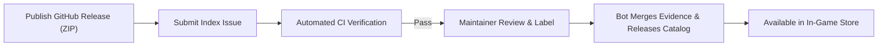

# Phinix Rework Plugin Development Guide

This document is the official technical reference for developing managed plugins for Phinix Rework. It aligns strictly with current codebase architecture and verified runtime practices.

> **Note**: The Phinix plugin development skill is currently in preparation; integration links will be added once ready.

---

## 1. Architecture Overview & Parity Principles

### 1.1 Plugin Parity
In Phinix Rework, built-in features (Chat, Trade, Virtual Inventory, Plugin Store) and third-party extensions share identical runtime lifecycles and privileges:
- **Unified Discovery**: Discovered dynamically by scanning assemblies for classes annotated with `[PhinixExtension]`.
- **Unified Registration & Composition**: Exposed via `IExtensionBuilder` APIs (`RegisterApi<T>`) or modern dependency injection scopes (`IClientCompositionScope`).
- **Unified Lifecycle Management**: Passive instantiation, explicit main-thread activation (`Activate`), and deterministic teardown (`Shutdown`).

### 1.2 Dependency Boundaries
- **Host Does Not Depend on Plugins**: The client host (`Phinix-Rework`) references only the neutral shared contracts (`ClientExtensionAbstractions`). It strictly forbids referencing any plugin or plugin Contracts project.
- **Loose Coupling Between Plugins**: Inter-plugin interaction is mediated directly through public Contracts interfaces and discovered via the host API registry (`ExtensionHostContext.TryResolveApi<T>`). The host never acts as a domain broker.
- **Explicit Dependencies**: Declared using `[PhinixExtension("your.package.id", DependsOn = new[] { "builtin.inventory" })]`. The host registry topologically sorts modules, ensuring prerequisites activate before dependent modules.

---

## 2. Public API Overview

### 2.1 Host Infrastructure Services
Obtained during the activation phase via `ExtensionHostContext.GetRequiredService<T>()`:

| Interface | Namespace | Capability |
| :--- | :--- | :--- |
| `IClientSessionContext` | `PhinixClient.Framework` | Session state, connected server address, local user UUID |
| `IClientUserDirectory` | `PhinixClient.Framework` | Online/offline user queries, display names, profile metadata |
| `IClientUserEventStream` | `PhinixClient.Framework` | User lifecycle events (join, leave, disconnect) |
| `IClientMainThreadDispatcher` | `PhinixClient.Framework` | Marshals background callbacks to the RimWorld main thread (`Enqueue(Action)`) |
| `IClientSettingsContext` | `PhinixClient.Framework` | Package-scoped persistent key-value configuration (`Get`, `Set`) |
| `IClientLocalizationService` | `PhinixClient.Framework` | Provides module-scoped localization (`ForModule(this)` -> `IClientLocalizer`) |
| `IClientWindowService` | `PhinixClient.Framework` | Host window management (opening dialogs, toggling windows) |
| `IClientSoundService` | `PhinixClient.Framework` | Native UI sound playback |
| `IClientExtensionManagementWindowService` | `PhinixClient.Framework` | Opens the extension manager window |

### 2.2 UI Extension Points
Registered during the registration phase via `builder.RegisterApi<T>(instance)`:

- **Main Tab (`IMainTabProvider` / `IResponsiveMainTabProvider`)**:
  Registers top-level tabs in the Phinix window (`TabLabel`, `TabOrder`, `Draw(Rect inRect)`).
- **Sidebar Drawer (`IServerSidebarProvider` / `IResponsiveSidebarProvider`)**:
  Provides right-hand sidebar panels or collapsible drawers.
- **Tab Badge (`IBadgeProvider`)**:
  Renders unread counters or badge notifications (`BadgeText`, `ShouldDisplay`).
- **Settings Panel (`IClientSettingsPanelProvider`)**:
  Renders plugin-specific settings sub-panels within the main Phinix Settings window.
- **Notice Banner (`INoticeBannerProvider`)**:
  Renders interactive alert banners at the top of the window.
- **Key Interception (`IUiAcceptKeyHandler`)**:
  Handles Enter / Return keyboard inputs.

### 2.3 Responsive Layout Utilities
Available in `PhinixClient.Framework.UI`:
- `UiScreenSafeArea.ClampWindow` / `Normalize`: Prevents windows from rendering off-screen and eliminates negative-dimension IMGUI exceptions.
- `ResponsiveFormLayout`: Adaptive single-line vs. vertically stacked form layouts.
- `ResponsiveSplitLayout`: Multi-pane layouts that degrade gracefully to vertical stacks or SinglePane tabs when width is constrained.
- `ResponsiveToolbarLayout`: Automatically collapses secondary actions into an overflow `⋯` FloatMenu.
- `VirtualListLayout`: Viewport virtualization for high-volume scroll lists.

---

## 3. Lifecycle & Dependency Injection (DI)

### 3.1 Standard Lifecycle
1. **Construction**: Must be **entirely passive**. Only initialize immutable fields. Never start threads, make network requests, or touch RimWorld game state in constructors.
2. **Registration / Composition**:
   - Invoked after host infrastructure is ready.
   - Used to publish APIs, register UI providers, and configure dependency scopes.
3. **Activation**:
   - Called on the main game thread (`Activate(ExtensionHostContext hostContext)`).
   - Resolve borrowed services, subscribe to event streams, load settings, and launch background tasks.
4. **Shutdown**:
   - Called on game exit, disconnect, or plugin disablement (`Shutdown(ExtensionHostContext hostContext)`).
   - Must perform **symmetrical teardown**: unsubscribe all events, terminate background tasks, and dispose owned resources.

### 3.2 Two Authoring Paradigms

#### Option A: Modern DI Composition (Recommended for New Plugins)
Derive from `ClientExtensionModule` and override `Compose`:

```csharp
using PhinixClient.Framework;
using Utils.Framework;

[PhinixExtension("my.custom.plugin")]
public sealed class MyCustomPlugin : ClientExtensionModule, IActivatablePhinixExtensionModule
{
    private IClientCompositionScope scope;

    public override string ExtensionId => "my.custom.plugin";

    public override void Compose(IExtensionBuilder builder)
    {
        scope = builder.HostContext.GetRequiredService<IClientCompositionFactory>().CreateScope(local =>
        {
            // Borrow host or cross-plugin services
            local.Borrow(builder.HostContext.Log);

            // Register owned implementations
            local.Register<IMyDomainService, MyDomainService>();
            local.Register<IMainTabProvider, MyPluginTab>();
        });

        // Publish components to host extension points
        builder.RegisterApi<IMainTabProvider>(scope.Resolve<IMainTabProvider>());
    }

    public void Activate(ExtensionHostContext hostContext)
    {
        // Activate active logic, subscribe to events
    }

    public void Shutdown(ExtensionHostContext hostContext)
    {
        // Dispose owned scope (automatically disposes registered IDisposable instances)
        scope?.Dispose();
        scope = null;
    }
}
```

> **Note**: The host internally uses Autofac 8.4.0, but the neutral contract layer completely hides container dependencies. Plugins must not reference Autofac directly.

#### Option B: Legacy Module Registration (Transitional Compatibility)
Implement `IPhinixExtensionModule` directly:

```csharp
[PhinixExtension("my.legacy.plugin")]
public sealed class MyLegacyPlugin : IPhinixExtensionModule, IActivatablePhinixExtensionModule
{
    public string ExtensionId => "my.legacy.plugin";

    public void Register(IExtensionBuilder builder)
    {
        builder.RegisterApi<IMainTabProvider>(new MyPluginTab());
    }

    public void Activate(ExtensionHostContext hostContext) { /* Startup */ }
    public void Shutdown(ExtensionHostContext hostContext) { /* Teardown */ }
}
```

> **Current Status**: Option B remains fully functional for backwards compatibility, but outputs a single migration advisory at startup. Removal is planned for host 1.0 / abstractions 2.0 after external migrations conclude.

### 3.3 Reality of Existing Managed Plugins
- **Phinix-Example-Plugin** (1.0.2): Uses legacy `IPhinixExtensionModule.Register`.
- **Phinix-Legacy-RedPacket** (1.0.0): Uses legacy registration.
- **Phinix-Legacy-TalentTrade** (1.0.1): Uses legacy registration.

**Do not claim that all plugins have migrated to DI.** These plugins will migrate in dedicated follow-up iterations.

---

## 4. Threading & Resource Ownership

### 4.1 Main Thread Dispatching
RimWorld engine methods and Unity GUI calls are strictly bound to the main thread:
- Never invoke GUI drawing, text measurement, or `Verse.*` methods from background threads.
- Marshal background results to the main thread via `IClientMainThreadDispatcher.Enqueue(Action)`:

```csharp
mainThreadDispatcher.Enqueue(() =>
{
    Find.LetterStack.ReceiveLetter(...);
});
```

### 4.2 Symmetrical Resource Cleanup
- **Owned Resources**: Timers, thread handles, and event handlers instantiated by the plugin must be disposed or unsubscribed (`+=` matches `-=`) in `Shutdown`.
- **Borrowed Services**: Services obtained from `ExtensionHostContext` or borrowed via DI are owned by the host; **plugins must never call `Dispose` on borrowed services**.
- **Localization Binding**: Localizers created with `localizationService.ForModule(this)` must have their `LanguageChanged` event unsubscribed and `localizer.Dispose()` called during `Shutdown`.

### 4.3 Harmony Patching Guidelines
If your plugin uses Harmony to patch RimWorld methods:
1. **Never patch in static constructors**: The CLR executes static constructors during initial assembly discovery, bypassing user disablement settings.
2. **Patch in `Activate`, unpatch in `Shutdown`**:
   ```csharp
   private Harmony harmony;

   public void Activate(ExtensionHostContext hostContext)
   {
       harmony = new Harmony("author.plugin.id");
       harmony.PatchAll(Assembly.GetExecutingAssembly());
   }

   public void Shutdown(ExtensionHostContext hostContext)
   {
       harmony?.UnpatchAll("author.plugin.id");
       harmony = null;
   }
   ```

---

## 5. Build & Packaging

### 5.1 Environment Prerequisites
- **.NET 10 SDK** (build runner and toolchain).
- **.NET Framework 4.7.2** targeting pack (via `Microsoft.NETFramework.ReferenceAssemblies`).
- **RimWorld 1.6 Managed Assemblies** (`Assembly-CSharp.dll`, `UnityEngine*.dll`) for compile-time references.

### 5.2 Packaging
Package release ZIPs using `pack.py` and `ManagedPackageTool`:

```bash
python3 pack.py \
  --phinix-root <path-to-Phinix-Rework> \
  --game-references <path-to-RimWorld-Managed> \
  --output <path-to-output>/your-package-1.0.0.zip
```

#### Package Layout
```text
your-package-1.0.0.zip
├── manifest.json                  # Metadata, declared assemblies, dependencies, Phinix version range
├── Assemblies/
│   └── YourPlugin.dll             # Only the plugin's own compiled assemblies
└── Resources/
    └── Localization/              # Package-scoped translation dictionaries
        ├── en-US.json
        └── zh-CN.json
```

> [!CAUTION]
> **Strict Rejection Rule**: Release packages must **never** bundle RimWorld game assemblies (`Assembly-CSharp.dll`, `UnityEngine*.dll`), host assemblies (`Utils.dll`, `ClientExtensionAbstractions.dll`), or Harmony. Bundling foreign DLLs causes runtime type clashes and triggers automated rejection by the index validator.

---

## 6. Testing & Validation

1. **Automated Headless Tests**:
   Write .NET 10 console test harnesses for domain logic and state transitions to verify boundary handling without game overhead.
2. **Local Mod Testing**:
   - Extract the generated ZIP into `<RimWorld>/SaveData/Phinix/ManagedExtensions/packages/<package-id>/<version>/`.
   - Launch RimWorld and verify discovery in **Extension Manager**.
   - Verify enabling, disabling, restart requirements, and clean teardown upon save exit.

---

## 7. Submission & Index Admission



1. **Publish GitHub Release**:
   Publish a GitHub Release in your public repository containing the immutable release ZIP.
2. **Submit Candidate Issue**:
   Open a **Plugin submission** Issue on [Phinix-Plugin-Index](https://github.com/HunYuan2333/Phinix-Plugin-Index) with the candidate JSON.
3. **Automated Static Checks**:
   Intake workflows automatically inspect candidate schema, PE metadata, dependency closures, and SHA-256 integrity.
4. **Maintainer Approval**:
   A maintainer reviews the submission and applies the `plugin-approved` label.
5. **Immutable Publication**:
   Automation creates and merges an evidence PR, publishes `catalog-v3-<commit>`, and updates `stable.json`.
6. **Client Store Sync**:
   The plugin becomes installable and upgradeable directly in the game client.

---

## 8. Current Limitations & Known Issues

- **Phinix-Example-Plugin**:
  Demonstrates UI tabs, persistent settings, dual-language translation, and responsive layout hints. Does not implement complex item transactions or networking.
- **Phinix-Legacy-RedPacket**:
  - Depends on Trade and Inventory.
  - **Known Issue 1**: Sending ordinary steel across multiple physical stacks can trigger an incompatible-stacks exception. Grouping and selection alignment are planned in a separate plugin update.
  - **Known Issue 2**: Claim completion summaries may encounter a `NullReferenceException` when processed without active world context (e.g., at the main menu). Decoupled notification scheduling is planned.
- **Phinix-Legacy-TalentTrade**:
  - Uses Harmony patches for pawn transfer interception.
  - **Persistence Boundary**: Active listings and rental records reside in a save-local `GameComponent`. Uninstalling while transactions are in-flight can corrupt save data.
- **Actions Automated Compilation**:
  Automated compilation workflows for the three standalone plugin repositories remain scheduled work under F7 (main/dev branch setup, compile-on-main, game reference provisioning). They are not yet implemented.
