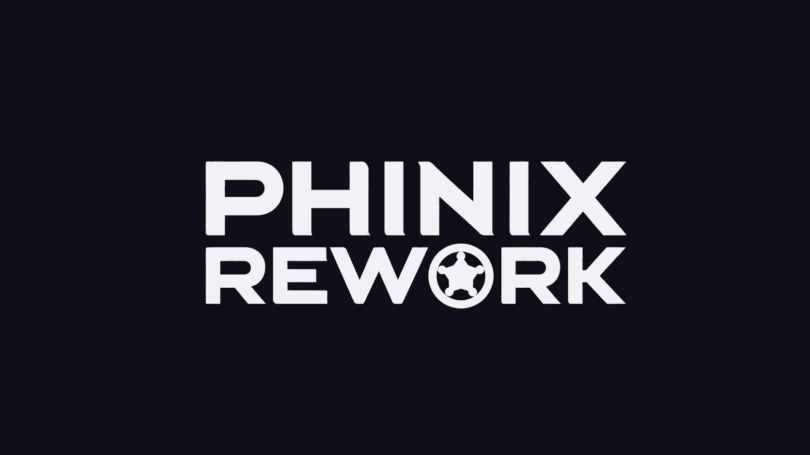

<h1 align="center">Phinix</h1>
<h4 align="center"><i>A RimWorld multiplayer mod — chat, trade, and extensible plugin framework</i></h4>
<p align="center"></p>
<br><br>

> Draft README for review only.
> The production README in `.github/README.md` is intentionally left unchanged for now.

中文版本: [README-draft.zh-CN.md](./README-draft.zh-CN.md)

# About

Phinix adds multiplayer chat and item trading to RimWorld via a dedicated external server. It is a continuation of the original Phinix mod, rebuilt around a plugin-oriented framework architecture.

Core capabilities:

- in-game chat between colonies
- asynchronous item trading (no simultaneous online required)
- dedicated server with authentication and user management
- extensible plugin system for third-party submods

# Architecture

Phinix has been restructured into a layered, plugin-first architecture:

```
Plugins (Extensions/Chat, Extensions/Trade, third-party)
  → Shared contracts (ClientExtensionAbstractions)
    → Host (Client / Server)
      → Infrastructure (Common: networking, auth, user management)
```

Key principles:

- **Plugin parity** — Chat and Trade are plugins, not built-in special cases. Third-party submods use the exact same discovery → registration → activation path.
- **Host doesn't depend on plugins** — The host only references `ClientExtensionAbstractions` (generic contracts). No compile-time dependency on any specific plugin project.
- **Three pipelines** — All network communication flows through `message` (display), `command` (control), and `item` (payload) lanes.
- **Dynamic UI** — Tabs, sidebars, and badges are contributed by plugins via `IMainTabProvider` / `IServerSidebarProvider` / `IBadgeProvider`. The host provides only the shell.
- **API registry** — Plugins expose and discover capabilities through `RegisterApi<T>()` / `TryResolve<T>()` without host mediation.

# Installation

## Client

1. Build or download the client package.
2. Extract into `RimWorld/Mods`.
3. Install the required Harmony dependency.
4. Enable the mod in RimWorld and restart.

Supported RimWorld versions: 1.3, 1.4, 1.5, 1.6.

## Server

Server configuration is stored in `server.conf` (defaults: port `16200`, max connections `1000`, auth type `ClientKey`).

1. Edit `server.conf` as needed.
2. Build the server project (requires .NET 10 SDK).
3. Run the server.
4. Use console commands such as `help` and `version`.

## Docker

Docker deployment is supported via `Dockerfile` and `docker-compose.yml`. Container-based hosting remains part of the intended workflow.

# Usage

## Client

1. Load a save or create a new colony.
2. Open the Phinix tab (chat icon in the bottom toolbar).
3. Go to Settings and enter the server address and port.
4. Connect to the server.

## Server

The server handles: connection management, authentication, chat message relay, trade state synchronization, and framework capability negotiation.

# Developers

## Environment Setup

The client project depends on RimWorld assemblies. Place the required DLLs in `GameDlls/`:

- `Assembly-CSharp.dll`
- `UnityEngine.dll`
- `UnityEngine.CoreModule.dll`
- `UnityEngine.IMGUIModule.dll`
- `UnityEngine.InputLegacyModule.dll`
- `UnityEngine.TextRenderingModule.dll`

Version-specific subdirectories under `GameDlls/` are supported.

## Building

The solution (`Phinix.sln`) contains client, common, server, and extension projects. A `TravisCI` build profile is available for builds that do not require RimWorld game assemblies.

- **Client**: .NET Framework 4.7.2 (Unity/Mono ecosystem)
- **Common projects**: multi-target `net472;net10.0`
- **Server**: .NET 10.0

## Protocol

Packet definitions use Protobuf. If you modify packet structures, you will need a `protoc` toolchain with C# support.

## Extension Development

Plugins implement `IPhinixExtensionModule` and register handlers, renderers, codecs, and APIs through `IExtensionBuilder`:

```csharp
public class MyExtension : IPhinixExtensionModule
{
    public string ExtensionId => "my.extension";

    public void Register(IExtensionBuilder builder)
    {
        builder.AddCapability("my.extension");
        builder.AddClientMessageHandler(this);
        builder.RegisterApi<IMyService>(this);
    }
}
```

See [设计哲学.md](./设计哲学.md) for the full architecture guide and design rules.

# Credit

Special thanks to the original Phinix creators and contributors, and to [Longwelwind's Phi mod](https://github.com/longwelwind/phi) for the earlier foundation.
