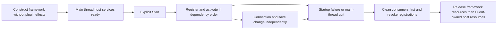

# Client infrastructure finishing and three-repository split

Updated: 2026-10-07. Branch: dev. [中文](后续实施计划.md).

This is the current schedule. It supersedes the earlier P0–P6 sequence that waited for store completion and a server compatibility prototype. Detailed older proposals remain references; current code and this schedule resolve conflicts. This is a plan, not evidence that DI, Stateless or repository extraction is implemented.

## 1. Scope and baseline

The store is delivered: managed DLL and Workshop routes, GitHub/CF adapters, localization, versions, upgrades, installation/removal, the redesigned UI and maintainer/distribution badges. The user accepted the new UI. The known handoff baseline is `f312c38940c8026f3f680089cf99b039402dc025`, including the one-time extracted-plugin announcement; its actual dialog and restart behavior still need game acceptance. This identifies delivered work, not a revision to reset to. Recheck the latest HEAD, remotes and concurrent documentation commits when starting.

Finish client lifecycle design, DI, a useful Stateless slice, limited testing/HTTP improvements and then extract Shared, Client and Server. Consume Phinix shared source through a Git submodule pinned to a commit and ProjectReference; do not add a parallel Phinix NuGet SDK channel. Ordinary third-party NuGet dependencies are allowed.

Defer server features, server DI and legacy-client compatibility. Repository extraction includes necessary server project paths, shared references, Docker context and publication wiring, with existing behavior retained. Independent RedPacket/TalentTrade business problems no longer gate this client infrastructure work.

## 2. Items recovered from older proposals

| Item | Current treatment |
| --- | --- |
| Construction versus startup, ownership and shutdown | Required before container integration |
| DI | Required: prove Chat first, then migrate relevant consumers in dependency order |
| Stateless | Required useful single-operation pilot; expand only where behavior and benefit are clear |
| HTTP/Polly | Inspect and address demonstrated sync/cancellation/duplicate-retry gaps; do not rewrite working async HttpClient merely to change libraries |
| NUnit/NUnitLite | Limited migration of affected scenarios; preserve existing coverage and executable failure reporting |
| Main thread and connection/save generations | Required; stale callbacks cannot mutate a new session/save |
| Shared versus game contracts and linked endpoint source | Required before extraction |
| Dependency versions, Mono loading and output ownership | Required; compilation alone is not deployment evidence |
| Example, index validator and host-module configuration | Update when contracts, real artifacts or source roots change |
| Display naming | Separate prose/display work; do not bundle assembly/module/package/storage renaming |
| SQLite, wholesale JSON/logging replacement | Defer as independent decisions requiring recovery and cost evidence |
| Server features and old-client compatibility | Defer |
| AI author tools, AGENTS and Skill | After author-facing composition contracts and source/build consumption stabilize |
| DLL hot replacement, new client CI, chat images/WebP | Defer; retain manual client checks and the existing server-image CI division |

## 3. Implementation order

| Stage | Work | Exit condition | Human acceptance |
| --- | --- | --- | --- |
| F0 Baseline | Pin input, existing failures, references/linked sources, candidate dependencies, output ownership and test backups | Existing client/server builds and scenario coverage are accounted for | Existing store/example/chat smoke |
| F1 Lifecycle and contracts | Separate construction, registration, activation and stopping using current assembly; define host/plugin/connection/save/operation ownership and neutral composition contract | Disabled plugins are not constructed; failed startup is cleaned; dependents stop first; behavior is testable without a container | Startup/shutdown, reconnect and save switching |
| F2 DI and Chat | Verify an Autofac candidate's net472/Mono loading, disposal and distribution; constructor-inject Chat services | Cancellation, subscription cleanup, borrowed API ownership and rollback work for official and third-party modules alike | Chat enable/disable, reconnect and repeated entry/exit |
| F3 Stateless pilot | Freeze current transitions/failure traces; migrate store single asynchronous-operation rules without changing installation transactions | Cancellation, errors, duplicate/stale events and stop/rebuild are deterministic; no false success | Cancel transfer, disconnect/retry, adapter switching and installation commit |
| F4 Adoption, old-entry deprecation and contract freeze | DI across Chat → Inventory → Trade → Store/LegacyAdapter; useful internal state slices; necessary HTTP/tests; update example and affected validators | Author-facing lifecycle/composition APIs and runtime distribution are stable; old client author entry is Deprecated with a declared removal version (section 4.1); superseded duplicate paths removed | Incremental store/example/inventory/trade checks; not a claim that historical recovery defects are repaired |
| F5 Shared-source rehearsal | Extract in independent temporary checkouts; both consumers pin the same initial gitlink; separate mixed tests; verify nested protobuf and Directory.Build behavior | Fresh recursive acquisition builds without neighboring old directories or duplicate runtime assets | New main package loads example; existing server image builds/starts |
| F6 Physical repositories | Extract Client/Server, history/branches as needed, tests, package paths, Docker workflow and developer entry points; pin a matching version set | Independent checkouts validate; remote shared commits and rollback are available; release ownership is clear | Main package/store/example and existing connection/chat/trade smoke |
| F7 Author experience | Refresh example/templates/guides, environment/build/publication tooling, then thin AGENTS/Skill | A new author can build/package/apply against one stable workflow; no-Git/gh path honors fixed gitlinks | Real example creation and normal submission |

Default order: F0 → F1 → F2 → F3 → F4 → F5 → F6 → F7. Pure library environment probes can run independently. Keep DI, state rules, HTTP, persistent formats and physical source moves in reviewable separate changes.

If container deployment fails, retain the useful lifecycle work and record evidence before selecting an alternative. HTTP and external RedPacket work do not block extraction. Changed contracts and runtime dependencies cannot be omitted from consumers to make extraction appear complete.

## 4. DI deliverables

Autofac is the initial candidate, not a preselected untested version. Microsoft DI remains a smaller alternative if local-registration/ownership benefits are insufficient. Verify current official requirements, actual net472 assets and real game/Mono loading before pinning versions and transitive dependencies.

- Keep the implementation in Client composition. Shared registry and public plugin APIs remain neutral and do not expose Autofac DSL/container types.
- Required dependencies are constructor parameters for ordinary services. Service location is limited to composition or justified transitional adapters, never per-frame UI or hidden domain dependencies.
- Host, plugin, connection, save and operation have explicit owners. Connection and save changes are independent; borrowed game objects and cross-plugin APIs are not disposed by the consuming container.
- Construct dependencies without running modules. Register/activate after host services are complete and in dependency order. Scanning cannot instantiate disabled plugins. Stop work, cancel old generations, revoke capabilities/subscriptions and then dispose on the correct thread.
- Official and third-party modules use the same path. Design the author-facing composition interface in F1/F2 and freeze it in F4.
- Development APIs may be coordinated across consumers rather than preserved as permanent debt. Breaking changes need declared abstraction versions and maintained example/plugin/index updates. Never overwrite fixed release assets or clear player settings/saves as migration.

### 4.1 Deprecation of the original client registration entry (2026-10-07 addition)

The user explicitly requires the original plugin registration entry to be Deprecated, rather than retained as a permanent second author path. New plugins, examples, templates and author documentation use the new neutral DI composition entry. Existing client plugins need a migration plan; do not continue promising that migration is unnecessary or that the old entry remains available indefinitely.

- **F2 is transitional**: Chat currently calls its new DI composition from `Register(IExtensionBuilder)`. This request updates the plan only. Marking that shared method Obsolete immediately would incorrectly label both new DI and unmigrated modules.
- **F4 distinguishes author entries and applies deprecation**: establish a neutral client contract/adapter boundary that clearly distinguishes new composition from old registration, then add `[Obsolete]` and replacement guidance to the old client author API/adapter entry. If necessary, emit one migration diagnostic for enabled modules actually using the old path, without constructing disabled modules or changing activation policy. Keep the neutral Common registry and discovery/register/activate/stop semantics unified. Server registration is not deprecated as part of this client DI rollout.
- **Migration coverage**: migrate official client Chat → Inventory → Trade → Store/LegacyAdapter and maintained third-party examples, templates, author documentation and affected index/validator configuration. Independent RedPacket/TalentTrade repositories schedule their own migrations; their old entry is not promised permanent compatibility either.
- **Temporary compatibility and removal gate**: retain the old entry only as a migration adapter; new features must not depend on it. F4 declares the deprecation version, replacement entry and intended removal version. After maintained modules/examples migrate and rollback/ownership regression and game acceptance pass, explicitly remove it or record remaining migration work. F5/F6 must not claim contract freeze and completed extraction while concealing retained dual entries.
- **Versions and rollback**: breaking removal upgrades the applicable abstractions/host, publishes migration instructions and synchronizes plugins/examples/validator configuration. Roll back a matching version set. Old plugins require upgrades to load after removal; immutable historical assets, player settings and saves stay intact.

## 5. Stateless target

The old first target, `Extensions/LegacyRedPacket/Client/RedPacketInventorySending.cs`, has been removed from the main repository and belongs to the independent RedPacket project. Do not retain that stale path as the main implementation prerequisite.

Start with a single asynchronous operation in [ManagedStoreController](../../../Extensions/PluginStore/Client/ManagedStoreController.cs): it has stages, cancellation, snapshots and real production-source regression coverage, and can be verified without a server change or external-plugin publication. Verify that an explicit transition table removes real duplication before replacing internal rules. Preserve refresh/planning/dependency confirmation/download/verification/install/manage/stop behavior.

Stateless expresses transitions; the controller still serializes work, verifies generations/cancellation and protects snapshot publication. Progress must not create costly transitions or per-buffer logs. Existing installation journals, hashes, file ownership, recovery and commit remain in the installation service. A transition does not make multiple files/plugins atomic, and Installed cannot precede durable commit. Recovery cannot rerun side-effecting entry actions.

Consider Trade/Inventory operation slices only with clear rules and failure evidence. Actual ACK, uncertain sent operations, duplicate results and persistence-before-publication retain their meaning. Historical recovery defects stay separate. RedPacket adoption is a future decision in its own repository.

## 6. Repository layout

Propose retaining the existing `Phinix-Rework` remote identity for Client, limiting disruption to current links/Workshop author entry points. Add Shared and Server repositories; confirm their exact names before F6. This plan does not create remote repositories.

| Repository | Owns | Excludes |
| --- | --- | --- |
| Shared | Game-independent contracts/protocols/tools and genuinely shared neutral runtime; business contracts stay organized by plugin | Concrete endpoints, Verse/Unity, Autofac, plugin UI |
| Client | RimWorld host, client/game/UI contracts, endpoint implementations, bundled client modules, game-related tests and packaging | Linked server endpoint source and copies of extracted plugin/gateway source |
| Server | Existing server/endpoints/modules/tests, Docker and server image workflow | Client/game/UI dependencies and linked client endpoint source |

Shared is not necessarily interface-only, and current Common directories cannot be copied without ownership review. Classify NetClient/NetServer/authentication/user-management endpoints. Split game/client portions of Chat/Trade Contracts from shared protocol before relocating them. Hosts still do not reference concrete business plugin contracts.

Each consumer pins a Shared commit at the proposed `Dependencies/Phinix.Common` path and uses ProjectReference. No floating branch acquisition; consumers may later pin different compatible versions. Preserve the vendor protobuf submodule, initializing it recursively when nested under Shared; do not patch its source for repository SDK issues.

Validate the new Server image workflow before retiring the old repository publisher; keep one publication owner and do not add a client build workflow. Future no-Git author tools must retrieve nested source at gitlink commits, not current floating Shared branches.

F5 checks SolutionDir/MSBuildThisFileDirectory, Directory.Build import boundaries, explicit/conditional Compile items, legal game references, copy paths, numbered client DLLs, protobuf paths, mixed Phase35-style linked tests, Docker contexts and validator source roots. The new Server must build without a neighboring Rework directory. Keep deployment/image names and connection behavior stable; provision workflow credentials separately without committing them.

Index/Gateway/Example/RedPacket/TalentTrade remain independent. DI does not change repository access protocols. Update affected fixed validator snapshots/host manifests from real artifacts and specified input commits when required; retain immutable release/catalog history.

## 7. Validation and completion

Record source commits, public API/data/protocol impacts, actual commands/results, output dependencies and human evidence by stage. Preserve current Phase35, ManagedExtensionRuntimeTests, ResponsiveUiGeometryTests, LegacyTradeRuntimeTests, packaging and plugin-specific scenario coverage; move tests by responsibility rather than testing stale production copies.

Inject construction/registration/activation failure, provider shutdown, duplicate subscriptions, cancellation/stale callbacks, save switches, failed persistence, duplicate ACK, missing references, logger/cleanup failure and wrong-thread resource handling. Library compile tests do not certify actual game loading or recovery. Human checks are incremental, not a replay of the whole accepted store route.

F6 requires stable shared/client composition APIs, independently obtainable/buildable pinned consumers, correct example/store loading, runtime assets and executable publication/rollback instructions. F7 does not await SQLite, Server DI, legacy-client new features or blanket HTTP/test-runner migration.

Rollback endpoint implementation, matching Shared gitlink and runtime dependencies as a set. Persistent-format changes require a separate compatibility/migration design; source rollback alone is not data rollback.

## 8. Status and references

- [x] Store and redesigned UI accepted by the user.
- [x] New ordering, missing items and deferred-server boundary recorded.
- [ ] Actual one-time upgrade-dialog/restart acceptance.
- [x] F0 first-batch framework baseline/ownership (section 11.1; live remote verified during F2 preparation).
- [x] F1 first batch accepted by the user, who authorized F2 (section 11.2; individual game steps were not separately confirmed).
- [x] F2 Autofac candidate environment probe.
- [x] F2 Chat production composition and regression coverage (section 11.4).
- [x] F2 game acceptance: user reported “F2 pass” (section 11.5).
- [ ] F3 Stateless and F4 adoption, old-entry deprecation and contract freeze.
- [ ] F5 source rehearsal and F6 physical repositories.
- [ ] F7 AI author tools and Skill.

References: [older four-part migration](客户端四项基础设施迁移方案.md), [library evaluation](客户端框架与库选型评估.md), [repository extraction details](Repo-Split-Plan.md). Deferred: [SQLite](客户端持久化与SQLite评估.md), [old-client server compatibility](老客户端服务端兼容插件评估.md), [naming](Naming-Consistency-Audit.md), [AI workflow](plugin-store/收尾顺序与AI作者工作流计划.md). Stable constraints: [design philosophy](../../Design-Philosophy.md), [compatibility/recovery](../../Compatibility-Boundaries.md).

Older stage numbers and pre-delivery store states do not impose new prerequisites. Recheck actual code before implementing details, especially extracted-plugin paths. Independent business or server unresolved items do not silently become gates for this client work.

## 9. Start directly in a new conversation

**The first delivery is F0 baseline verification plus a minimal F1 lifecycle change with regression coverage.** Do not substitute another plan, introduce containers/state libraries, extract repositories or redesign accepted store UI in this batch. Proceed to F2 container/Chat integration after this batch and its game acceptance. Another task owns repository documentation cleanup; read its latest work, check it against code and preserve its changes rather than rewriting those READMEs.

1. In the original workspace, read AGENTS.md, this plan and the design philosophy. Read compatibility boundaries before touching trade, recovery or ownership. Inspect branch, HEAD, remotes, recent commits and tracked/untracked changes. Distinguish pushed work, concurrent edits and local drafts; do not reset, clean or stage everything to manufacture a baseline.
2. Check the actual entry points below and record the small F0 ownership/lifecycle inventory, existing failures and missing prerequisites. Earlier user acceptance is existing evidence, not a new test performed by the incoming agent.
3. Implement production F1 code and matching tests in one reviewable batch. Ask only for missing decisions, external permissions or real blockers; resolve ordinary implementation choices autonomously.
4. Prefer a suitable existing isolated workspace; otherwise create a `codex/` branch from the verified development baseline. At this handoff these plan files are untracked in the original workspace: read and explicitly carry them, or include them in a later commit. A fresh worktree/clone does not automatically receive them, game references, legacy NuGet caches or concurrent uncommitted code.
5. Preserve parallel changes and compare actual overlapping diffs before editing. Unfinished unrelated work, IDE files, generated fixture DLLs and outputs are outside this batch. Remote creation/naming, credentials and repository migration belong to later stages, not F0/F1.

Announcement game acceptance can run independently and does not gate F0/F1. F1 lifecycle acceptance is still required before expanding integrated F2 changes. Give the user short steps, rebuild scope and expected outcomes; continue independent ownership or library-environment preparation while waiting.

### 9.1 Source entry points

| Entry point | Inspect |
| --- | --- |
| [Client.cs](../../../Client/Source/Client.cs), `InitializeExtensions` | Startup already waits for LongEvent completion and the main-thread dispatcher. Check service readiness, dependency policy and every framework construction call rather than adding another arbitrary delay |
| [PhinixFrameworkClient.cs](../../../Client/Source/Framework/PhinixFrameworkClient.cs) | Construction now has no discovery/activation effects; explicit Start performs composition/startup and ClientExtensionRuntime owns module lifecycle. Recheck shutdown/failure cleanup |
| [FrameworkTypes.cs](../../../Common/Utils/Framework/FrameworkTypes.cs), `ExtensionHostContext` | Current service dictionary/capability access, not an already integrated DI container |
| [PhinixExtensionRegistry.cs](../../../Common/Utils/Framework/PhinixExtensionRegistry.cs) | Discovery, registration rollback, dependency ordering, activation/shutdown and parameterless-constructor checks. Keep official/third-party parity; do not assume constructor injection already exists |
| [Client abstractions](../../../Client/ClientExtensionAbstractions/Framework/IClientExtensionAbstractions.cs) | Public services/events/lifecycle; add only needed neutral contracts, never container-specific author APIs |
| [Dispatcher](../../../Client/Source/Framework/ClientMainThreadDispatcher.cs) | Queue limits and real game-thread handling. Construction on a loading thread does not identify the game thread; a bounded queue cannot be assumed to accept every critical callback |
| [Settings adapter](../../../Client/Source/Framework/ClientSettingsContextAdapter.cs) | Set triggers persistence. Global settings do not belong to one save scope; failed saves are not success |
| [Chat entry](../../../Extensions/Chat/Client/BuiltInChatClientExtension.cs) | F2 pilot dependency access, subscriptions and activation/shutdown; preserve behavior in F1 |
| [Inventory entry](../../../Extensions/Inventory/Client/BuiltInInventoryClientExtension.cs), [InventoryGameComponent](../../../Extensions/Inventory/Client/InventoryGameComponent.cs), [Trade entry](../../../Extensions/Trade/Client/BuiltInTradeClientExtension.cs) | Independent connection/save lifetimes; defer domain adoption to F4 |
| [ManagedStoreController](../../../Extensions/PluginStore/Client/ManagedStoreController.cs) | F3 operation serialization, snapshots, cancellation and stale callbacks; retain transaction services |
| [StoreReleaseNotice](../../../Extensions/PluginStore/Client/StoreReleaseNotice.cs) | Announcement already implemented; remaining work is actual game acceptance |
| [Package layout](../../../Client/Packaging/ClientPackageLayout.targets), [artifact check](../../../.github/scripts/check-artifacts.ps1) | Output ownership, excluded game DLLs/optional legacy plugins, languages and LoadFolders |
| [Validator snapshot](../../../Extensions/PluginStore/RepositoryAutomation/scripts/validator_snapshot.py) | Pinned production inputs; coordinate only affected changes, never refresh blindly to hide inconsistency |

These paths are navigation at handoff time; inspect current callers and files before changing them. Removed RedPacket/TalentTrade directories are not F1/F3 prerequisites.

### 9.2 First batch and exit conditions

Record F0 results in section 11, linking a necessary audit artifact if useful; avoid proliferating duplicate plans:

- Project inventory: target frameworks, shared/endpoint ownership, game dependencies, linked sources, reference directions and output/distribution responsibility. Cover F1 callers first, then extend to extraction candidates.
- Lifecycle inventory: creator/stopper/disposer for host, plugin, connection, save and operation; borrowed services; thread/generation requirements.
- Verification baseline: commands actually run, existing failures and environment gaps. Do not repair unrelated business bugs merely to make every check green.

Minimal F1 implementation:

- Move discovery/registration/activation out of framework construction into explicit startup after composition is complete. Trace every caller, readiness and failure path; retain manual composition at this stage.
- Define repeated Start/Stop/Dispose and failed-start semantics. Clean owned resources after partial registration/activation, dispose once, never destroy borrowed services, and avoid constructing disabled plugins during discovery.
- Preserve dependent-first stopping, capability/subscription revocation, cancellation and stale callback isolation. Handle game resources through actual main-thread rules; no background Verse/Unity/translation calls.
- Leave a neutral creation/lifecycle boundary for DI, introducing only interfaces used by current production code. Record actual public API/version and maintained-plugin impacts; do not add speculative extension points.
- Extend the closest existing runtime harness with production-path coverage: construction without activation, explicit one-time startup, disabled construction prevention, partial failure, repeated Start/Stop, provider shutdown and cleanup exceptions. Do not verify only a separate imitation of the implementation.

Exit with production code/tests, reviewed diff, build/regression evidence, ownership conclusions, concise game steps and the next F2 slice. Another plan alone is not delivery. Do not bundle persistent format, trade ACK/ownership, installation transaction, access protocol or accepted UI changes.

F1 human smoke uses test saves: restart → chat/store/installed example → disconnect/reconnect → main menu and another test save → exit. Check errors, duplicate tabs/subscriptions/messages and stale callbacks affecting the new save. No real-asset trade is required; changes to trade paths need targeted compatibility acceptance.

## 10. Current monorepository validation entry points

Run from the repository root. Check .NET 10, net472 targeting support, classic NuGet dependencies, protobuf submodule and legally available RimWorld 1.6 references. Restore missing dependencies first; do not assume `--no-restore` is valid in a fresh environment or that one SDK restore resolves every packages.config dependency. Report exact missing prerequisites instead of borrowing output DLLs to fake source dependencies.

The commands below are current starting points, to be updated after extraction. Record actual complete commands and exit results. Do not run builds concurrently when they write the same output folders.

```sh
phinix_repo_root="$(pwd)/"
phinix_game_references="${phinix_repo_root}GameDlls/1.6"

# Full build only when legal game references are available.
dotnet build Phinix.sln --configuration "Release 1.6" \
  -p:SolutionDir="$phinix_repo_root" \
  -p:RimWorldDepDir="$phinix_game_references" \
  -p:GameReferenceDirectory="$phinix_game_references" \
  -p:BuildInParallel=false -m:1

# Existing server behavior/references, not server feature development.
dotnet build Server/Server.csproj --configuration Release \
  -p:SolutionDir="$phinix_repo_root" -p:BuildInParallel=false -m:1

dotnet build Tests/Phase35RuntimeTests/Phase35RuntimeTests.csproj \
  --configuration Release -p:SolutionDir="$phinix_repo_root" \
  -p:BuildInParallel=false -m:1
dotnet Tests/Phase35RuntimeTests/bin/Release/net10.0/Phase35RuntimeTests.dll

dotnet build Tests/ManagedExtensionRuntimeTests/ManagedExtensionRuntimeTests.csproj \
  --configuration Release -p:SolutionDir="$phinix_repo_root" \
  -p:BuildInParallel=false -m:1
dotnet Tests/ManagedExtensionRuntimeTests/bin/Release/net10.0/ManagedExtensionRuntimeTests.dll
# If Mono is available; still not a real RimWorld loading/GUI test.
mono Tests/ManagedExtensionRuntimeTests/bin/Release/net472/ManagedExtensionRuntimeTests.exe
```

Choose an existing reference directory containing all required Unity modules; store additions also require UnityEngine.ImageConversionModule.dll and com.rlabrecque.steamworks.net.dll. Some older configurations use GameDlls/ rather than GameDlls/1.6; check both path properties and actual files, or use the game's Managed directory. Never commit/package these game references.

For geometry/layout changes only, add deterministic assertions and run:

```sh
dotnet run --project Tests/ResponsiveUiGeometryTests/ResponsiveUiGeometryTests.csproj \
  --configuration Release
```

After building the corresponding artifacts:

```sh
pwsh -File .github/scripts/check-artifacts.ps1 -IncludeClient
```

If pwsh is unavailable, report that script as not run. An equivalent read-only inspection must follow its current required files, `/,Common,1.6` load folders, languages, excluded game DLLs and excluded bundled RedPacket/TalentTrade artifacts. State substituted checks and limits; do not claim the PowerShell script passed.

When modifying pinned validator production inputs, first run:

```sh
python3 Extensions/PluginStore/RepositoryAutomation/scripts/validator_snapshot.py \
  check --source-root .
```

Investigate drift before updating trusted inputs/provenance and the independent index validator; refresh is not unconditional. For LegacyAdapter/trade changes use the documented MSBuild/runtimeconfig method in [compatibility boundaries](../../Compatibility-Boundaries.md), not an assumption that dotnet test executes console harnesses. Do not commit build artifacts, fixture DLLs or logs.

## 11. Handoff record and maintenance

Known at handoff: f312c38 is pushed. The announcement's store build and ManagedExtensionRuntimeTests on .NET 10 and net472/Mono passed; the main harness then had 937 assertions including nine announcement assertions. This is prior evidence, not F1 verification. DI, Stateless and repository extraction remain unimplemented. Recheck the latest HEAD for concurrent documentation commits.

The announcement uses global configuration key `plugin-store.notice.optional-plugins-20261007`, not per-save state. Pending human checks: first startup shows it, the store action opens the store, and another restart does not repeat it. Use an isolated test configuration for repeated acceptance, never clear real player settings. No further announcement framework is required.

Append one short record per batch and update section 8 only with actual evidence:

```text
Stage/date:
Input: branch/HEAD, relevant remote/shared SHAs, concurrent edits
Delivery: production files/entry points, public API/dependency versions, ownership changes
Impact: settings/saves/protocol/items/packaging, including explicit no-change conclusions
Validation: actual commands/results/evidence; checks not run and why
Human: actual user feedback, pending short steps; build success is not game acceptance
Commit: batch commit/PR or local-only status; no unrelated files
Next: one actionable slice, exit conditions and required external inputs
```

New-conversation prompt:

> Read AGENTS.md and docs/branch-local/dev/后续实施计划.md. Verify current code and concurrent documentation commits, then implement F0 plus F1 production code and regression coverage following section 9. Preserve existing edits; do not redo accepted store behavior, extract repositories or introduce a container yet. Deliver one verified batch, report game acceptance steps and update the handoff record.


### 11.1 F0 + F1 first batch (2026-10-07)

Input: original workspace, `dev`, HEAD and cached `origin/dev` at `f312c38940c8026f3f680089cf99b039402dc025`; protobuf gitlink `4b0c3aacf0657fbf38253b38918d3358dd4319ec`. `git ls-remote origin refs/heads/dev` failed because the configured proxy could not reach GitHub; live remote state is unverified. The pre-existing abstraction-file working-tree state, other untracked plans/audits, IDE files, Inventory output and fixture DLLs were retained. Only related status and handoff entries were added to these two plans.

F0 ownership for this batch; expand the full extraction inventory in F5:

| Project/source | Target, dependency direction and ownership | Game/linked source | Distribution |
| --- | --- | --- | --- |
| Client/Source | net472 host → abstractions/Common/client endpoints; no business Contracts reference | Verse/Unity; explicit Compile includes the new runtime | Client main package, 13-PhinixClient.dll |
| ClientExtensionAbstractions | net472 client service/UI contracts → Utils/UserManagement | Game APIs; not wholly Shared; existing parallel interface file untouched | Client main package, 10-ClientExtensionAbstractions.dll |
| Common/Utils | net472/net10.0 neutral registry/context/protocol/managed runtime → protobuf | No game dependency; automatic source inclusion | Client 03-Utils.dll and server Utils.dll; each endpoint owns distribution |
| Common Connections/Authentication/UserManagement | net472/net10.0 shared primitives/protocol | Endpoint implementations excluded from compilation; no Client back-reference | Client 04/06/08 and server equivalents |
| Client/Common endpoints | net472 endpoint implementations → Common | Link NetClient, ClientAuthenticator and ClientUserManager still physically under Common; relocate by ownership before F5 | Client 05/07/09 |
| Chat/Trade Contracts | net472/net10.0 plugin contracts | net472 still conditionally references client/game contracts; not yet entirely neutral | Client Extensions 08/09; separate server Extensions |
| Inventory and PluginStore.Client | net472 client plugins; ordinary module path | Game/UI types; Store → client abstractions and Utils; no new infrastructure libraries | Client Inventory 10/11, Store 17 |
| Phase35 / Managed tests | net10.0 / net472+net10.0 console harnesses | Link actual runtime/endpoints or store/localization source, no duplicated implementation | Test outputs only; fixture DLLs excluded from distribution |
| Server | net10.0 existing host/endpoints | No game dependencies; consumes the shared registry cleanup change | Existing server output/publication path |

Existing LiteNetLib, protobuf and Memory/Unsafe/Vectors ownership remains with the main package; no third-party dependency or version was added. Autofac, Stateless, Polly and NUnit versions/real Mono distribution are not selected. Compile references came from existing `GameDlls/`, since `GameDlls/1.6` is absent.

| Lifetime | Owner and stop boundary | Borrowed resources/callbacks |
| --- | --- | --- |
| Host | Client prepares services, explicitly starts framework, handles startup failure and Unity main-thread quitting | Framework owns timer/network registration/service slots; Client owns localization/managed host runtime. ProcessExit handles game-independent host resources only |
| Plugin | ClientExtensionRuntime uses the ordinary registry; partial failure and terminal idempotent Stop/Dispose clean consumers before providers | Registrations revoked; plugin cancels work/unsubscribes; borrowed services/APIs are not disposed. Constructors must be exception-safe before an instance exists |
| Connection | Existing NetClient/authenticator/userManager; reconnect does not reconstruct plugins | Existing dispatcher/disconnect handling retained; stopped framework rejects late send/display/timeout work; no unified connection generation framework introduced |
| Save | InventoryGameComponent and Inventory plugin own save identity/journal | Global settings stay Client-owned; Set still saves; no save-format/scope migration |
| Operation | Store controller/plugin owns task/CTS | Existing running/token/disposed gates and installation transactions retained |



Delivery: production ClientExtensionRuntime and explicit classic-project Compile inclusion; passive framework construction and explicit pre-connect Start; symmetric failure/quit cleanup; registry cleanup for partial Register/Activate failure, registered-but-not-active modules and dependent rollback. Phase35 links the production runtime and covers passive construction, single startup, disabled construction, constructor/register/activate failure, repeated Start/Stop/Dispose, terminal stop, thread rejection, consumer-before-provider cleanup, module/observer exceptions and borrowed service ownership. Existing registry scenarios remain.

API impact: additive `ExtensionHostContext.RemoveService<T>(ownedInstance)` removes only the matching owner without disposal. Existing author-interface signatures remain unchanged; constructor injection is not supported yet. Utils remains 0.9.7.0, client abstractions 1.8.0.0. Deploy matching 03-Utils.dll and 13-PhinixClient.dll because the new host calls the new Utils method. Third-party Shutdown must now tolerate incomplete Register/Activate; official client/server cleanup was checked for partial initialization, while real third-party loading needs game acceptance. No pinned validator source input changed and no snapshot refresh was performed.

Settings/save formats, wire protocol, trade ACK/item ownership, install transactions, accepted store UI and packaging layout remain unchanged. The shared registry cleanup affects both endpoints; no business recovery claim is made.

Actual checks, all exit 0, from repository root; `phinix_repo_root=/home/hunyuan2333/Phinix/Phinix-Rework/` represents the absolute property values used:

```sh
phinix_repo_root=/home/hunyuan2333/Phinix/Phinix-Rework/
dotnet build Phinix.sln --configuration "Release 1.6" -p:SolutionDir="$phinix_repo_root" -p:RimWorldDepDir="${phinix_repo_root}GameDlls/" -p:GameReferenceDirectory="${phinix_repo_root}GameDlls/" -p:BuildInParallel=false -m:1
dotnet build Tests/Phase35RuntimeTests/Phase35RuntimeTests.csproj --configuration Release -p:SolutionDir="$phinix_repo_root" -p:BuildInParallel=false -m:1
dotnet Tests/Phase35RuntimeTests/bin/Release/net10.0/Phase35RuntimeTests.dll
dotnet build Tests/ManagedExtensionRuntimeTests/ManagedExtensionRuntimeTests.csproj --configuration Release -p:SolutionDir="$phinix_repo_root" -p:BuildInParallel=false -m:1
dotnet Tests/ManagedExtensionRuntimeTests/bin/Release/net10.0/ManagedExtensionRuntimeTests.dll
mono Tests/ManagedExtensionRuntimeTests/bin/Release/net472/ManagedExtensionRuntimeTests.exe
python3 /tmp/phinix-f1-check-artifacts.py
git diff --check
```

Full build: 0 errors, 9 existing protobuf/obsolete warnings; includes client main package and server. Phase35 passed. Managed main harness: 937 assertions plus six child scenarios on each of .NET 10 and Mono; NU1900 audit requests failed due to unavailable NuGet network, but builds/tests passed. No pwsh: the PowerShell checker was not run. A temporary equivalent read-only Python check passed the same 21 required files/languages, load folders and game-DLL/retired-plugin exclusions. Local build logs are `/tmp/phinix-f1-{solution,phase35,managed}-build.log`, not committed.

Known entry limitation: direct Client.csproj build with Release 1.6 and these path/serial properties exited 1 because the classic abstractions project has no OutputPath for that configuration; solution configuration mapping compiled successfully, without a project-configuration workaround. Geometry and LegacyTrade harnesses were not run because their code paths were unchanged. No game/Steam/GUI or server deployment was performed. Harnesses use isolated temporary directories; player settings/saves were not accessed or changed. Copy test configuration and two test saves before human acceptance.

Pending game steps: deploy the full new Output/phinix-rework package or at least the matching Utils/host pair; restart RimWorld 1.6; check chat/store/installed example, send once, disconnect/reconnect and send once again; return to menu, enter another test save, then quit normally. Expect no duplicate tabs/messages, stale save callbacks or plugin shutdown errors. Also disable a regular example in test settings, restart, check Disabled/no tab/no activation log, then restore it. Prior store UI acceptance stays historical evidence; this batch did not repeat it. The announcement remains an independent pending check.

Commit: local changes only, no staging/commit/push and no inclusion of other drafts/generated DLLs. Next: process actual F1 game feedback, then F2 Autofac environment/distribution and Chat composition pilot; F2 integration remains gated by game acceptance.


### 11.2 F1 feedback and F2 preparation (2026-10-07)

The red-packet symptom recovered; the user considered it an intermittent relay problem and explicitly said “没问题，准备F2”. Proceed on that acceptance without inventing separate confirmation of every reconnect/save/quit step. The supplied log shows the host/business/example/managed modules active, but also notice/legacy-chat notification NREs; it is not a clean-log or announcement acceptance claim. Relay HTTP 500 and eventual reward deposit lack a complete causal trace; no red-packet code was changed.

Input remains dev/f312c38940c8026f3f680089cf99b039402dc025 plus preserved F1/local edits. Approved read-only network access with the unavailable proxy cleared let git ls-remote confirm remote dev at the same SHA.

Delivery: independent Tests/ClientCompositionRuntimeTests, net472 binary, exact candidate and lock file; no shipping Client reference. Nineteen assertions cover lazy construction, separate activation, borrowed ownership, subscription/cancellation, partial constructor failure, reverse dependency disposal, cleanup failure and guarded release; actual ActivityContext/ActivitySource operations exercise diagnostic dependencies.

| Candidate | Evidence | Treatment |
| --- | --- | --- |
| Autofac 9.3.4/netstandard2.0, AsyncInterfaces/DiagnosticSource 10.0.12 | Complete Mono probe passes; same net472 binary on .NET 10 fails DiagnosticSource 10.0.0.12 strong-version loading after real activity operations; mixed Mono loads both old/new support assemblies | Comparison only; not evidence that native net10.0 assets or Mono are unsupported |
| Autofac 8.4.0/netstandard2.0 | Mono, .NET 10 and Mono preloaded with current host support DLLs each pass 19 assertions; build has zero warnings/errors | Current trial candidate, pinned only in the probe; shipping version requires actual game acceptance |

Runtime assets: Autofac 8.4.0/netstandard2.0; AsyncInterfaces 8.0.0/net462; DiagnosticSource 8.0.1/net462; Memory 4.5.5/net461; Unsafe 6.0.0/net461; Buffers 4.5.1/net461; Vectors 4.5.0/net46; Tasks.Extensions 4.5.4/net461. ReferenceAssemblies 1.0.3 is compile-only. Memory/Unsafe/Vectors differ from current host files. Ship one host-owned copy of each public assembly after coordinated validation; do not rely on duplicated files or console binding redirects. Mixed Mono loads old and new Memory side by side; .NET 10 uses framework diagnostics/memory, so neither scenario certifies Unity loading.

Both candidates stop default scope disposal when one owned Dispose throws, skipping its remaining dependency. Guarded OnRelease catches/reports each object error and continues cleanup; verified by the probe. Production coordination must cancel/unsubscribe first and use that protected release path. Register borrowed host/cross-plugin APIs ExternallyOwned. Container disposal does not cancel ordinary subscriptions/CTS. Sources: [official package](https://www.nuget.org/packages/Autofac/8.4.0), [Autofac disposal](https://docs.autofac.org/en/latest/lifetime/disposal.html).

Actual 8.4.0 commands, all exit 0, from repository root:

```sh
HTTPS_PROXY= HTTP_PROXY= ALL_PROXY= dotnet restore Tests/ClientCompositionRuntimeTests/ClientCompositionRuntimeTests.csproj --packages /tmp/phinix-f2-packages -p:AutofacCandidateVersion=8.4.0 -p:NuGetAudit=false
dotnet restore Tests/ClientCompositionRuntimeTests/ClientCompositionRuntimeTests.csproj --packages /tmp/phinix-f2-packages --source /tmp/phinix-f2-packages -p:NuGetAudit=false
dotnet build Tests/ClientCompositionRuntimeTests/ClientCompositionRuntimeTests.csproj --configuration Release --no-restore
mono Tests/ClientCompositionRuntimeTests/bin/Release/net472/ClientCompositionRuntimeTests.exe
dotnet exec --depsfile Tests/ClientCompositionRuntimeTests/bin/Release/net472/ClientCompositionRuntimeTests.deps.json --runtimeconfig Tests/ClientCompositionRuntimeTests/runtimeconfig.json Tests/ClientCompositionRuntimeTests/bin/Release/net472/ClientCompositionRuntimeTests.exe
mono Tests/ClientCompositionRuntimeTests/bin/Release/net472/ClientCompositionRuntimeTests.exe --host-dependencies Output/phinix-rework/Common/Assemblies
git diff --check
```

Online restore used approved network access and /tmp cache. Final exact-version restore reused downloaded packages locally. The narrower initial 9.3.4 probe passed both runtimes; after adding real activity operations .NET 10 exits 1 while Mono exits 0. Logs: /tmp/phinix-f2-{mono,dotnet}.log; comparison lock: /tmp/phinix-f2-autofac-9.3.4.lock.json. Full solution tests were not rerun because shipping sources/dependencies did not change.

Chat inspection: module Register constructs the graph manually. FrameworkClientChatServiceAdapter constructor takes only chatApi and Initialize supplies feed/store/users/settings; ChatUiHostContext similarly initializes required session/settings/events/transport later. Next slice moves required ordinary-service dependencies to constructors and pairs Stop/Dispose, with one composition/module publication entry. Keep the container in Client composition, add only necessary neutral factory/scope contracts, and preserve identical official/third-party discovery/composition. Trade APIs stay borrowed and resolved when needed. These production contracts and Chat changes are not implemented yet.

No new game deployment is required for preparation. After a complete Chat pilot and coordinated host dependency package exist, check actual assembly origins, one chat send/receive, reconnect and repeat, two test saves, normal quit and example disable/enable; expect no duplicate subscriptions/stale callbacks/cleanup errors. Current shipping output stays the accepted F1 package; do not manually copy probe/cache DLLs into the game. F2 integration and real Unity/Mono acceptance remain pending. Local edits only; no commit/push.


### 11.3 F1 commit (2026-10-07)

Committed directly on dev as authorized: `702981b`, refactor(client): separate extension startup and lifecycle cleanup. Parent/rollback baseline: `f312c38940c8026f3f680089cf99b039402dc025`. Twelve files contain production lifecycle changes, Phase35 regression coverage, bilingual lifecycle guidance and the [F1 handoff](F1-Lifecycle-Handoff.md). F2 probes, both unified plans, other parallel drafts, the existing interface working-tree state and generated files were excluded. Not pushed. Staged diff check passed; source was unchanged since section 11.1 validation, so tests were not repeated. Revert this commit when undoing F1 while preserving other work; do not reset/clean parallel changes.


### 11.4 F2 production composition (2026-10-07)

Input: dev/702981b plus retained parallel working-tree state. Implemented neutral client factory/builder/scope, the client-owned Autofac 8.4.0 SDK library and pinned runtime distribution, constructor-injected Chat graph with explicit subscription startup and scoped cleanup, stale module/connection/game notification rejection, image cancellation/texture release, and protected managed-package host-library identities/aliases. Module discovery remains the ordinary parameterless path for official and third-party modules. Host/Utils and abstraction assembly versions stay 0.9.7.0 / 1.8.0.0; the new composition assembly is 1.0.0.0. No settings/save/protocol/ACK/item/installation transaction changes.

Evidence: clean followed by full solution build passes with 0 errors/7 existing warnings; the earlier single --no-incremental command loses already-built references and fails, recorded separately. Actual composition/runtime/Chat-service regressions pass 52 assertions on Mono, .NET 10 and preloaded packaged dependencies. Phase35 passes; Managed passes 943 main assertions plus six children on each runtime; all 16 existing Chat scenarios pass, including actual complete passive graph registration and ordinary host construction. Validator builds, six snapshot tests and 19 mock admission/publication tests pass. Equivalent read-only packaging check passes 30 required files and nine unique composition assets matching real build bytes; pwsh is unavailable, so its script was not executed. Existing release profile digests were inspected and are historical, not the locally rebuilt artifacts; module IDs/dependency graph stay unchanged. No blind profile rewrite, independent index publication or game test.

Full commands, source ownership, scope semantics (including rejection of async-only owned resource types), validation limitations and short game steps: [F2 handoff](F2-Composition-Handoff.md). Both plans and unrelated drafts/fixtures/IDE/output/interface state are retained. Source/tests/lock files/docs remain uncommitted; no branch/push. Deploy the entire matching main package for the game smoke; after acceptance, commit F2 as a separate batch on dev, then begin F3.


### 11.5 F2 user acceptance (2026-10-07)

The user explicitly reported “F2 pass”; F2 game acceptance is recorded as passed. No per-step results or complete log were supplied, so do not invent individually confirmed reconnect/save/quit checks, blanket mod compatibility or fixes to historical business issues. F2 has no remaining game-acceptance gate. Current dev/702981b still has uncommitted F2 production work and preserved parallel edits. This turn records acceptance only; no repeated tests, commit or push. Next: commit F2 as a separate batch on dev, then enter the F3 store-operation baseline and Stateless pilot. F4 retains the old-entry deprecation policy in section 4.1.
