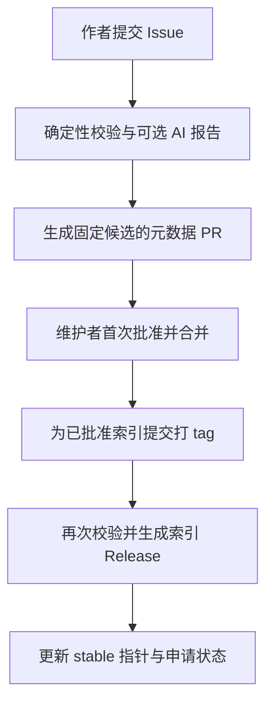

# 插件商店双渠道索引与 GitHub 自动审核发布评估

日期：2026-10-01。分支：`dev`。状态：调研与设计提案，未实现。

本文补充 [插件商店可行性评估与功能设计](插件商店可行性评估与功能设计.md)，集中回答工坊/GitHub 双渠道、轻量 DLL 的安装形态，以及类似 AstrBot 的入库审核和索引发布自动化。已结合 [设计哲学](../../../Design-Philosophy.md)、[附属 Mod 开发者指南](../../../Phinix附属Mod开发者指南.md)、当前加载代码与公开的一手资料评估。示例字段、工作流、目录和工期均为建议，不表示仓库已经具有这些能力。

2026-10-02 补充 [安全性与维护成本独立评估](插件商店安全性与维护成本评估.md)。用户确认开放作者申请、保留首次人工批准与后续自动检查，并要求默认源 GitHub 插件提供可审查源码；确定性检查通过不等于代码安全，额外安全投入按独立评估中的建议与待决事项处理。

2026-10-02 补充 [安装目录、发现加载与官方插件拆分评估](插件安装目录与发现加载及官方插件拆分评估.md)：后续只拆红包、人才贸易，基础 Chat/Trade/Inventory/LegacyAdapter 暂留主包；推荐独立本地模组而非自动写入主包目录，复用模块依赖排序并加强程序集解析。官方业务包的 Release 与官方索引发布仍是两个职责。

## 1. 结论与已确认范围

术语统一见 [术语与功能分层](术语与功能分层.md)：内置功能模块提供 Phinix 基础功能，可选扩展提供按需功能；商店条目、扩展包和运行时扩展模块是不同对象。官方维护不等于官方索引收录，默认索引中的社区作品仍由社区作者维护。本文自动化审批的是条目/发行候选，不是赋予代码官方身份或特权。

**可以建设，建议复刻 AstrBot 历史流程的组织方式，自行实现适合 RimWorld/.NET 的校验器。** 首版无需自建插件托管平台或常驻机器人服务，GitHub Issue Forms、Actions 和 Release 足以组成基本流程。

已由用户确认：

- 游戏内客户端商店为首版目标；服务端插件暂时手动安装。
- 默认 GitHub 索引由 Phinix 维护，支持自定义源。
- 工坊模组索引工坊链接，GitHub DLL 插件索引作者 GitHub 仓库及发行资产。
- 官方仓库只发布审核后的索引；DLL/模组包由作者仓库发布。
- 首次入库人工批准；后续版本自动检查，通过后更新索引。
- 默认源允许任何作者申请，审核后收录；GitHub 插件必须提供可审查源码，无源码 DLL 不收录。工坊审核范围单独标注。
- 工坊只提供链接，前置依赖交给 Steam；GitHub DLL 包由作者声明版本号和依赖，后续评估聚焦具体工程实现。
- 下载支持商店专用 HTTP、SOCKS5 代理。
- 本阶段仅研究并保存设计文档。

建议的完整关系：

| 对象 | 谁维护或下载 | 官方审核/自动化的作用 |
| --- | --- | --- |
| 插件条目及渠道身份 | 作者申请，Phinix 首次批准 | 确认来源、加载方式、兼容声明与发行规范 |
| GitHub 编译产物 | 作者 Release；商店下载 | 检查具体版本与资产，固定身份、哈希和依赖 |
| 工坊内容 | 作者上传，Steam 下载 | 审核条目并跟踪元信息；不能保证审核每次工坊二进制更新 |
| 官方索引版本 | Phinix 索引仓库 | 校验后打索引 tag，发布对应的完整索引快照 |
| 玩家已安装版本 | 玩家本地 | 索引更新仅产生可用更新，不等于自动覆盖安装 |

首次人工批准的是一个明确的发行来源和候选版本，后续自动检查遵循该来源已批准的规则。**“官方收录”“版本通过自动检查”“在游戏内验证过”必须分开显示**，不能合并为一个“官方安全认证”。

## 2. AstrBot 实际采用了什么

### 2.1 历史 Issue 入库流程有公开证据

在 AstrBot 的历史插件申请记录中，可以观察到提交结构化插件信息、机器人初审、维护者批准，以及另一机器人同步到插件索引 PR 的过程。例如 [Issue #6918](https://github.com/AstrBotDevs/AstrBot/issues/6918) 和 [Issue #5420](https://github.com/AstrBotDevs/AstrBot/issues/5420) 展示了 `astrpluginreviewer[bot]`、`plugin-maintainer-approved` 和 `astrbot-plugin-copybara[bot]` 的处理记录。初审报告也提示其覆盖有限、不能替代人工审核。

可借鉴的流程是：作者提交申请 → 机器人生成报告 → 维护者批准 → 机器人整理索引变更并合并。**这些记录没有证明 AstrBot 使用“索引 tag → GitHub Release”作为最后发布步骤。** 本文的 tag 发布属于 Phinix 的额外设计。

### 2.2 当前 AstrBot 已转向 Cloud

[AstrBot_Plugins_Collection](https://github.com/AstrBotDevs/AstrBot_Plugins_Collection) 的 README 现已标记旧仓库过时，并引导向 AstrBot Cloud 提交；[当前发布指南](https://docs.astrbot.app/dev/star/plugin-publish.html) 也采用 Cloud 流程和插件元数据。因而不能把旧 Issue 机制描述为 AstrBot 当前唯一的发布方案。

本次建议借鉴其历史机制，原因是 Phinix 已选择 GitHub 索引，并不需要先建设独立账户和发布平台。未核实到上述两个机器人完整的部署源码、权限设计及内部审核规则，不能声称可以原样复制机器人实现。

### 2.3 公开索引仓库的自动化可以参考

| 已查到的工作流 | 可借鉴内容 | 对 Phinix 的限制 |
| --- | --- | --- |
| [validate_json.yml](https://github.com/AstrBotDevs/AstrBot_Plugins_Collection/blob/main/.github/workflows/validate_json.yml) | 检查 JSON 和仓库链接可访问性 | 链接可访问不能证明资产正确、依赖可解或代码可信 |
| [transform-plugin-data.yml](https://github.com/AstrBotDevs/AstrBot_Plugins_Collection/blob/main/.github/workflows/transform-plugin-data.yml) | 定时生成/更新插件数据 | 要增加固定发行资产、哈希及审核来源记录 |
| [validate-plugin-smoke.yml](https://github.com/AstrBotDevs/AstrBot_Plugins_Collection/blob/main/.github/workflows/validate-plugin-smoke.yml) | 定时/PR 检查并保存报告 | Python 插件验证方式不能直接证明 RimWorld DLL 可加载或游戏行为正确 |

复刻流程不要求复制其代码。若后续实际复用旧索引仓库中的代码，应另行核对文件许可证；该仓库标注 AGPL-3.0。本评估不复制其实现。

## 3. 来源、载荷与加载方式必须分别记录

### 3.1 “功能少”不是分发格式的判断条件

只做 patch 的 DLL 也可能有 Harmony 初始化、其他模组依赖、第三方程序集、配置和静态状态。应按作者真实发行物决定来源，按真实入口决定加载方式。

| 维度 | 可选值 | 决定什么 |
| --- | --- | --- |
| 分发来源 `distribution.kind` | `steam-workshop` / `github-release` | 从哪里获取、谁负责下载 |
| 载荷 `payloadKind` | 标准模组 ZIP / DLL 加清单 / Steam 管理内容 | 如何检验、安装和恢复 |
| 集成类型 `integrationKind` | `phinix-extension` / `rimworld-mod` | 是否具有 Phinix 模块生命周期和模块 ID |

普通 RimWorld patch 模组不必强行声明 Phinix 模块。Phinix 扩展关闭开关也不等于撤销普通模组的 Harmony patch 或启动副作用。UI 应区分“模组已安装”“模组已启用”“Phinix 扩展已激活”。

### 3.2 GitHub 纯 DLL 的推荐处理

**优先推荐作者发布一个很小的标准模组 ZIP；纯 DLL 也可以收录，但必须附带可检验的安装清单。** 对确定只需要程序集的插件，商店可依据清单生成最小本地模组壳：独立目录、`About/About.xml`、顶层 `Assemblies`、安装记录。

这样既保留 GitHub DLL 的发布习惯，又能利用现有模组发现机制。需明确稳定的 packageId、模块 ID（如适用）、程序集名、入口方式和加载顺序。不能认为“下载到一个 DLL”就能自动执行：没有对应入口或依赖的库程序集仍只是库。

当前 [Client.cs](../../../../Client/Source/Client.cs) 探测活跃第三方模组的顶层程序集目录；[ExtensionAssemblyLoader.cs](../../../../Common/Utils/Framework/ExtensionAssemblyLoader.cs) 顶层扫描并跳过已加载的同名程序集。这个机制不支持任意按包建立的用户子目录自动发现，也不支持热替换。

另一条路线是新增独立 DLL 安装区和通用启动探测契约，但需额外解决模组启用、包隔离、资源、排序及重名问题，成本更高。首版不建议因为 DLL 体积小就引入第二套加载模型。商店功能模块使用通用抽象；官方商店和第三方商店使用同一路径，符合扩展模块共享契约和生命周期的原则。

有 Defs、语言、贴图、多版本 LoadFolders 或复杂库布局的发行物，应要求作者提供完整模组包，不由商店猜测布局。纯 DLL 加清单的可行性仍需拿真实样例在 RimWorld 1.6 验证。

### 3.3 同一插件同时提供两个渠道

允许条目声明替代来源，但首版安装时只选择一个渠道。使用稳定逻辑条目 ID 关联来源，同时分别记录 RimWorld packageId、Phinix ExtensionId 和程序集身份。发现本地已装工坊版本时，不再平行安装 GitHub 副本；跨渠道迁移应单独提示，不能把相同显示名称当作身份依据。

不允许从索引中用后加入的同名条目覆盖另一个源的已安装包。自定义源的依赖解析与信任范围沿用主文档约定，官方审批不自动延伸到自定义源。

## 4. 双渠道索引的建议字段

所有条目共享：稳定 `id`、名称、作者、描述、许可证/分发声明、packageId、集成类型、兼容范围、依赖、首次审批来源、审核范围。两种来源保留各自的版本语义，不能强行统一为可精确锁定的 SemVer。

以下是结构示意；尖括号字符串及数字仅为占位，不可作为可下载的正式记录。生产校验器应拒绝占位符。

GitHub 条目示例：

```json
{
  "id": "example.patch",
  "packageId": "example.author.patch",
  "integrationKind": "phinix-extension",
  "extensionIds": ["example.patch.module"],
  "version": "1.2.0",
  "compatibility": {"rimWorld": ["1.6"], "phinixApi": "<approved-range>"},
  "distribution": {
    "kind": "github-release",
    "repository": "<owner>/<repo>",
    "repositoryId": "<github-repository-id>",
    "ownerId": "<github-owner-id>",
    "releaseId": "<release-id>",
    "tag": "v1.2.0",
    "sourceCommit": "<full-commit-sha>",
    "assetId": "<asset-id>",
    "assetName": "ExamplePatch.dll",
    "payloadKind": "dll-with-manifest",
    "sha256": "<64-hex-digits>",
    "sizeBytes": 123456
  },
  "installation": {
    "layout": "generated-mod-shell",
    "assemblyNames": ["ExamplePatch"],
    "entryKind": "phinix-module"
  },
  "dependencies": [{"id": "example.common", "range": ">=1.0.0 <2.0.0"}],
  "review": {"scope": "source-and-release-metadata", "updatePolicy": "automatic-checks"}
}
```

工坊条目示例：

```json
{
  "id": "example.workshop-mod",
  "packageId": "example.author.workshopmod",
  "integrationKind": "rimworld-mod",
  "compatibility": {"rimWorld": ["1.6"]},
  "distribution": {
    "kind": "steam-workshop",
    "publishedFileId": "<decimal-workshop-item-id>",
    "url": "https://steamcommunity.com/sharedfiles/filedetails/?id=<item-id>",
    "observedUpdatedAt": "<utc-timestamp>"
  },
  "dependencies": [],
  "review": {"scope": "listing-and-metadata", "updatePolicy": "metadata-only"}
}
```

工坊 ID 用十进制字符串保存，避免跨语言数值精度问题；正式收录应验证条目所属游戏。GitHub 身份同时绑定仓库/所有者 ID，而非只存可重命名的 URL。`sourceCommit` 记录来源，不证明 DLL 就是该源码编译结果；源码与二进制的一致性需要可复现构建或可验证的构建证明另行支撑。

正式索引还应包含清单摘要、首次审批人及时间、申请链接、版本检查报告摘要、撤回状态。`review.scope` 使用受控枚举，不能由作者随意填写“官方验证”。架构、目标运行时与依赖范围应由完整 schema 限定，主文档中的包清单继续作为基础。

## 5. 工坊链接与 GitHub 依赖的边界

### 5.1 工坊仅提供链接

用户已确认简化范围：商店显示工坊条目，点击后在 **Steam 游戏内浏览器（Steam Overlay）** 打开页面，由玩家自行订阅；商店不下载工坊内容，订阅、下载及前置依赖使用 Steam 自身机制。不接入 SteamUGC，也不维护工坊下载等待状态。

Steam 官方提供 `ISteamFriends::ActivateGameOverlayToWebPage` 作为网页入口；调用前检查游戏已有 Steam 上下文和覆盖层可用性。此入口与 SteamUGC 分离，返回值不提供订阅结果，不能将点击或覆盖层关闭显示为安装完成。实际 RimWorld 1.6 C# 绑定、不可用条件与降级建议见主文档第 9.1、15.2 节；本次只确认 API 路径，没有验证游戏内调用。[Steam 覆盖层网页入口](https://partner.steamgames.com/doc/api/ISteamFriends#ActivateGameOverlayToWebPage)

[SteamUGC 官方 API](https://partner.steamgames.com/doc/api/isteamugc?language=english) 的订阅、下载和安装状态能力属于早期调研依据，不纳入当前商店实现/验收。工坊链接不能提供 GitHub 固定发行资产式的历史版本安装保证。

工坊的更新时间可用于提示内容变化，不能冒充发行版本或固定内容哈希。Steam 的子条目/依赖查询也不能直接充当 Phinix 版本范围解析器；集合子项、游戏/DLC 依赖和模组依赖需要分别理解。

### 5.2 GitHub 依赖由作者显式声明

GitHub 包作者声明包版本、依赖包及版本要求，商店仅递归解析允许源中的 GitHub 包，固定具体版本和哈希；处理缺失、环路、版本冲突和已有包，不从 DLL 反射猜出完整依赖。

示例：A（GitHub）→ B（GitHub）→ C（工坊）。商店处理 A/B 的下载计划，遇到 C 时显示作者声明的工坊链接和前置提示，不继续解析 C 的前置，也不监控 Steam 安装。A/B 文件安装成功不表示 C 已满足；启用/排序仍由玩家和原生模组机制处理。元数据和 About 声明需保持一致。

本地 GitHub 文件可暂存、原子提交或回滚；Steam 订阅属于外部状态，不能纳入同一个文件事务。GitHub 安装失败时不擅自撤销玩家的 Steam 订阅。下载完毕也仍需模组启用、排序和重启，不承诺游戏内热加载。

### 5.3 代理仅覆盖商店自己的请求

HTTP/SOCKS5 配置用于索引请求、GitHub API、Release 资产和商店重试；不得改变全局代理或游戏服务器连接。工坊网页在 Steam 游戏内浏览器打开，页面访问和实际下载使用 Steam 自身网络配置，商店代理不会自动作用于它们。

需要保留主文档的 net472/Unity 运行时验证：HTTP CONNECT、SOCKS5 远端 DNS/认证、重定向、取消及超时。索引和资产域名可不同，代理不能只覆盖最初 URL。配置凭据不进入索引、上传报告或日志。

## 6. 官方索引仓库的建议组成

推荐单独建立索引仓库，避免把外部插件的入库操作和 Phinix 框架源码发布混在一起。以下只描述未来目录，不在本次创建：

```text
.github/ISSUE_TEMPLATE/plugin-submit.yml    首次申请表
.github/workflows/validate-submission.yml  申请/元数据校验与报告
.github/workflows/monitor-releases.yml     跟踪已批准来源的新发行
.github/workflows/publish-catalog.yml      生成并发布完整索引
schema/                                   版本化格式定义
packages/<stable-id>.json                  审核中的条目源数据
reviews/                                  绑定候选指纹的审批记录
scripts/                                  官方维护的可信校验器
```

官方 Release 发布 `catalog.json`、内容校验文件和必要的格式说明；另有 `stable.json` 指向最近一次完整成功的 Release 及其索引摘要。**不上传作者 DLL，不把 CI 临时 artifact 当作正式发行。** 客户端消费已发布快照，不直接把开发分支上的编辑当作批准结果。

当前 [.github/workflows/mono.yml](../../../../.github/workflows/mono.yml) 是构建与验证工作流，未提供上述申请、审核、索引 tag 发布流程。它的临时构建产物也不应成为作者插件的永久下载链接。

## 7. 首次入库：人工批准绑定具体候选

建议把申请、审批和发布设计成可追踪的独立状态：



1. 作者提交来源、作者身份/授权说明、许可证、兼容版本、加载入口、依赖清单及准确的 Release/工坊条目。默认源 GitHub 申请必须同时提供可审查源码和编译产物，并定位候选对应的源码 commit；不收录无源码 DLL，也不让客户端临时编译。
2. 校验器解析数据，获取来源身份，下载 GitHub 候选资产到隔离暂存区，仅做结构/元数据检查并计算摘要。工坊申请检查条目与声明，不标记二进制审核通过。
3. 可选 AI 静态阅读源码和报告。记录读取的 commit、文件覆盖、截断、超时与发现，不能让模型直接授予官方入库权。
4. 机器人生成只含条目元数据的 PR；报告绑定候选指纹：结构化申请摘要、仓库身份、commit、清单及资产哈希。人工在这个固定候选上批准。
5. Issue 被编辑、资产替换、PR 内容变化时，旧批准不能继续适用。提交前重新核对指纹；分支规则要求变更后重新审批。
6. 合并后进入待发布集合；维护者可手工推送索引 tag 批量发布。只有 Release 完成并且 stable 指针更新，才将申请标为“已发布”。合并不能直接等同上架成功。

若采用批准标签，应核验操作者具有维护权限，并把标签转换为绑定候选指纹的审核记录。普通评论中的“approved”、机器人生成的文本、过期标签都不能作为授权。

## 8. 后续版本：自动检查、自动更新索引

用户已选择后续自动更新，不应把每个普通版本又设计成人工签字。首次审批记录定义以后允许自动跟踪的范围。

### 8.1 GitHub 发行版本

建议每六小时轮询已批准的仓库，并提供手动重试入口；按规模调整频率和 API 缓存。无需要求每位作者配置 webhook 或交出令牌。作者自己的 tag 可以触发其编译发布，但**官方收录等待正式 Release 及完整资产**，不因 tag 存在就认为 DLL 已发布。跳过 Draft，稳定渠道默认跳过预发行，不能只信 `latest` 返回值。

每个新版本依次检查：来源仍在批准范围内、对应可审查源码可获取、版本递增、兼容声明、清单和资产一致性、结构/运行时元数据、哈希、依赖可解。检查源码关联不等于已证明 DLL 对应源码或已重新人工审查代码。资产/源码暂未完整时保持待检查，避免误判永久失败。合格版本进入候选索引，失败版本保留旧稳定版本并展示具体原因。

对多个相关版本，先在候选集合验证依赖闭包；A 依赖 B 的新版本时，应一起发布可解集合，或等待 B 合格。不能发布一个引用尚不存在版本的正式索引。

| 变化 | 建议处理 |
| --- | --- |
| 同一批准来源的正常新版本 | 自动检查；通过后自动更新索引 |
| 包新增/改变依赖、兼容范围或声明的程序集 | 自动重算、复验；仍在批准规则内可自动处理，越界则暂停 |
| 渠道、仓库身份、所有者或加载方式改变 | 暂停自动收录，重新人工批准来源/规则 |
| 同一版本的 tag、资产或已接受哈希改变 | 拒绝覆盖已接受记录，要求新版本或明确修复审批 |
| 仓库转移、来源删除、批准撤销 | 停止跟踪并标明原因；不静默改用同名替代来源 |
| 作者删除旧发行资产 | 保留审计记录，标记不可下载；不能保证历史版本仍可恢复 |

计算新资产哈希能建立后续下载校验，但不能证明代码无害。作者清单中的哈希只是输入，官方应对实际获取的字节自行计算；已接受版本的摘要不能随远端替换而自动刷新。

### 8.2 工坊更新

工坊条目可定期自动检查可访问性、作者/条目身份及更新时间，更新索引元信息。**这类更新的审核范围仍是条目和元信息。** 若没有可验证的新内容快照和隔离检查路径，就不能将工坊的新版本描述为“DLL 已通过自动审核”。玩家可能经 Steam 收到作者更新，独立于官方索引的发布时间。

对需要精确版本或高确定性恢复的 Phinix 扩展，应优先建议作者同时提供 GitHub 固定发行资产。选择 GitHub 后仍要避免与现有工坊副本重复安装。

### 8.3 目录更新和本地升级分离

通过检查后，机器人可以自动创建索引提交和索引 tag，并调用发布过程。玩家看到“新版本可用”，不会因为后台目录更新而直接覆盖正在运行的程序集。安装升级、启用、服务端部署与存档兼容仍遵循主文档的边界。

## 9. GitHub Bot 和 tag 发布具体怎么接

### 9.1 首版使用 Actions，GitHub App 可后置

机器人只是用户看到的身份和处理结果，不必首先部署一个常驻服务。Issue 事件启动官方校验器，Actions 写报告、创建元数据 PR；定时事件检查已批准来源；tag 或显式调用负责发布。GitHub 官方支持相关 [事件类型](https://docs.github.com/en/actions/reference/workflows-and-actions/events-that-trigger-workflows)。

推荐权限按任务拆分，默认只读：

| 任务 | 主要输入 | 所需写权限及限制 |
| --- | --- | --- |
| 候选校验 | 不可信 Issue/作者资产 | 校验阶段无仓库写权限，不执行作者代码 |
| 回报结果 | 官方校验器产生的结构化报告 | `issues: write`，只更新报告和状态 |
| 整理元数据变更 | 已验证的候选记录 | `contents: write`、`pull-requests: write`，限定索引变更 |
| 发布索引 | 受信任提交及重新验证结果 | `contents: write`，仅发布目录快照和指针 |

具体设置需结合 [GITHUB_TOKEN 权限指南](https://docs.github.com/en/actions/tutorials/authenticate-with-github_token) 和仓库分支规则确认。`contents: write` 本身不能按文件目录收窄，表中的“限定索引变更”需要可信脚本的路径白名单及分支规则约束，所以独立索引仓库更合适。GitHub App 适合跨仓库触发、独立机器人身份或成熟规模，可将权限限定为指定索引仓库；其密钥留在官方可信发布任务。不是首版先决条件。

### 9.2 不要掉进“机器人打 tag 却没有发布”的陷阱

GitHub 的 [工作流触发说明](https://docs.github.com/en/actions/how-tos/write-workflows/choose-when-workflows-run/trigger-a-workflow) 规定，`GITHUB_TOKEN` 引发的多数事件不会再次启动工作流。因此不能假定“Actions 用自己的 token 推 tag → 另一条 `push.tags` 工作流自然运行”。

建议首次入库由维护者手工打 tag，常规后续更新由一个编排工作流先验证、生成索引提交和 tag，再直接调用可信的可复用发布工作流。也可显式 `workflow_dispatch`；必要时采用受限 GitHub App token。选择一个明确路径，不依赖隐含的多级事件链。

当前文档还列出了一个需要注意的例外：`GITHUB_TOKEN` 创建/更新 PR 时，部分 PR 事件会生成需人工批准运行的工作流。因此不能同时声称“机器人 PR 必然不触发 CI”或“机器人 PR 必然无人值守通过”。要让后续版本保持自动检查，校验/发布编排应明确调用检查；若分支规则要求完整 PR 流程并希望自动触发其 CI，再使用受限 App token，且不可绕过必要检查。

官方索引 tag（如 `catalog-2026.10.01.1`）只代表目录快照；作者 tag（如 `v1.2.0`）只代表作者发行版本，二者不要求一致。GitHub [Release API](https://docs.github.com/en/rest/releases/releases) 支持创建、上传和发布，技术上可实现“索引 tag 自动发布”。

## 10. 自动检查究竟能覆盖什么

### 10.1 首版确定性检查应作为发布门槛

- Schema、唯一 ID、合法版本与范围、允许的来源/下载位置、条目所属游戏、声明的许可证和分发权限。
- Release/asset 身份、实际大小和 SHA-256、清单对应关系；严格约束 HTTPS 与重定向目标，拒绝私网地址及任意自定义下载脚本。
- ZIP 路径穿越、绝对路径、符号链接、文件数量/解压大小上限、禁止覆盖其他包；DLL 模式只写规定位置。
- 静态读取 PE/程序集元数据、目标框架及引用；不调用插件入口或 `Assembly.Load` 执行候选。缺少可验证的运行时兼容声明则失败。
- 模组 packageId、模块 ID、程序集身份冲突，以及直接/传递依赖、环路和版本范围；已有 Phinix/游戏运行库不得随包覆盖。
- 首次审批候选指纹与最终记录一致，自动更新来源未越界，相关依赖集合在同一个正式快照里可解。

API 版本、程序集版本与包版本不是一回事；`DependsOn` 不能替代发行清单。即使所有静态检查通过，也不能证明 Unity/RimWorld API 调用、主线程要求、协议能力或存档迁移行为正确。

### 10.2 AI 初审提供线索，不能当作唯一门槛

AI 可辅助检查可疑网络/文件操作、明显宿主耦合、框架生命周期和指南偏离，以及生成维护者可读摘要。报告必须给出具体代码位置与覆盖说明，源码/Issue 内的文字当作不可信数据，不接受其指示修改审批或执行命令。

首次人工入库以确定性检查加人工判断为基础；后续符合批准范围的版本按确定性规则自动更新。严重 AI 发现可以标记待复核，但需有明确原因，不能让模型给出的模糊分数变成随意阻断。AI 超时不能伪造通过：若其被配置为门槛则排队重试；若仅为辅助则标记报告缺失，并按确定性结果处理。

推荐首版先完成非 AI 机器人流程，再增加 AI 辅助。模型调用有额外费用和配额，需限制申请频率、文件/输入规模与重试；不在本评估中承诺具体价格。

### 10.3 外部代码和发布权限必须隔离

外部仓库的构建不只是“编译 DLL”：MSBuild、脚本和测试都能执行代码。默认初审只下载资产并静态检查。若后续增加隔离构建/测试，应无官方发布密钥、无持久 checkout 凭据、无共享高权限缓存，并限制访问和输出。

带权限的工作流只运行官方维护的校验/发布代码，不 checkout 或执行申请者的工作流/脚本。Issue 字段用结构化方式传入解析器，不能拼接到 shell 命令；校验报告本身也不能成为执行指令。[GitHub Actions 安全指南](https://docs.github.com/en/actions/reference/security/secure-use) 和 [pull_request_target 专项说明](https://docs.github.com/en/actions/reference/security/securely-using-pull_request_target) 支持这一隔离原则。

游戏独立测试只能覆盖清单、依赖、安装事务与网络逻辑；真正的加载、patch 和资源兼容还需 RimWorld 1.6 测试环境。本次没有下载/运行作者插件，也没有进行游戏内验证。

## 11. 发布、并发与撤回

生成索引时固定输入提交、候选记录和规范化序列化方式，保存校验报告及来源摘要。先构建并检查完整快照，再创建 Draft Release、上传全部文件、发布，最后更新 stable 指针。指针更新前客户端继续使用上一份稳定快照；失败不发布半份目录。

发布任务串行处理或使用 revision 检查，避免较慢旧任务覆盖较新目录。同一 tag 重试必须得到相同内容；不同内容不得覆盖同一发行身份。固定 GitHub 资产哈希可以检测变化，但普通 tag/Release 默认不能被当作绝对不可变存储；可进一步评估 GitHub 的 [不可变 Release 功能](https://docs.github.com/en/code-security/concepts/supply-chain-security/immutable-releases)。

只有哈希校验文件且文件和索引同处一仓库，能够检测传输/文件错配，不能防止同一发布账户被攻破后两者一起改写。若威胁模型要求独立真实性验证，可后续增加客户端固定公钥的签名目录、密钥轮换及自定义源信任策略；不得把“有 SHA-256”写成“已证明官方身份”。

撤回可疑条目时发布新目录，阻止新安装并提示已有用户；不自动删除运行中的文件。回退目录版本不保证工坊内容或作者已删除的资产可回退，也不能自动逆转存档、配置和服务端协议变化。重大兼容变化应清楚标注需手动处理，不能因索引检查通过而隐去。

## 12. 分阶段投入与验收

以下为增量设计估算，假设已有主文档中的商店下载、清单和依赖基础，不是承诺工期。单位为熟悉仓库的开发者工作日，集成部分可能与主文档估算重叠，不能机械相加。

| 新增工作 | 估算 | 验收重点 |
| --- | --- | --- |
| Issue 表单、schema、确定性检查、首次审批记录 | 3–5 | 编辑申请使旧候选失效；无权限用户不能批准 |
| 已批准来源监控、版本检查及依赖候选集合 | 4–7 | 普通更新无需人工批准；来源改变暂停；同版本资产替换拒绝 |
| 索引 tag/Release/stable 发布与重试 | 2–4 | 自动 token 路径实测；失败保留旧指针；并发不会倒退 |
| 权限隔离、报告和异常回归 | 3–6 | 作者代码不能接触发布凭据；可追踪审批和发行输入 |
| 可选 AI 初审 | 额外 2–4 | 限流、覆盖说明、超时及提示注入处理 |
| 客户端双渠道展示与纯 DLL 模组壳 | 额外 2–5 | 无重复副本；真实入口/启用/重启验证 |

确定性索引自动化约 **12–22 工作日**；若还需要 SteamUGC 集成、构建沙箱、目录签名或新的 DLL 探测契约，需要另行评估。推荐顺序：先验证一个工坊条目和一个 GitHub 轻量插件，再上线首次入库流程，再打开后续自动收录，最后加入 AI 辅助。

后续实现必须验证的具体场景：

| 场景 | 期望结果 |
| --- | --- |
| 人工批准后作者编辑 Issue 或替换候选 | 旧批准失效，不能发布变化后的内容 |
| 正常新 Release 检查通过 | 自动进入新索引，已装客户端仅收到更新提示 |
| GitHub A 依赖尚未批准版本的 B | 等待可解集合，不发布断链目录 |
| 机器人用 GITHUB_TOKEN 创建 tag/PR | 使用明确发布调用路径；不陷入等待不会到来的事件或人工 CI 批准 |
| 作者仓库转移、同版本资产变化 | 暂停/拒绝，保留原记录与原因 |
| Steam 游戏内浏览器打开条目，但玩家尚未订阅 | 商店只提供入口/提示，不能宣布下载完成或前置已满足 |
| Steam 上下文/覆盖层不可用或暂未就绪 | 解释原因并允许重试；不静默改为外部浏览器，不进入下载等待状态 |
| 工坊与 GitHub 本地副本具有同一身份 | 提示冲突，不自动重复安装 |
| Release 上传中断或两任务并发发布 | 旧稳定快照仍可用；成功版本不会被旧任务覆盖 |
| HTTP/SOCKS5 能访问索引但资产重定向失败 | 明确报告失败，可重试；游戏联网不受配置影响 |

## 13. 仍需在实施前确定的细节

不影响本次可行性结论，但正式实施前需要选定官方索引仓库及维护权限、首批真实插件样例、首版平台范围、批准的版本/兼容规则，以及是否将 AI 设为必需步骤。建议默认 AI 辅助、标准小 ZIP 优先、纯 DLL 加清单受控支持、安装后启用并重启。

当前不需要作者源码在官方仓库重新编译，也不需要 Phinix 托管 DLL。上述两个做法都会改变已确认的发行责任及投入，不能作为“模仿 AstrBot”的隐含前提。

## 14. 本次验证与限制

本次阅读本地架构/开发文档、加载相关实现和现有构建工作流，并查询 AstrBot 公开记录、官方工作流及 GitHub/Steam 官方资料。已区分公开事实、根据 API 的推断和 Phinix 设计建议。

交付仅为 Markdown 文档及主文档链接同步；未创建机器人、工作流、外部 Issue/PR/tag/Release，未安装插件或改动运行时代码。文档执行格式、相对链接、JSON 示例与代码围栏检查。GitHub 权限/事件链、游戏 Steam 绑定与覆盖层入口、Unity 网络运行时和真实插件加载仍需实施阶段实测，不能从本次调研推导为已验证能力。

本次执行的 Git 格式检查：

```bash
git diff --check
git diff --no-index --check /dev/null docs/branch-local/dev/plugin-store/插件商店可行性评估与功能设计.md
git diff --no-index --check /dev/null docs/branch-local/dev/plugin-store/插件商店双渠道索引与GitHub自动审核发布评估.md
```

两份文档仍是未跟踪新文件，因此额外执行 `--no-index` 检查；无诊断的退出码 1 表示存在新文件差异。另通过 `python3 -` 的临时只读校验检查两份文档的本地链接目标、JSON 语法、围栏配对、行尾空格和末尾换行，全部通过。本次未运行构建或游戏测试，因为没有实现改动。
