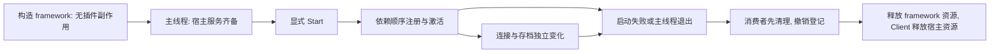

# 客户端基础设施收尾与三仓拆分计划

更新：2026-10-08。分支：dev。英文：[Client infrastructure and three-repository plan](ClientInfrastructureFollowUpPlan.md)。

本文件是当前统一排期，替代此前以商店未完成、服务端兼容试点为前提的 P0—P6 顺序。旧专项文件用于查设计细节；与本文件冲突时，以本文件及实际代码为准。本文是实施计划，不表示已引入 DI/Stateless 或已完成拆仓。

## 按用户决定关闭 F4（2026-10-08）

F4 按用户确认的范围检查点结束。本决定覆盖此前“整模组/主题事项关闭后才能结束 F4”的表述。F5 暂停推进，须用户明确授权才开始；不据此拆仓、进入新阶段、提交或发布。

- 取消整模组 ZIP 安装方向及 F4-F2c 整模组收窄方案。本轮只改文档，现有旧安装器代码未删除或禁用；不宣称已经移除代码或修好其已知元数据扫描边界。
- 第三方主题选择与商店下载主题转为后续增强评估。暂保留现有主题行为，尚未实现选择器、载荷格式、目录支持或下载能力。见 [主题与商店后续评估](Theme-Store-Future-Evaluation.md)。
- 官方客户端模块和维护示例已使用 Compose。F4-H 已加入带 Obsolete 的客户端源兼容适配器和实际登记旧模块的单次启动迁移提示，共享服务端 Register 不弃用；作者指南/示例入口及可信元数据/验证器同步。见 [F4 收尾证据](F4-H-Closure-Handoff.md)。
- 客户端组合契约维持 1.9；首个稳定弃用版本计划为宿主 0.9.8，条件满足后在宿主 1.0 / 抽象 2.0 移除旧入口。本轮未发布或提升版本。独立红包/人才贸易入口迁移和硬移除门槛作为明确的后续工作保留，红包业务优化仍暂缓。
- 关闭阶段不等于虚构全部游戏测试通过；F4-G/F4-H 没有新增逐项游戏结果。H 切片窄回归通过；后续 dev 保存点全量构建、31 项输出和 14 个验证器来源复核也通过，但不代表游戏验收。保留已有提交及并行修改。


## 1. 本轮目标与基线

商店主体已经交付：托管 DLL、工坊索引、GitHub/CF 访问切换、版本与升级、安装/启停/卸载、本地化、正式 UI、维护方和安装方式标识均已有实现；用户确认新增界面验收通过。此次交接已知代码基线为 `f312c38940c8026f3f680089cf99b039402dc025`，包含“红包、人才贸易不再内置”的一次性升级提示；其实际弹窗与重启不重复仍需人测。该提交仅用于识别已有成果，不要求新对话退回它；实施时重新核对最新 HEAD、远端和并行文档提交。

接下来集中完成最后一批客户端基础设施：生命周期整理、DI、Stateless、小范围测试及必要的 HTTP 整理，然后把现有 Rework 拆成共享、Client、Server 三个仓库。共享源码以 Git submodule 固定提交消费，不新增 Phinix NuGet SDK 渠道。普通第三方 NuGet 依赖不受这个决定影响。

Server 功能、Server DI、旧客户端兼容插件暂缓。拆仓时允许必要的服务端项目路径、共享引用、Docker 构建上下文和发布入口调整；不把它扩展为服务端业务重构。红包、人才贸易的业务缺陷和独立仓库维护不再阻塞本轮主仓基础设施。

## 2. 收口范围与漏项

| 旧文档提过的事项 | 本轮安排 | 原因或边界 |
| --- | --- | --- |
| 宿主构造与启动分离 | 必做，DI 前完成 | 不能在尚未完成的对象图中激活插件 |
| DI 与插件对象归属 | 必做，先 Chat，再按依赖推广 | 解决装配、订阅、取消和释放；不是替换一个服务字典 |
| Stateless | 必做一条有收益的客户端操作试点，再按证据推广 | 转移规则与副作用、持久提交分开 |
| HTTP/Polly | 纳入检查，按缺口做局部切片 | 已有 async HttpClient 不重复改写；存在同步请求、重复重试或取消缺口才接入 |
| NUnit/NUnitLite | 有限迁移，优先新生命周期/状态机场景 | 保留现有场景和非零退出码；全面换 runner 不作为前置 |
| 主线程与连接/存档代次 | 必做 | 关闭、断线、换档后的回调不能写新环境；GUI/翻译/游戏资源释放仍在主线程 |
| 共享/游戏契约边界及链接源码 | 必做，物理拆仓前清理 | 避免 Common 反向依赖端点；避免新仓仍靠旧目录构建 |
| 依赖版本、Mono 与打包布局 | 必做 | net472 可编译不等于真实游戏可加载；第三方基础库只能有明确的分发责任 |
| 示例插件、索引校验器与宿主清单联动 | 有契约或路径变化时同步 | 作者模板、可信校验副本和真实主包必须一致 |
| 品牌命名整理 | 仅独立整理显示文字和文档 | 不把程序集、moduleId、packageId、存储键改名混进拆仓 |
| SQLite/增量账本/JSON 或日志库全面替换 | 延后，独立评估 | 状态机与容器不解决恢复或事务；没有新证据不追加整套库 |
| Server 功能与旧客户端兼容 | 延后 | 不牵入这轮客户端收尾 |
| AI 作者 CLI/API、AGENTS 与 Skill | 装配契约及拆仓方式稳定后 | 避免教程和构建工具反复跟随未定 API 改写 |
| 热替换 DLL、客户端新增 CI、聊天图片/WebP | 延后 | 不扩大本轮目标；继续遵循现有客户端手动验证和服务端镜像 CI 分工 |

## 3. 推荐顺序

| 阶段 | 实施内容 | 完成门槛 | 人工验收点 |
| :-: | --- | --- | --- |
| F0 基线与依赖清单 | 固定输入提交；记录现有失败；列项目引用、链接源码、游戏/共享类型、候选库及实际输出；备份测试配置和存档 | 能构建现有主包及服务端；原场景不丢失；每个文件和产物有归属 | 当前商店/示例/聊天正常的基线冒烟 |
| F1 生命周期与契约 | 在现有装配下分离构造、注册、激活和关闭；明确宿主、插件、连接、存档、操作的资源归属；设计中立装配接口 | 禁用不构造；失败可清理；依赖消费者先停止；不用容器也能验证 | 启动、退出、断线重连、切换测试存档 |
| F2 DI 环境与 Chat 试点 | 先验证 Autofac 候选在 net472/Mono 的加载/释放/分发；Chat 服务构造函数注入；模块入口集中装配 | 失败回滚、取消、订阅及借用 API 的释放规则通过；第三方样例走同一路径 | Chat 启停、重连、连续进出，确认无重复消息/订阅和错误 |
| F3 Stateless 单次操作试点 | 冻结当前行为表和故障样本；先接商店异步操作状态，不碰其事务/归属检查；核对存储与外部确认边界 | 取消、失败、重复事件、过期回调、停止/重建都可确定重放；无假成功 | 下载取消、断网失败、切换访问方式及重试；安装提交期不提前宣布完成 |
| F4 推广、旧入口弃用与契约冻结 | DI 按 Chat → Inventory → Trade → Store/LegacyAdapter 推进；仅迁有收益的内部状态；补必要 HTTP 与测试切片；更新示例和相关校验工具 | 本轮作者使用的装配/生命周期 API 稳定；运行时依赖、设置与存档边界完整；清理被替代的重复路径 | 商店与示例、库存、交易的增量游戏验收；不宣称旧业务恢复问题已解决 |
| F5 共享源码消费演练 | 在独立临时副本提取共享仓候选；两端用同一个固定 gitlink 提交消费；拆分跨端混合测试；核对嵌套 protobuf 与 Directory.Build 导入 | 干净递归获取可构建；不依赖原工作区/旁边仓库；程序集分发无重复 | 新构建主包加载示例；服务端镜像构建与启动冒烟 |
| F6 物理三仓与交付 | 提取 Client/Server；迁移分支/历史所需内容、发布路径、Docker CI、开发说明和对应测试；固定一组匹配的共享/端点提交 | 两端独立 checkout 可验证；原部署入口迁移清楚；保留回滚记录；共享提交在远端可获取 | 主包加载、GitHub/CF 商店和已装示例正常；现有连接/聊天/交易冒烟 |
| F6-M 扩展管理与商店状态同步 | 共用包/模块状态计算与管理操作入口；变更后通过版本或通知刷新两页；保留重启生效 | 区分整包与单模块、当前与下次启动状态；显示部分停用、等待重启和加载失败；不覆盖其他模块选择 | 两页双向启停、单/多模块、连续操作、失败恢复及重启后状态一致 |
| F7 作者体验 | 更新示例模板、开发者指南及环境检测/构建发布工具，再编写薄 AGENTS/Skill | 新人按同一稳定入口能构建、打包、申请；缺 Git/gh 路线正确处理固定 gitlink | 真实示例制作与正规提交演示 |

默认主线是 F0 → F1 → F2 → F3 → F4 → F5 → F6 → F6-M → F7。库的纯环境试验可以独立做；集成提交按阶段拆开，不把换 DI、状态机、HTTP、持久化和物理路径混在一次提交中。

用户于 2026-10-08 明确取消 F6-S（强制插件签名/可信公钥准入），本轮不实施，也不作为 F7 的前置条件。现有哈希、载荷完整性、兼容性及安装事务检查继续保留。

F6-M 在 F6 后作为独立修复批次实施，并在 F7 开始前验收。先明确包/模块操作语义，复用共享管理服务提供状态快照和变更版本，禁止两页直接互相调用；后台处理完成后通过现有主线程派发更新 UI。涉及包状态和模块设置的联合修改，必须定义校验、提交失败/部分失败恢复及并发过期快照处理，避免已保存意图显示为当前已运行。保留旧配置/状态文件读取和依赖检查。测试覆盖两页分别操作、单模块恢复、多模块部分停用、包禁用叠加模块禁用、切页刷新、重启、操作失败和状态读取失败；2026-10-08 已实现客户端统一控制入口、共享状态版本和明确分离的包/模块操作；自动验证通过；用户于 2026-10-08 确认验收，并表示审查问题已无问题。见 [F6-M 交付记录](F6-M-Management-Store-State-Handoff.md)。F7 尚未开始。

若 DI 候选无法在真实环境分发，不以安装包成功代替验收；保留 F1 已完成的生命周期整理，记录阻塞和替代容器证据后再决定。HTTP 或外置红包事项不作为整个三仓拆分的门槛。不能为了按时拆仓遗漏已经改变的共享契约或运行时依赖。

## 4. DI 的设计交付

Autofac 是当前优先试验对象，不预先锁未经验证的包版本；若局部注册和对象归属收益不足，Microsoft DI 仍可作为较小替代方案。实施前据官方资料、实际 net472 资产和 RimWorld/Mono 试验固定版本及传递依赖。

- 容器实现放 Client 装配层。Common 的 registry 保持中立，公共插件契约不暴露 Autofac 的 DSL 或具体容器类型。
- 普通业务类通过构造函数声明必需依赖。`GetRequiredService` 集中在装配入口或必要过渡适配，不继续散落到每帧 UI 和领域对象。
- 插件运行期与连接期、存档期分别有负责人；连接和存档可独立变化，不强制套进一棵嵌套 scope 树。借用的游戏对象和跨插件 API 不由消费容器 Dispose。
- 构造只建立依赖；注册/激活在宿主服务齐备之后按依赖顺序执行；停用插件不会被容器扫描提前实例化。关闭前先停新工作、取消旧代次、撤销能力与订阅，再在正确线程释放资源。
- 同一普通注册/激活路径覆盖官方与第三方插件。装配接口签名在 F1/F2 产出并在 F4 冻结；旧客户端作者注册入口按 4.1 弃用并制定移除版本，不凭规划名称伪称当前已支持。
- 开发期 API 可以联动整理，不为保留每个旧写法增加永久技术债。若需要破坏性更改，明确升级抽象版本、同步维护的示例/插件和索引宿主配置；不覆盖已发行的固定版本资产，也不把玩家设置/存档清空当作迁移。

### 4.1 原客户端注册入口弃用策略（2026-10-07 补充）

用户明确要求：原插件注册入口标记为弃用（Deprecated），不再作为长期保留的第二条作者路径。新插件、示例、模板和作者文档统一采用新的中立 DI 装配入口；现有客户端插件需要安排迁移，不能继续承诺“无需迁移、旧入口永久可用”。

- **当前 F2 是过渡实现**：Chat 的新 DI 装配仍从 `Register(IExtensionBuilder)` 调用。此次只补充计划，不把现有统一 Register 方法直接标记为 Obsolete，否则新 DI 和未迁移模块会一起被误标。
- **F4 落实作者入口区分及弃用标记**：先形成能明确区分新装配入口与旧注册入口的中立客户端契约/适配边界，再对旧客户端作者 API/适配入口添加 `[Obsolete]` 和清晰的替代说明；必要时对实际使用旧入口的已启用模块给出一次迁移诊断。诊断不得构造被禁用插件或改变激活策略。Common 的中立注册表、发现及注册/激活/停止语义继续统一，服务端入口不随本次客户端 DI 推广一并弃用。
- **迁移覆盖**：依次迁移官方客户端 Chat → Inventory → Trade → Store/LegacyAdapter，同步维护的第三方示例、模板、作者文档及受影响的索引/校验器。独立红包/天赋交易插件在各自仓库安排迁移，也不把旧入口视为永久兼容承诺。
- **临时兼容及移除门槛**：旧入口仅作为迁移期兼容适配，禁止新功能继续依赖它。F4 交付必须声明弃用版本、替代入口和计划移除版本；在维护中的模块/示例迁移、失败回滚/所有权回归和游戏验收通过后，明确执行移除或记录尚未完成的迁移项。不得在 F5/F6 宣称契约已冻结并完成拆分时隐瞒仍保留的双入口。
- **版本与回退**：破坏性移除需升级对应抽象/宿主版本，发布迁移说明并同步插件、示例和校验配置；回退采用匹配版本集。旧插件在移除版本之后需升级才能加载，固定历史资产、玩家设置和存档保持原样。

### 4.2 F4 分批实施与提交门槛（2026-10-07）

用户反馈“没问题了”，记录本轮扩展管理阻塞修复的游戏核查通过；没有逐项完整日志，不推定所有 F3 故障时序已在游戏重现。F3 及修复的自动回归证据保留。进入 F4 前，先把当前已验收 F3/修复整理成明确 dev 回退基线；提交只包含本任务成果并保留并行修改，不推送、不新建分支。本次仅拆分计划，尚未提交或开始 F4 代码。

根据现有入口：Chat 已使用 scope，但仍通过旧 Register；Inventory 入口兼任六类库存 API、注册表、ledger/journal、GameComponent 绑定及 Harmony；Trade 手工构造 pipeline/service/adapter/UI 并借用 Inventory API；Store 在 Activate 构造 controller/界面；LegacyAdapter 负责端点与连接订阅。按以下小批推进，不用一次性重写所有插件。

| 批次 | 交付范围 | 验证及游戏核查重点 |
| --- | --- | --- |
| F4-A 新作者入口 + Chat 接线 | 明确中立客户端装配契约与旧入口适配边界，Chat 走新入口；确定弃用/移除版本方案。保持普通发现、激活、停止路径一致，服务端 Register 不弃用。此批不冻结契约 | 新/旧入口各执行一次、禁用零实例、失败回滚、停止清理；聊天发送接收、重连、禁用恢复 |
| F4-B 示例与 Playtest | 两个维护中的客户端示例改用新入口，给出最小作者样例，更新必要构建/验证切片；为三方普通入口提供证据 | 实际示例构建、契约/manifest 校验、安装→禁用→恢复→卸载→重装；不批量改写历史发布物 |
| F4-C Inventory 装配 | 将普通服务依赖与 UI/设置装配移入 scope；模块保留必要 façade/游戏入口，API 身份与 codec 注册语义不变 | 部分构造失败、借用 API 不释放、服务单实例；打开库存、入库/提取、禁用恢复 |
| F4-D Inventory 存档生命周期 | 明确 ledger/journal 与存档绑定的所有者、切档及退出清理；游戏对象由原游戏生命周期拥有。只移动有必要的接线，不改账本/持久格式或领域算法 | 两个测试存档、返回菜单、重入、旧回调/重复订阅；预约、回滚、重启库存一致 |
| F4-E Trade 装配 | pipeline/service/legacy façade/UI 移入 scope，借用 Inventory API，注册及连接 Start/Stop 明确 | 框架及 legacy 交易回归；报价、拒绝/撤销、成功回执、断线重连；ACK、批次转换与物品归属不变 |
| F4-F Store 装配 | controller/相关服务及视图接入 DI，保留 F3 Stateless 操作模型与原事务服务；本批不再增加状态机行为 | 取消重试、切仓库、安装、模块恢复、卸载重装、退出；不重写下载协议或安装恢复 |
| F4-F2 本地模组检查收窄 | 在 Store 装配验收后独立实施：以实际加载程序集/有效目录为主要冲突证据，区分确定冲突与无法检查；不让无关目录错误自动阻止安装 | 活跃/未启用模组、多版本/条件目录、真实冲突、不可读/损坏 XML、链接/越界及安装前重检；明确未知情形策略，不一律忽略 |
| F4-G LegacyAdapter 装配 | 端点适配器构造及连接订阅归属接入 scope；沿用原协议能力与 wire 行为 | 原版/框架端点选择、重连、依赖禁用、停止；原版交易完整回归 |
| F4-H 弃用落实与契约冻结 | 按 4.1 对可区分的旧客户端作者入口标记 Obsolete，迁移诊断只针对已启用旧模块；统一作者文档/模板及受影响校验配置，列出独立仓迁移状态和版本门槛 | 官方/第三方同一路径、无内部旧入口残留、服务端无意外弃用；全量构建/分发与组合游戏核查 |

每批先核对最新代码和并行改动→实施→窄回归/受影响构建→报告游戏步骤→用户验收→单独提交 dev。复杂批次仍可拆成更多提交，但不能提交半套无法构建的契约与消费者；一批失败不混入下一插件。F4-A 先声明版本方案，F4-H 核验所有迁移及发布约束后才冻结；旧入口移除未满足门槛必须明确留作待办。独立红包/人才仓迁移不能伪称已完成。

HTTP/状态机扩展只在发现具体收益或缺陷时另立批次，不作为每个插件 DI 迁移的附带改造；持久格式、物理搬仓和 F5/F6 拆分仍按原阶段执行。

## 5. Stateless 的首个落点与推广边界

旧计划首先迁移 `Extensions/LegacyRedPacket/Client/RedPacketInventorySending.cs`。该代码已经从主仓移除，属于独立红包仓；旧路径不能继续作为主仓实施清单。

本轮第一候选改为 [ManagedStoreController](../../../Extensions/PluginStore/Client/ManagedStoreController.cs) 的单次异步操作。它已有阶段、取消和快照模型，并有真实生产代码回归，能够在不改服务器、不中断外置插件维护的情况下验证库接入。先确认转移表能减少实际重复，再替换相应内部规则；保留刷新、规划、依赖确认、下载、校验、安装、管理和停止的当前行为。

Stateless 只表达合法转移。Controller 仍负责串行协调、取消和代次校验；快照仍按既有线程保护方式发布。下载进度事件不逐次创建昂贵状态，也不逐缓冲区记日志。

安装与升级的磁盘 journal、文件归属、SHA、恢复以及事务提交继续由现有安装服务负责。一次状态机转移不能宣称跨文件或跨插件原子提交，也不能先发布 Installed 再等待写盘。重启恢复不自动执行有副作用的 entry action。

Trade/Inventory 有清晰状态和故障证据时再逐操作接入。真实 ACK、已发送但结果未知、重复确认和候选状态先持久提交的边界保持。已有托管/恢复缺陷另列问题，不以换库宣称修好。红包是否迁移以后在其独立仓决定，不阻塞 F3。

## 6. 三仓与 submodule 的目标结构

建议保留现有 `Phinix-Rework` 的远端身份承载 Client，减少现有链接与工坊开发入口变化。另建 Shared、Server 仓；具体新仓名称在 F6 前确认，本轮只计划，不创建远端。

| 仓库 | 持有内容 | 不应持有的依赖 |
| --- | --- | --- |
| Shared | 无游戏依赖的共享契约、网络/认证协议、共用工具及确需两端使用的中立运行时；共享业务契约仍按插件归属分目录 | Client/Server 具体实现、Verse/Unity、Autofac、各插件 UI |
| Client | RimWorld 宿主、客户端抽象/游戏 UI 契约、客户端端点实现、内置客户端插件、游戏相关测试和主包打包 | Server endpoint 的链接源码；独立红包/人才/网关源码副本 |
| Server | 现有服务器、服务端端点与插件、服务端测试、Docker 和镜像发布工作流 | Client UI/游戏依赖和客户端 endpoint 链接源码 |

Shared 不只是一个只有 interface 的空工程，也不把所有现在叫 Common 的文件原样搬走。先核对 `NetClient`、`NetServer`、认证和用户管理实现的真实归属，再移动。Chat/Trade 现有 Contracts 在 net472 中混有客户端/游戏引用，先分离游戏相关部分与跨端协议；宿主继续不依赖具体业务插件 Contracts。

两端各通过 `Dependencies/Phinix.Common`（候选相对路径）固定共享仓 commit，用 ProjectReference 构建，不依赖浮动分支、不要求两端永远同一提交。第一次演练采用同一基线；以后每端记录自身兼容的明确版本组合。protobuf 仍为其原供应商子模块，若随共享归属迁入则初始化嵌套子模块，不改其源码解决主仓 SDK 问题。

F5 必查：`SolutionDir` 与 `MSBuildThisFileDirectory`、Directory.Build.props/targets 的导入边界、条件编译/显式 Compile、GameDlls/游戏安装路径、复制目标、客户端编号 DLL、protobuf 路径、Phase35 等跨端链接测试、服务器镜像上下文以及源快照校验器的输入根。

新的 Server 镜像工作流验证后，再停用原仓相同的发布入口，保持唯一发布归属；Client 不新增自动构建工作流。无 Git 的作者工具以后也必须按 gitlink 指定提交获取嵌套源码，不能把共享分支当前最新代码当作固定输入。

Server 在 F5/F6 只做这些消费/构建调整和现有功能验证。新 Server 仓不能依赖旁边保留的 Rework 目录。Docker 镜像名、用户现有连接配置与服务行为不因仓名改变；新工作流所需凭据在迁移时单独配置，不复制进源码。

Index/Gateway/Example/红包/人才仓保持独立，不并入新的三仓。目录访问协议不因 DI 改变；只有共享协议或校验输入实际变化时才安排关联更新。需要更新的模块清单从真实产物发现，校验器副本必须对照指定共享/客户端提交，固定 Release/目录历史保持不可变。

## 7. 验证、提交与退出条件

每个阶段记录输入提交、源码范围、公开 API 影响、设置/存档/协议影响、实际命令、产物依赖及必要的人测。构建成功不冒充游戏加载；逻辑状态迁移不冒充业务恢复。验证入口沿用当前 Phase35、ManagedExtensionRuntimeTests、ResponsiveUiGeometryTests、LegacyTradeRuntimeTests、打包检查及对应插件回归；拆仓时按归属迁移场景，不靠旧生产源码副本维持假成功。

故障覆盖至少包括：构造/注册/激活中断、依赖停止、重复订阅、取消和迟到回调、换档、保存失败、重复确认、缺失引用、日志/清理异常和正确线程释放。纯机制测试可先自动完成；真实 Mono/Steam/GUI、存档和联机行为按阶段安排人测，不重复整套已经通过的商店测试。

F6 的完成条件：共享接口和客户端装配方式已稳定；两个独立消费者可获取并构建固定源码；示例/商店加载正常；依赖分发一致；发布路径及回滚方法可执行。F7 不等待 SQLite、Server DI、旧协议新功能或全面 HTTP/runner 改造。

回滚按“端点实现 + 匹配共享提交 + 运行时依赖”成组恢复。若确实改持久格式，单独设计兼容读取/迁移，不能只退 gitlink 或 DLL 就宣称数据回滚成功。

## 8. 当前状态与旧资料入口

- [x] 商店主体及新增界面用户验收完成。
- [x] 已汇总本轮顺序、漏项及 Server 暂缓边界。
- [ ] 一次性升级公告实际游戏弹窗与重启验收。
- [x] F0 首批框架基线和依赖归属清单（见 11.1；F2 准备时已实时核对远端）。
- [x] F1 首批用户接受并授权进入 F2（见 11.2；不代表每个人测步骤都单独确认）。
- [x] F2 Autofac 候选环境探针完成。
- [x] F2 Chat 生产装配与回归覆盖（见 11.4）。
- [x] F2 游戏验收：用户反馈“F2 pass”（见 11.5）。
- [ ] F3 Stateless、F4 推广、旧注册入口弃用与契约冻结。
- [ ] F5 干净 submodule 消费演练与 F6 物理三仓交付。
- [x] F6-M 扩展管理/商店状态同步；用户于 2026-10-08 确认本批验收。
- [x] F6-S 已按用户决定取消，不实施强制签名准入。
- [ ] F7 AI 作者工具与 Skill。

设计细节：[四项基础设施旧方案](客户端四项基础设施迁移方案.md)、[库选型](客户端框架与库选型评估.md)、[三仓拆分细节](Repo-Split-Plan.md)。延后事项：[SQLite](客户端持久化与SQLite评估.md)、[旧客户端服务端兼容](老客户端服务端兼容插件评估.md)、[命名](Naming-Consistency-Audit.md)、[AI 作者工作流](plugin-store/收尾顺序与AI作者工作流计划.md)。稳定约束：[设计哲学](../../Design-Philosophy.md)、[兼容与恢复边界](../../Compatibility-Boundaries.md)。

旧四项方案的 M0—M6、旧拆仓阶段和历史商店未完成状态不作为当前前置；实施前按本文件和现状重新核对。独立红包、人才或服务器未决事项不能自动重回这轮的强制门槛。

## 9. 新对话直接开工入口

**首批交付是 F0 基线核对 + F1 最小生命周期改造及回归验证。** 不再先写一份替代计划，也不在首批安装 DI/Stateless、搬仓库或重做商店 UI。完成本批并确认游戏行为后，按 F2 开始容器与 Chat 试点。文档整理已由另一个任务负责，接手者应读取其最新结果，以实际代码修正判断；不替它重写各仓 README。

1. 在原始工作区阅读 `AGENTS.md`、本文件和设计哲学。涉及交易、恢复、物品归属时再读兼容边界。检查分支、HEAD、远端、最近提交、已跟踪与未跟踪改动，区分已经推送的成果、并行编辑和本地草稿。不要 reset、clean 或批量暂存来制造干净基线。
2. 将下节源码入口与当前实现逐项核对，形成 F0 小型归属表和生命周期图；记录已有构建失败及环境缺口。用户已通过的商店测试作为既有证据，不能写成接手者再次亲测。
3. 开始 F1 的生产代码与测试修改，以一个可审阅批次交付。仅在无法从代码确定的边界、外部权限或实际阻塞处询问用户；普通局部实现选择自行处理。
4. 若使用隔离工作区，优先复用合适的工作区，否则从核对后的开发基线建立 `codex/` 分支。本计划在此次交接时仍是原工作区的未跟踪文件；先读完并显式携带计划，或由后续提交收录，不能假定新 worktree/clone 会自动拥有它。游戏引用、旧 NuGet 缓存和并行未提交改动也不会自动复制。
5. 不覆盖他人改动。遇到同文件并行修改，先比较实际 diff，再合并需要的局部代码；未完成的其他专项、IDE 文件、测试生成 DLL 和输出目录不进本批提交。新仓命名、创建、凭据和远端迁移留到对应阶段，F0/F1 不需要这些操作。

升级提示人测可与基础设施准备分开进行，不阻塞 F0/F1；F1 的生命周期人测仍是推广到 F2 集成之前的验收门槛。需要人测时给出最短步骤、需要重编译的范围和预期结果，等待结果期间继续独立的归属检查或库环境准备。

### 9.1 实际源码入口

| 入口 | 接手时要查什么 |
| --- | --- |
| [Client.cs](../../../Client/Source/Client.cs) 的 `InitializeExtensions` | 已通过 LongEvent 完成回调和主线程 dispatcher 延后启动；核对主机服务准备、依赖策略和所有 framework 创建调用，避免重复添加延迟层 |
| [PhinixFrameworkClient.cs](../../../Client/Source/Framework/PhinixFrameworkClient.cs) | 构造已无发现/激活副作用；显式 Start 装配与启动，ClientExtensionRuntime 协调模块生命周期；核对关闭/失败清理 |
| [FrameworkTypes.cs](../../../Common/Utils/Framework/FrameworkTypes.cs) 的 `ExtensionHostContext` | 当前服务字典和能力获取边界；不是一个已经存在的 DI 容器 |
| [PhinixExtensionRegistry.cs](../../../Common/Utils/Framework/PhinixExtensionRegistry.cs) | 发现、注册、依赖顺序、激活、关闭、注册回滚以及无参构造约束；保持官方/第三方同路，不能误写成当前已支持构造注入 |
| [客户端抽象](../../../Client/ClientExtensionAbstractions/Framework/IClientExtensionAbstractions.cs) | 公开服务、生命周期和事件契约；只放必要的中立接口，不把容器类型塞进作者 API |
| [主线程 dispatcher](../../../Client/Source/Framework/ClientMainThreadDispatcher.cs) | 队列、限额和游戏线程判定；不把加载线程的构造现场当作游戏主线程，不假设有限队列永远接受关键回调 |
| [设置适配器](../../../Client/Source/Framework/ClientSettingsContextAdapter.cs) | `Set` 会触发持久保存；不要把全局设置误归为某个存档 scope，或把保存失败当成成功 |
| [Chat 入口](../../../Extensions/Chat/Client/BuiltInChatClientExtension.cs) | F2 首个实际模块的依赖获取、订阅、Activate/Shutdown；在 F1 保持现有功能 |
| [Inventory 入口](../../../Extensions/Inventory/Client/BuiltInInventoryClientExtension.cs)、[InventoryGameComponent](../../../Extensions/Inventory/Client/InventoryGameComponent.cs)、[Trade 入口](../../../Extensions/Trade/Client/BuiltInTradeClientExtension.cs) | 连接与存档生命周期的差异；F4 才按依赖推广，不在 F1 顺便重写领域行为 |
| [ManagedStoreController](../../../Extensions/PluginStore/Client/ManagedStoreController.cs) | F3 的串行操作、快照、取消和过期回调入口；先保留事务服务 |
| [StoreReleaseNotice](../../../Extensions/PluginStore/Client/StoreReleaseNotice.cs) | 已实现升级公告；仅补实际人测，不另做迁移框架 |
| [ClientPackageLayout.targets](../../../Client/Packaging/ClientPackageLayout.targets)、[打包检查](../../../.github/scripts/check-artifacts.ps1) | 文件归属、游戏 DLL 禁止分发、可选插件不再内置、语言文件和 LoadFolders |
| [validator_snapshot.py](../../../Extensions/PluginStore/RepositoryAutomation/scripts/validator_snapshot.py) | 索引校验器固定生产源码输入；只有涉及这些输入的更改才联动，不能盲目更新快照掩盖不一致 |

以上路径是交接时的导航，实施时以实际文件和调用者为准。旧红包/人才客户端目录已从主仓移除，不找回来充当 F1/F3 目标。

### 9.2 首批实现清单与退出条件

F0 的记录直接写在本文件第 11 节或链接一份必要的审计产物，不再扩散多个重复计划：

- 项目归属表：项目/目标框架、公共契约或端点实现、游戏依赖、链接源码、引用方向、产物与分发责任；先覆盖 F1 触及的框架和调用者，再补三仓候选。
- 生命周期表：宿主、插件、连接、存档、操作分别由谁创建/停止/释放，哪些 API 是借用的，哪些回调需要线程与代次检查。
- 验证基线：执行了哪些检查、已有失败及原因、未具备的环境；不为了追求全绿修复无关业务问题。

F1 最小改造：

- 从 framework 构造函数移出发现/注册/激活，明确构造完成后由装配入口启动。沿所有创建调用核对服务齐备、失败处理和启动时机；现阶段继续用手动装配。
- 定义 Start/Stop/Dispose 的合法重复调用与失败语义。注册或激活中断能回收本次拥有的资源；重复停止不重复释放；借用服务不被插件销毁。禁用插件不应被发现阶段实例化。
- 保留依赖消费者先停、能力与订阅撤销、取消与迟到回调隔离。实际游戏资源的处理走现有主线程规则，不能从后台直接访问 Verse/Unity 或翻译。
- 为后续 DI 留中立创建/生命周期边界，只新增当前生产代码真正需要的接口。若公开 API 确实改变，记录版本与关联维护插件的更新范围，不为规划添加空扩展点。
- 在最接近的现有运行时测试中覆盖生产路径：构造不激活、明确启动一次、禁用不构造、部分注册/激活失败、重复 Start/Stop、依赖停止和清理异常。不要仅测试另写的一份模拟实现；保留现有行为覆盖。

本批退出时应有：代码和对应测试、实际 diff 审查、编译/回归结果、资源归属结论、待用户测试的最短操作，以及 F2 的下一步。不能只交第二份计划。不得顺带更改存档格式、交易 ACK/所有权、安装事务、访问协议或已验收 UI。

人工 F1 验收使用测试存档：重新启动游戏 → 检查聊天/商店/已安装示例 → 一次断线重连 → 返回主菜单并进入另一测试存档 → 退出游戏；观察错误、重复 Tab/订阅/消息，以及旧回调对新存档的影响。不要求使用真实资产测试交易；若修改了交易路径，按兼容边界追加针对性验收。

## 10. 当前单仓的验证入口

在仓库根目录运行，先核对 .NET 10、net472 targeting support、经典 NuGet 依赖、protobuf 子模块和合法 RimWorld 1.6 引用。新环境先恢复依赖；没有完成恢复时不要照抄 `--no-restore`。经典项目的 `packages.config` 依赖不能假定仅一次 SDK restore 就已齐全。缺 SDK/包/游戏引用时报告准确缺口，不复制发行 Output DLL 来伪造源码依赖。

以下是当前路径的起点，拆仓后必须随新入口更新；实施者记录自己实际运行的完整命令与退出结果。不要同时构建会写同一输出目录的项目。

```sh
# 从仓库根目录设置任务变量；引用目录可换成游戏安装下的 Managed 目录。
phinix_repo_root="$(pwd)/"
phinix_game_references="${phinix_repo_root}GameDlls/1.6"

# 完整客户端/服务端构建：有游戏引用时才运行。
dotnet build Phinix.sln --configuration "Release 1.6" \
  -p:SolutionDir="$phinix_repo_root" \
  -p:RimWorldDepDir="$phinix_game_references" \
  -p:GameReferenceDirectory="$phinix_game_references" \
  -p:BuildInParallel=false -m:1

# 服务端验证只确认原行为和引用，不表示开始 Server 业务重构。
dotnet build Server/Server.csproj --configuration Release \
  -p:SolutionDir="$phinix_repo_root" -p:BuildInParallel=false -m:1

# F1 先用最近的运行时场景，再按影响范围扩大。
dotnet build Tests/Phase35RuntimeTests/Phase35RuntimeTests.csproj \
  --configuration Release -p:SolutionDir="$phinix_repo_root" \
  -p:BuildInParallel=false -m:1
dotnet Tests/Phase35RuntimeTests/bin/Release/net10.0/Phase35RuntimeTests.dll

dotnet build Tests/ManagedExtensionRuntimeTests/ManagedExtensionRuntimeTests.csproj \
  --configuration Release -p:SolutionDir="$phinix_repo_root" \
  -p:BuildInParallel=false -m:1
dotnet Tests/ManagedExtensionRuntimeTests/bin/Release/net10.0/ManagedExtensionRuntimeTests.dll
# 有 Mono 时补跑；该测试仍不能替代 RimWorld 内的库加载/GUI 验收。
mono Tests/ManagedExtensionRuntimeTests/bin/Release/net472/ManagedExtensionRuntimeTests.exe
```

实际引用目录需包含项目要求的 Unity 模块，新增商店实现也使用 `UnityEngine.ImageConversionModule.dll` 和 `com.rlabrecque.steamworks.net.dll`。部分旧配置使用 `GameDlls/`；选择当前存在的目录并核对两个路径属性，不假定 `GameDlls/1.6` 已有完整文件。游戏引用只供本地编译，不能提交或打包。

只有改布局/几何时运行并补断言：

```sh
dotnet run --project Tests/ResponsiveUiGeometryTests/ResponsiveUiGeometryTests.csproj \
  --configuration Release
```

只有相关产物已构建时检查打包：

```sh
pwsh -File .github/scripts/check-artifacts.ps1 -IncludeClient
```

没有 `pwsh` 时报告未运行该脚本，可按其当前规则做等价只读检查：必需文件、`/,Common,1.6` 加载目录、语言文件、禁止游戏 DLL、禁止旧红包/人才内置产物；列明替代检查与局限，不能宣称 PowerShell 检查通过。不要把可选插件重新带回主包。

涉及索引校验器固定输入时先核对：

```sh
python3 Extensions/PluginStore/RepositoryAutomation/scripts/validator_snapshot.py \
  check --source-root .
```

发现不一致先分析影响，再更新可信输入、来源记录和独立索引仓校验；不是无条件执行 `refresh`。涉及 LegacyAdapter/交易时，按 [兼容边界](../../Compatibility-Boundaries.md) 的 MSBuild 与 runtimeconfig 方式运行真实适配测试，不假定普通 `dotnet test` 会执行本仓的 console harness。构建产物、fixture DLL、日志不进提交。

## 11. 交接记录与后续更新方式

交接时已知：`f312c38` 已推送；升级公告的商店项目构建、ManagedExtensionRuntimeTests 的 .NET 10 与 net472/Mono 回归已通过。后者主 harness 当时为 937 个断言，包含 9 个公告断言；这是已有记录，不是 F1 验证结果。DI、Stateless 和拆仓仍未实现。并行文档的新提交以接手时核对的 HEAD 为准。

公告使用全局配置键 `plugin-store.notice.optional-plugins-20261007`，不是每存档状态。待人工检查：首次启动显示、按钮可打开商店、再次启动不重复。需要重复验收时使用独立测试配置，不能清空玩家真实设置。此项无需再做公告代码重构。

每批在此追加一条简短记录，及时更新第 8 节；只勾选有实际证据完成的项目：

```text
阶段/日期：
输入：分支 + HEAD + 相关远端/共享 SHA；已有并行改动说明
交付：文件/生产入口、公开 API 与依赖版本、资源归属变化
影响：设置/存档/协议/物品/打包（无变化也写清结论）
验证：实际命令、退出结果、证据位置；未运行项及原因
人工：用户实际回复、待测最短步骤；不得把编译写成游戏通过
提交：本批 commit/PR 或仍为本地改动；不要混入别人的文件
下一批：单个可开工范围、退出条件及仍需外部输入的事项
```

新对话启动提示词：

> 阅读 AGENTS.md 和 docs/branch-local/dev/后续实施计划.md，先核对最新代码与并行文档提交，按第 9 节开始 F0＋F1 的生产代码和回归验证。保留已有改动，不重做已验收商店，不提前拆仓或引入容器；完成一批后报告实际验证和游戏人测步骤，并更新交接记录。


### 11.1 F0＋F1 首批记录（2026-10-07）

输入：原工作区 `dev`，HEAD 与本地 `origin/dev` 均为 `f312c38940c8026f3f680089cf99b039402dc025`；protobuf gitlink 为 `4b0c3aacf0657fbf38253b38918d3358dd4319ec`。`git ls-remote origin refs/heads/dev` 因代理无法连接 GitHub 失败，所以不宣称远端实时状态已确认。接手前的客户端抽象文件工作区状态、未跟踪计划/审计文档、IDE 目录、fixture DLL 和 Inventory 输出保留；仅在本中英文计划追加相关状态与记录，没有改其他工作草稿。

F0 归属（本批框架及调用者范围；全仓提取清单留给 F5）：

| 项目/源码 | 目标与归属、引用方向 | 游戏依赖/链接源码 | 产物与分发负责人 |
| --- | --- | --- | --- |
| Client/Source | net472 客户端宿主；引用客户端抽象、Common 与客户端 endpoint；不直接引用业务插件 Contracts | Verse/Unity；显式 Compile，已包含新增 runtime | 主包 `1.6/Assemblies/13-PhinixClient.dll`，Client 打包 |
| ClientExtensionAbstractions | net472 客户端公共服务/UI 契约，依赖 Utils/UserManagement | Verse/Unity，不能整包归 Shared；本批未编辑原有并行接口文件 | 主包 `Common/Assemblies/10-ClientExtensionAbstractions.dll`，Client 打包 |
| Common/Utils | net472/net10.0 中立 registry、上下文、协议及托管扩展运行时，引用 protobuf | 无游戏依赖；自动源码发现 | 客户端 `03-Utils.dll` 与服务端 `Utils.dll`，各端消费固定源码并负责分发 |
| Common/Connections、Authentication、UserManagement | net472/net10.0 共享基础类型/协议 | 排除了 NetClient/NetServer、ClientAuthenticator、ClientUserManager；不反向引用 Client | 客户端编号 04/06/08 及服务端对应 DLL |
| Client/Common 三个 endpoint 项目 | net472 客户端端点，向下引用 Common | 分别链接仍位于 Common 目录的 NetClient、ClientAuthenticator、ClientUserManager；F5 前需要按真实归属迁移 | 客户端编号 05/07/09 DLL，Client 打包 |
| Chat/Trade Contracts | net472/net10.0 插件契约 | net472 条件引用客户端抽象/游戏类型，尚非完整中立 Shared 契约 | 主包 Extensions 的 08/09；Server 独立 Extensions 目录 |
| Inventory Contracts/Client、PluginStore.Client | net472 客户端插件 | Inventory 有游戏类型；Store 引用客户端抽象和 Utils，UI 使用 Unity；没有引入 DI/Stateless | 主包 Extensions 的 Inventory 10/11、Store 17；沿普通模块注册/激活路径 |
| Phase35 / ManagedExtensionRuntimeTests | net10.0 / net472＋net10.0 控制台测试 | Phase35 链接实际 ClientExtensionRuntime 和 endpoint 源码；Managed 链接真实商店/本地化源码，不复制生产实现 | 仅测试输出；fixture DLL 不属于发行主包 |
| Server | net10.0 现有端点/宿主 | 无游戏依赖；共享 registry 清理修复同时被服务端消费，未改业务实现 | Server/bin/Release/net10.0；现有服务端发布入口 |

没有新增第三方库或改变分发责任。现有 LiteNetLib、protobuf、System.Memory/Unsafe/Vectors 延续主包责任；Autofac、Stateless、Polly、NUnit 的版本与真实 Mono 分发仍未固定。编译引用来自已有 `GameDlls/`（没有 `GameDlls/1.6`），未复制引用进入发行目录。

| 生命周期 | 创建/关闭负责人 | 资源与回调边界 |
| --- | --- | --- |
| 宿主 | Client 准备服务 → 显式 framework.Start；启动异常及 Unity Application.quitting 调用 StopExtensions | framework 拥有计时器、网络登记和本次服务槽；定位服务/托管运行时由 Client 释放。ProcessExit 只释放无游戏依赖宿主资源 |
| 插件 | ClientExtensionRuntime 调用同一 registry；注册/激活失败调用 Shutdown，依赖消费者先清理；Stop/Dispose 终结且幂等 | API/handler/持久化登记撤销；插件自己撤销订阅和取消任务；不 Dispose 借用服务/API。构造抛出前的资源由插件构造自身保证异常安全 |
| 连接 | 现有 NetClient/authenticator/userManager 负责连接；插件宿主不会因重连而重复构造 | 延续插件已有 dispatcher/断线处理；本批加 stopped 检查阻止关闭后的框架发送、显示和协商超时回调；没有引入统一连接代次框架 |
| 存档 | InventoryGameComponent 与 Inventory 插件负责当前存档身份、journal 及切换 | 全局 settings 仍由 Client 持有，Set 仍触发保存；没有迁存档字段或把 settings 放进存档 scope |
| 单次操作 | Store controller/插件拥有任务与 CancellationTokenSource | 保留现有 running/token/disposed 检查和安装服务事务；未改变安装确认或持久提交规则 |



交付：新增生产 `ClientExtensionRuntime` 并在传统客户端项目显式包含；framework 构造/Start 分离；客户端连接前显式启动，异常及正常退出对称清理；registry 补注册/激活失败、尚未激活模块及依赖失败回滚。新增 Phase35 生产 runtime 回归，保留原 registry 场景，覆盖构造无副作用、一次启动、禁用不构造、构造/注册/激活失败、重复启停、停止后不能重启、错误线程拒绝、消费者先清理、模块/observer 清理异常及借用服务不释放。

公开影响：增加 `ExtensionHostContext.RemoveService<T>(ownedInstance)`，只按引用身份撤销服务槽，不释放对象；不改现有作者接口签名，不支持构造注入。Utils 程序集仍为 0.9.7.0，客户端抽象仍为 1.8.0.0；新宿主调用新 Utils 方法，部署必须成组更新 `03-Utils.dll` 和 `13-PhinixClient.dll`，避免混用旧 Utils。第三方 Shutdown 现在可能在 Register/Activate 未完成时被调用；官方客户端及服务端入口已核对空值清理，第三方实际加载仍需人测。索引快照固定的源码输入未修改，未 refresh。

影响：设置/存档格式、协议、交易 ACK、物品所有权、安装事务、商店 UI 及打包布局未更改。共享 registry 的失败清理规则影响两端。没有测试真实交易资产或宣称业务恢复问题已修复。

实际验证命令（仓库根；`phinix_repo_root=/home/hunyuan2333/Phinix/Phinix-Rework/`，各属性实际展开为该绝对路径）：

```sh
# 均退出 0；完整解决方案包含客户端主包和服务端。
phinix_repo_root=/home/hunyuan2333/Phinix/Phinix-Rework/
dotnet build Phinix.sln --configuration "Release 1.6" -p:SolutionDir="$phinix_repo_root" -p:RimWorldDepDir="${phinix_repo_root}GameDlls/" -p:GameReferenceDirectory="${phinix_repo_root}GameDlls/" -p:BuildInParallel=false -m:1
dotnet build Tests/Phase35RuntimeTests/Phase35RuntimeTests.csproj --configuration Release -p:SolutionDir="$phinix_repo_root" -p:BuildInParallel=false -m:1
dotnet Tests/Phase35RuntimeTests/bin/Release/net10.0/Phase35RuntimeTests.dll
dotnet build Tests/ManagedExtensionRuntimeTests/ManagedExtensionRuntimeTests.csproj --configuration Release -p:SolutionDir="$phinix_repo_root" -p:BuildInParallel=false -m:1
dotnet Tests/ManagedExtensionRuntimeTests/bin/Release/net10.0/ManagedExtensionRuntimeTests.dll
mono Tests/ManagedExtensionRuntimeTests/bin/Release/net472/ManagedExtensionRuntimeTests.exe
python3 /tmp/phinix-f1-check-artifacts.py
git diff --check
```

完整编译 0 error、9 warning（protobuf 旧 target/trimming、既有 Auth/Trade obsolete）；Managed 的 NuGet 审计请求因网络失败产生 NU1900，但构建与两种 runtime 均通过，每种主 harness 937 断言、六个子进程场景通过。Phase35 报告全部通过。没有 pwsh，所以未运行 PowerShell 打包脚本；临时 Python 等价只读检查按当前脚本核对 21 个必需文件、语言、`/,Common,1.6` 加载目录，以及游戏 DLL/退休插件禁入，结果通过，不宣称 PowerShell 执行通过。构建记录在本机 `/tmp/phinix-f1-{solution,phase35,managed}-build.log`，临时文件不提交。

已有入口限制：单独运行 `dotnet build Client/Source/Client.csproj --configuration "Release 1.6"` 并传上述路径/串行属性退出 1，原因是传统抽象项目没有该配置的 OutputPath；使用 solution 的项目配置映射后成功，未为此更改项目配置。未改布局，未运行 geometry harness；未改交易业务/adapter 路径，未追加 LegacyTrade harness。未运行游戏、Steam/GUI 或服务器部署。测试使用 harness 独立临时目录；没有访问或改写玩家配置/存档，人测前自行复制测试配置和两份测试存档。

人工待测：使用本次构建的整套 `Output/phinix-rework` 或至少匹配的 Utils＋宿主 DLL；重新启动 RimWorld 1.6，检查聊天/商店/已安装示例；发送一条消息确认只显示一次；断线重连再发一条；返回主菜单并进入另一测试存档；正常退出游戏，检查无重复 Tab/消息、旧回调写入新档或退出时插件清理异常。另在测试配置禁用一个普通示例并重启，确认它显示 Disabled 且没有 Tab/激活日志，再恢复启用。已有商店 UI 用户验收保留为历史证据，本批未再次亲测。升级公告人测仍独立待办。

提交：仍为本地改动，未暂存/提交/推送，未纳入其他草稿或生成 DLL。下一批：收到 F1 游戏结果并处理实际失败后，进入 F2 Autofac 环境/分发验证与 Chat 装配试点；F2 集成验收之前保持本批人工门槛。


### 11.2 F1 用户反馈与 F2 准备（2026-10-07）

用户反馈：红包领取未入库的问题自行恢复，用户认为是偶发中继故障，随后明确回复“没问题，准备F2”。据此接受首批并推进 F2；不补写每个断线/切档/退出步骤都已分别确认。附件日志证明 Chat、Inventory、Trade、Store、示例及托管红包/人才模块均激活；日志另有 StoreReleaseNotice/Legacy Chat 通知 NRE，未宣称全日志无错误或公告已验收。红包中继 HTTP 500 与最终入库的因果没有完整事件证据，本轮未修改红包。

输入仍为 `dev/f312c38940c8026f3f680089cf99b039402dc025` 和现有 F1 本地改动。提权只读网络访问绕过不可用代理后，`git ls-remote origin refs/heads/dev` 已确认远端也是同一 SHA。F1 源码与原有并行改动保留。

已交付独立 `Tests/ClientCompositionRuntimeTests`：net472 二进制、固定候选版本及 packages.lock.json；不被发行 Client 引用。实际下载并核对官方 NuGet 资产，构造/激活分离、惰性解析、借用 API、订阅/取消、部分构造失败、依赖释放顺序、清理失败及受保护 OnRelease 共 19 个断言。诊断探针真正执行 ActivityContext 解析与 ActivitySource 创建，避免只编译而不触发传递依赖。

| 候选 | 实测 | 本轮决定 |
| --- | --- | --- |
| Autofac 9.3.4，netstandard2.0，AsyncInterfaces/DiagnosticSource 10.0.12 | Mono 全部通过；同一 net472 程序在 .NET 10 上触发 DiagnosticSource 10.0.0.12 强版本引用加载失败；预加载旧主包基础库时 Mono 并存新旧程序集 | 保留对照证据；该失败不等于 9.x 的原生 net10.0 资产不可用，亦不等于 Mono 失败 |
| Autofac 8.4.0，netstandard2.0 | Mono、.NET 10、预加载旧主包 Memory/Unsafe/Vectors 的 Mono 各通过 19 断言，编译 0 warning/error | 当前试验候选；仅锁独立探针，发行版本仍待真实 RimWorld 验收 |

8.4.0 实际 runtime 资产：Autofac 8.4.0/netstandard2.0；Microsoft.Bcl.AsyncInterfaces 8.0.0/net462；DiagnosticSource 8.0.1/net462；System.Memory 4.5.5/net461；Unsafe 6.0.0/net461；Buffers 4.5.1/net461；Vectors 4.5.0/net46；Tasks.Extensions 4.5.4/net461。ReferenceAssemblies 1.0.3 仅编译输入。Memory/Unsafe/Vectors 与主包现有文件字节不同，不能简单并排复制或依赖控制台 binding redirect 就宣称游戏可用；分发时每个公共程序集只能有一个明确的宿主副本。混合 Mono 探针出现新旧 Memory 并存，保留为游戏加载风险；.NET 10 会使用自身 DiagnosticSource/Memory，也不能代替游戏 Mono 证据。

实测发现：8.4.0 和 9.3.4 的默认 scope.Dispose 都会在一个 IDisposable 抛出后跳过后续依赖。探针同时验证 `OnRelease` 中逐对象捕获、保留错误后继续清理可解决该机制问题。生产装配必须在取消/退订之后用受保护的对象释放路径，并把错误交给宿主记录；不能裸 Dispose scope 就宣称隔离所有清理异常。借用宿主与跨插件 API 使用 ExternallyOwned；容器自身不自动退订事件或取消 CTS。依据：[官方包](https://www.nuget.org/packages/Autofac/8.4.0)、[Autofac 释放规则](https://docs.autofac.org/en/latest/lifetime/disposal.html)。

实际命令（仓库根）：

```sh
# 首次在线 restore 在获准网络环境中清空失效代理；官方包缓存只写 /tmp。
HTTPS_PROXY= HTTP_PROXY= ALL_PROXY= dotnet restore Tests/ClientCompositionRuntimeTests/ClientCompositionRuntimeTests.csproj --packages /tmp/phinix-f2-packages -p:AutofacCandidateVersion=8.4.0 -p:NuGetAudit=false
# 精确候选版本和 lock 更新后，实际用已下载的本地包完成最终 restore/build。
dotnet restore Tests/ClientCompositionRuntimeTests/ClientCompositionRuntimeTests.csproj --packages /tmp/phinix-f2-packages --source /tmp/phinix-f2-packages -p:NuGetAudit=false
dotnet build Tests/ClientCompositionRuntimeTests/ClientCompositionRuntimeTests.csproj --configuration Release --no-restore
mono Tests/ClientCompositionRuntimeTests/bin/Release/net472/ClientCompositionRuntimeTests.exe
dotnet exec --depsfile Tests/ClientCompositionRuntimeTests/bin/Release/net472/ClientCompositionRuntimeTests.deps.json --runtimeconfig Tests/ClientCompositionRuntimeTests/runtimeconfig.json Tests/ClientCompositionRuntimeTests/bin/Release/net472/ClientCompositionRuntimeTests.exe
mono Tests/ClientCompositionRuntimeTests/bin/Release/net472/ClientCompositionRuntimeTests.exe --host-dependencies Output/phinix-rework/Common/Assemblies
git diff --check
```

以上 8.4.0 命令退出 0。9.3.4 的基础探针曾通过两种 runtime；加入真实 Activity 操作后 .NET 10 退出 1，Mono 仍退出 0，不能拿早先较窄断言冒充完整通过。结果日志在 `/tmp/phinix-f2-{mono,dotnet}.log`；9.3.4 对照 lock 在 `/tmp/phinix-f2-autofac-9.3.4.lock.json`。没有运行完整解决方案回归，因为本批未改变生产程序集；没有把 Autofac 或其新依赖放进主包。

已核对 Chat 改造入口：BuiltInChatClientExtension 的 Register 目前手动创建服务图；FrameworkClientChatServiceAdapter 构造只有 chatApi，其 messageFeed/store/userDirectory/settings 仍经 Initialize 注入；ChatUiHostContext 的 session/settings/userEvents/transport 等也仍经 Initialize 注入。下一切片以这些普通类的必需依赖构造参数和 Dispose/Stop 对称性为主，模块入口集中装配和注册 API。容器实现留 Client 装配层，中立工厂/作用域契约只覆盖实际所需能力，官方与第三方继续同一入口；跨插件 Trade API 借用且延迟解析，不由 Chat scope 释放。以上生产装配接口与 Chat 改造尚未实现，不宣称构造注入已经可用。

本批没有新的游戏部署步骤。Chat 试点连同单一宿主依赖副本构建完成后，最短游戏验收为：启动检查 Autofac 实际程序集来源 → Chat 发/收一次 → 断线重连发/收一次 → 连续进出两份测试存档 → 正常退出；另禁用/启用示例，确认相同发现/装配/清理路径且无重复订阅、晚回调或清理错误。当前主包仍是已验收 F1；测试输出和包缓存不应手动复制进正式游戏目录。F2 尚未完成集成或真实游戏 Mono 验收。本批为本地改动，未提交/推送。


### 11.3 F1 提交记录（2026-10-07）

按用户授权直接提交 dev，commit `702981b`（refactor(client): separate extension startup and lifecycle cleanup），父提交/回退基线 `f312c38940c8026f3f680089cf99b039402dc025`。本批 12 个文件包含 F1 生产代码、Phase35 回归、中英文生命周期说明和 [独立 F1 交接记录](F1-Lifecycle-Handoff.md)。F2 候选探针、两份统一计划及其他并行草稿、原有接口工作区状态和生成物未纳入提交。尚未推送。提交前暂存差异检查通过；没有代码新变化，因此沿用 11.1 的构建/回归结果。需要撤销 F1 时优先 revert 本提交，保留其他工作区内容，不 reset/clean 并行工作。


### 11.4 F2 生产装配（2026-10-07）

输入：dev/702981b，保留现有并行工作区状态。交付中立客户端 factory/builder/scope、客户端专属 Autofac 8.4.0 SDK 库与锁定运行依赖、Chat 构造注入对象图及显式订阅/作用域清理、模块/连接代次/游戏实例失效后的排队通知拦截、图片取消/纹理释放，以及托管插件对宿主新运行库的身份/文件名别名保护。官方和第三方仍走同一无参模块发现/注册/激活/停止路径。宿主/Utils 及抽象程序集版本保持 0.9.7.0 / 1.8.0.0，新装配库为 1.0.0.0。没有改变设置、存档、协议、ACK、物品所有权或安装事务。

证据：先 clean 后完整构建通过，0 错误/7 个既有警告；此前单条 --no-incremental 会使前面已生成的引用消失并失败，另存失败记录。真实装配/模块运行时/Chat 服务回归在 Mono、.NET 10 和预载主包依赖时各通过 52 条断言；Phase35 通过；Managed 两种运行时各通过 943 条主断言及六个子场景；现有 Chat 16 场景通过，覆盖真实完整对象图被动注册和宿主真实构造。静态 Validator 构建、6 个快照测试和 19 个模拟准入/发布测试通过；等价只读打包检查通过 30 个必需文件、9 个唯一运行资产及其真实构建字节匹配。没有 pwsh，未执行 PowerShell 脚本。检查了历史发布 profile 指纹，未把本地重编译产物冒充历史版本；模块 ID/依赖图不变，未盲改 profile，也未发布独立索引或进行游戏测试。

完整命令、资源归属、同步释放限制、验证边界和游戏步骤见 [F2 交接记录](F2-Composition-Handoff.md)。两份计划和其他并行草稿、fixture/IDE/输出、原接口文件状态均保留。代码/测试/锁文件/文档尚未提交，未开分支/推送。人测需部署完整匹配主包；接受后将 F2 单独提交 dev，再进入 F3。


### 11.5 F2 用户验收（2026-10-07）

用户明确反馈“F2 pass”，记录 F2 游戏验收通过。没有提供各项操作或完整日志，不另行声称每个重连/存档/退出步骤均单独确认，也不把本次反馈扩展为全模组兼容或历史业务问题已修复。F2 无剩余游戏验收门槛；核对当前 dev/702981b，F2 代码仍未提交，其他并行改动保留。本次仅更新验收记录，未重复运行测试、未提交或推送。下一步按批次单独提交 F2 到 dev，再进入 F3 商店操作状态基线与 Stateless 试点；F4 继续执行 4.1 的旧入口弃用安排。

### 11.6 F2 提交与 F3 实施（2026-10-07）

已验收的 F2 已直接提交 dev：`58c043e`（37 个文件），未推送或开分支。接口、IDE、fixture、输出、草稿等并行修改保留。F3 已实现商店操作状态转移试点，锁定 Stateless 5.20.1，覆盖代次、取消、停止终态及控制器/事务边界确定性回归。现有持久事务与协议服务未改。完整证据及游戏步骤见 [F3 交接](F3-Store-State-Handoff.md)。F3 游戏验收待完成；不能推定通过并提交 F3 或进入 F4。第 4.1 节旧注册入口弃用仍属于 F4 要求。

### 11.7 扩展管理后续修复标记（2026-10-07）

按用户要求仅定位，暂不修复。记录 OPEN EM-01（禁用托管模块后上方基于发现的列表丢失条目，包期望状态仍 Enabled）及 EM-02（重装规划中模块禁用或其他候选冲突被汇总为 ManagedDependencyConflict）。已确认路径、替代原因及后续验收见 [已知问题](ExtensionManagement-Known-Issues.md)。本轮未改行为代码或运行测试；这次反馈不代表 F3 pass，游戏验收仍待完成。修复排期等待用户后续指令。

### 扩展管理阻塞修复（2026-10-07）

用户已授权优先修复 EM-01/EM-02。两个管理列表补充未被发现的禁用 ID 恢复条目，区分包及模块意图；规划器保留实际候选拒绝原因，商店给出明确恢复提示。不自动清除禁用偏好，用户明确恢复后可在卸载完成后重装；事务及程序集安全门保持原样。验证和游戏步骤见 [问题记录](ExtensionManagement-Known-Issues.md)。本修复及 F3 仍待游戏验收，未提交或推送。

2026-10-07 临时优先项：用户报告第三方 LoadFolders 检查阻止安装红包，先完成 EM-03 路径规范化修复与完整修复包，验证见 ExtensionManagement-Known-Issues.md。F4-A 尚未实施；待该包实际模组列表复测后继续。

### F4-A 实施记录（2026-10-07）

已验收 F3/扩展管理修复单独提交 dev：`1be33dd`，未推送。待复测 LoadFolders 路径修复及并行修改不在该提交内；阶段文档包含其待复测记录。F4-A 采用客户端中立基类 Compose、共享 Register 内部桥接与普通生命周期，Chat 已迁移；抽象 API/CLR 升至 1.9，静态载荷校验同步识别可信基类。具体证据见 F4-A-Author-Entry-Handoff.md。F4-F2 新增本地模组检查收窄独立批次。当前不进入 F4-B，也不宣称旧客户端作者入口已完成弃用。弃用版本提案：F4 全部验收后的宿主 0.9.8 发布；客户端旧作者适配计划在宿主 1.0 / 客户端抽象 2.0 移除，前提为迁移和回滚门槛全部通过。F4-H 再核对并冻结发布版本。F4-A 待游戏核查后单独提交。

### F4-B 实施记录（2026-10-07）

最新整包游戏核查通过，已分别提交 EM-03 `c0c8d4e` 与 F4-A `b339cb6`，未推送。F4-B 两个示例迁入 Compose/scope，候选 Example 1.0.3、Playtest 1.4.0，保留设置/游戏行为，最低抽象 1.9。实际 DLL 的 Mono 注册、本地化、禁用/失败清理及实际 ZIP 的安装/卸载恢复/重装均通过；本地测试包及完整命令见 [F4-B 交接](F4-B-Samples-Handoff.md)。未发布线上候选，F4-B 待游戏核查后提交，不进入 F4-C。

### 优先最小商店 / Chat 修复（2026-10-07）

用户要求立即可核查的下载包，提前实施 F4-F2 的第三方磁盘门禁移除：不再扫描普通模组 LoadFolders/DLL，保留真实已加载身份冲突和声明依赖检查。Chat 回调游戏操作转主线程并隔离订阅者异常。见 Store-Chat-Minimal-Fix-Handoff.md、RimWorld-Ownership-Boundary-Audit.md；游戏验收待反馈。不宣称 F4-F2 全部完成：最新环境采集、旧加载/解析器归属收敛及整模组安装边界另分批。F4-B 修改保留，其示例不进入本次主包 ZIP。

### F4-F2b 客户端加载边界候选（2026-10-07）

用户已接受商店/聊天历史修复。下一独立批次实现自身 ModContentPack 根目录加载、可释放解析器及请求者/完整声明身份边界；游戏已加载普通 submod 保留同一注册路径，服务端旧加载兼容。两运行环境各 13 加载断言、各 3108 托管断言及完整构建通过。见 F4-F2b-Owned-Loader-Handoff.md，游戏验收待反馈。F4-B 修改保留，未发布示例；整模组安装元数据和最新环境采集仍待分批。

## 商店安装流程补充（2026-10-07）

继续插件迁移前，先核查通用版本系列策略、schema 2 短暂存路径及环境诊断，详见 [Store-Install-Flow-Review.md](Store-Install-Flow-Review.md)。F4-F2 后续先完成主线程最新环境复核，再区分目标/依赖故障与全局所有权不确定；不得直接跳过事务保护。商店全部错误提示和安全日志统一仍未完成，列在 F4-F2c 前；本批仅完善关键阻塞错误和通用上下文。

### 商店修复验收与环境复核候选（2026-10-08）

用户反馈“已修复 成功”，记录此前商店修复及正确部署后的安装核查通过；不推定 F4-B 示例候选或每项人测均已验收。下一小批实现 F4-F2 主线程最新环境采集：下载前、安装前复核，取消/超时处理和宿主/路径变化拒绝，见 [F4-F2-Environment-Refresh-Handoff.md](F4-F2-Environment-Refresh-Handoff.md)。本批游戏核查待完成；之后继续故障范围分类和商店全部错误统一。F4-B 及其他并行修改保留。

### 商店故障分类候选收尾（2026-10-08）

F4-F2 临时错误提示/日志改造已实现并通过回归，两套商店控制器及界面共用安全诊断和提示分类，详见 [F4-F2-Store-Failures-Handoff.md](F4-F2-Store-Failures-Handoff.md)。自身托管记录不确定仍拒绝写入，不添加单个模组例外，不跳过事务保护。本批游戏核查待完成。后续回到 F4 装配主线，先核对 F4-B 示例验收，再推进 F4-C Inventory；F4-F2c 整模组与主题边界保留独立批次。

### F4-C Inventory 装配候选（2026-10-08）

用户反馈“没问题 继续吧”，接受前批并明确要求 DI 前后行为一致。本批 Inventory 的普通依赖及 UI 迁入 Compose/scope，保留六个 facade API、共享设置 panel、ledger/journal 归属和契约版本。实际旧/新 DLL 用同一探针在两运行环境分别通过 24/52 assertions，四项事实输出逐行一致；原 13 库存场景在旧/新两版本及两运行环境均通过。详见 [F4-C-Inventory-Composition-Handoff.md](F4-C-Inventory-Composition-Handoff.md)。本批游戏核查待完成；F4-D 存档生命周期继续独立处理。保留 F4-B 及其他并行修改，未推断示例候选已完成每项独立核查。

### F4-D1 库存生命周期候选（2026-10-08）

用户接受 F4-C。将 F4-D 分为 D1 绑定/停止清理与 D2 返回菜单/重新进入生命周期。D1 增加激活代次和当前游戏组件归属校验，单项释放失败后继续其余清理。两种运行时的新旧实际 DLL 行为事实一致，候选 62 项断言及原有 13 个领域场景通过，整包编译与发行检查通过。命令、限制与游戏步骤见 [F4-D1 交接](F4-D1-Inventory-Lifetime-Handoff.md)。本批游戏验收待完成；返回菜单立即释放 journal 与旧快照处理留在 D2。保留全部并行修改。

### F4-D2 菜单/重新进入候选（2026-10-08）

用户授权 D1 后继续，未提供逐项游戏验收日志。D2 在离开当前游戏时释放 journal 并清空显示，支持组件初始化后补绑，新游戏清空继承路径，恢复操作增加归属校验。持久化/协议/归属算法不变。候选 77 项断言、原 13 个领域场景（实际新旧 DLL、两种运行时）、整包和发行检查通过；Mono 恢复按钮夹具受参考程序集限制。见 [F4-D2 交接](F4-D2-Inventory-Lifetime-Handoff.md)。完成 F4-D 游戏核查后进入 F4-E；未提交/推送，保留并行修改。

### F4-E1 Trade 被动组合候选（2026-10-08）

用户授权 F4-D2 后继续，未提供逐项游戏验收日志。F4-E 分为 E1 被动组合、E2 激活/连接/库存令牌生命周期。E1 将七项核心/界面实现纳入作用域，保留十一项 API 和原激活路径，补齐列表/页签八个事件的幂等退订。新旧实际 DLL 基线 23/候选 42 项断言，两种运行时行为事实一致；原十个 Legacy 场景在新旧 DLL/两种运行时均通过，整包及发行包 31 项检查通过。见 [F4-E1 交接](F4-E1-Trade-Composition-Handoff.md)。E2 与 F4-D/Trade 游戏核查仍待完成，未提交/推送，保留并行修改。

### F4-E2 Trade 生命周期候选（2026-10-08）

用户接受 E1。E2 私有激活作用域持有注册/连接令牌、交付辅助及默认行为，借用库存/核心/主机服务。激活/Start 幂等，部分失败回滚，单项释放错误后继续清理，停止使排队工作和模块旧回调失效，停止的门面/界面拒绝写操作。实际新旧 DLL 正常事实一致（两种运行时基线 35/候选 112 项断言），包含启动和完成 ACK 时机；原十个协议场景、整包/发行检查通过。隔离旧版方法、限制与数量/重连游戏步骤见 [F4-E2 交接](F4-E2-Trade-Lifetime-Handoff.md)。F4-E 实现等待游戏验收，下一步 F4-F Store 组合迁移。保留并行修改，未提交/推送。

### F4-F1 商店提供者候选（2026-10-08）

用户接受 E2。F4-F 分为提供者组合（本批）和后续激活/控制器/视图工厂迁移，不占用既有 F4-F2 边界编号。商店通过普通 Compose/作用域持有三个提供者，幂等释放，窗口/本地化停止失败后分别继续清理。Activate 和事务/状态/环境代码不变。实际新旧 DLL 事实一致（两种运行时基线 6/候选 38 项）；商店 946 项、管理两种运行时各 3212 项（含商店操作 2224 项）通过。整包、Validator 14 源和发行 31 项检查通过。见 [F4-F1 交接](F4-F1-Store-Composition-Handoff.md)。游戏验收与激活迁移待完成；未提交/推送，保留并行修改。

### F4-F Store 组合迁移实现完成（2026-10-08）

用户要求 Store 完成后合并游戏测试。激活作用域持有本地化/控制器租约、图标、独立视图工厂与提示租约，借用端点服务/提供者。重复激活重建资源但 API 身份稳定，失败回滚，旧视图/工厂/提示失效。原控制器、F3 状态流、环境复查和安装恢复语义不变。实际新旧 DLL 两种运行时基线 16/候选 93 项断言，启动/显示事实一致，旧图标原生释放明确排除。商店 946、管理各 3212、Validator 14 源与发行 31 项检查通过。见 [Store 完成交接](F4-F-Store-Completion-Handoff.md)。F4-F 代码完成，合并游戏验收待完成，之后进入 F4-G。未提交/推送，保留并行修改；既有 F4-F2 边界跟进分开。

## F4-G 候选（2026-10-08）

用户报告 Store 合并游戏测试通过，记录 F4-F 验收，不虚构逐项游戏结果。F4-G 改用普通 Compose 入口，私有作用域持有适配器构建、模式订阅及端点登记寿命；借用宿主端点和可选 Trade API。真实旧/新 DLL 在 .NET 与 Mono 分别通过 58/68 项断言，登录历史、模式切换与交易服务端确认行为保持一致。见 [F4-G 交接](F4-G-LegacyAdapter-Handoff.md)。游戏验收待完成，未提交/推送，保留并行修改。F4-H 与已登记的 F4-F2c 整模组/主题边界关闭后，才能宣称整个 F4 完成并进入 F5。

## F5-A 本地演练获授权并通过（2026-10-08）

用户授权推送 dev 并继续本地 F5；origin/dev 已到 328c556。本地 Shared 核心快照与 net472 客户端/net10 服务端最小消费者固定同一提交，本地镜像递归获取 protobuf；生成脚本实际复跑，干净副本不引用原仓源码即可构建/运行。三次运行各 11 项、路径/导入/归属 16 项通过，离线还原利用已有缓存。保留旧 SourceLink 本地地址故障和重复 Dispose 限制，不能掩盖。见 [F5-A 证据](F5-A-Local-Rehearsal-Handoff.md)。F5-A 完成，整个 F5 还需契约拆分、完整消费者/打包/混合测试及镜像验证；未建新 GitHub 仓库或移动主仓源码，未开始 F6。

## F5-B 契约与完整消费者核查（2026-10-08）

本地 Shared 保留无游戏依赖的双目标 Chat/Trade 契约，客户端包装保留原游戏接口和程序集身份。完整两端 fresh 消费者锁定同一 Shared 提交，构建通过；四组契约 988 行元数据、400 个方法体一致，11 项隔离、31 项产物检查通过，实际服务端隔离启动/退出通过。获取遗漏已修正，本地旧 NuGet/游戏依赖与 SourceLink、Docker 限制明确保留。详见 [F5-B 交接](F5-B-Contracts-Full-Consumers-Handoff.md)。混合测试迁移、完整获取重放、插件/游戏验收和镜像门槛留给 F5-C；未移动主仓源码，未开始 F6。

## F5-C 本地测试与获取核查（2026-10-08）

完整生成脚本重放和两端递归 fresh 获取均通过完整构建。Phase35 按归属拆分，保留原18场景/117条断言；商店968、托管扩展双运行时各3212、加载器各13、客户端/库存/交易/商店 DI 69/77/112/93、旧适配器11场景/68条、聊天17场景、库存13场景通过。实际本地服务端镜像构建并在隔离数据/网络环境正常退出。主仓只补正 Phase35 契约源码引用与经典聊天测试的 DI 依赖复制；生产迁移仍限本地试验。契约与端点实现一致，产物和依赖获取证据详见 [F5-C 交接](F5-C-Runtime-Acquisition-Handoff.md)。本地自动核查通过，游戏验收、托管发布及 SDK 源码快照策略仍有明确门槛；未开始 F6，未提交/推送主仓。

## F5 验收与 F6 仓库名称确认（2026-10-08）

用户明确反馈“F5-C通过”并要求继续，记录整体验收，不补造逐项游戏反馈。正式名称已确认：客户端保留 HunYuan2333/Phinix-Rework，新增 HunYuan2333/Phinix-Common 与 HunYuan2333/Phinix-Server。本地历史/归属迁移准备已授权；本地候选和正式 URL 不等于远端已发布或发布者已切换。F6 后执行 F6-M，再进入 F7；F6-S 保持取消。

## F6-A 本地历史/归属候选（2026-10-08）

已按确认名称准备三仓本地 dev 候选，客户端保留原历史，新 Shared/Server 过滤相关历史；固定 Shared/protobuf 提交及正式子模块 URL。fresh 两端完整构建、117条混合测试、商店/托管/DI/旧适配器回归和31项产物检查通过；412份源码与 F5一致，保留 Phinix.sln 入口。尚未创建/推送远端或替换主工作区。Index 固定校验器3份源码已有滞后，下一批从固定 Client/Shared 输入更新并验证来源；根许可证、独立消费者和发布切换仍有后续事项。详见 [F6-A 交接](F6-A-History-Ownership-Handoff.md)。F6未整体完成，F6-M仍在其后，F6-S取消。

## F6 拆分前备份与独立三仓编译（2026-10-08）

按用户要求建立本地备份分支 codex/pre-split-20261008（0b17036），保存未拆分源码和当前测试/文档修正；dev、原索引和工作文件保留。三仓分别 fresh clone 至 /home/hunyuan2333/Phinix/Phinix-Split-Validation-20261008，Shared 六工程双目标、完整两端均零错误；117条混合回归、69条作者/DI回归和31项产物检查通过，505条源码/工程引用局限自身 checkout。详见 [备份与独立获取记录](F6-PreSplit-Backup-Independent-Clones.md)。远端尚未发布/切换，Index/示例/发布者后续门槛仍保留；F6-M随后、F6-S取消。

三仓目录、普通编译命令、输出位置和本地验证参数统一见 [三仓编译命令](Three-Repository-Build-Commands.md)。


## F6 远端发布检查点（2026-10-08）

用户明确授权三仓公开推送 dev。Common 6e1f470、Client ae4cbaf、Server 5b7743e 已发布，新仓默认 dev，拆分前备份 0b17036 已远端保留。真实 GitHub 递归 clone 后八次编译、117条运行时与69条组合回归、31项产物检查通过，Server CI 构建成功。原脏工作区保留。详见 [发布证据](F6-Remote-Publication-Handoff.md)。Index/示例/唯一发布者/工作区切换仍待完成，F6未整体结束。


## F6 最终核查检查点（2026-10-08）

原父目录下已切换三仓，采用统一 Phinix-Rework 命名，原脏工作区保存在 Phinix-Rework-unsplit-backup-20261008。Index schema 2 明确固定 Client/Common 来源，更新静态源码；107项 Python 测试运行成功（跳过1项历史单仓来源检查），可信校验器零警告/错误。恢复拆仓意外遗漏的既有 ManagedPackageTool 三文件并固定 Common 引用，独立示例构建/打包和静态校验通过；重导宿主图仍为8程序集/5模块。旧 Rework Docker 工作流281519567已手动停用，新仓发布开关已启用；真实发布37777113964登录/构建通过，但push因insufficient_scope拒绝，必须确认镜像命名空间/写权限并完成成功推送才能关闭F6。不实施F6-M/F7，也不补造游戏实测。详见F6-Final-Verification.md。


## F6 真实镜像发布（2026-10-08）

用户明确选用新 Docker 地址 hunyuan2333/phinix-rework。Server 42516ec 已在37778078886成功发布，公共 dev manifest获取验证linux/amd64；旧Rework Docker工作流保持停用。客户端工具恢复77cdbba、Index df31c54和Example af0ed15均已推送；后两仓保留既有codex/docs-user-guide分支，包含此前文档修改，合并main需用户选择审阅/合并。实现与验证完成，默认分支交付完成后再关闭F6；F6-M/F7未开始。


## F6 旧 Store 兼容及用户暂停合并（2026-10-08）

用户在实际合并前要求先停止，main未改；此前纯文档已经合入main。两独立仓F6代码保存在codex/f6-repository-split，核对内容后删除已完成文档分支。实际stable目录6条和全部5个固定GitHub DLL ZIP在更新前/后Store同源静态解析器下通过目录、依赖闭包和载荷校验，未变更客户端目录协议。未来DI插件仍须真实声明最低宿主/抽象版本。兼容验证不自动恢复main合并授权，F6交付继续保持暂停；详见F6-Final-Verification.md。


## 后续红包独立修复补充（2026-10-08）

用户新增领取完成汇总通知空引用：ref 21196259，QueueSenderSummary → HandleClaimSafe，外层保留中继游标等待重试。与已有200钢铁跨堆发送问题合为同一后续红包修复批次；本轮仅记计划，不改插件代码/测试/发布。核对游戏信件上下文及领取、去重、完成清理、游标顺序，不把未复现线索断言为根因，不削弱物品/确认/恢复规则。当前基础设施F阶段完成后，在红包独立仓修复验收，单独发布不可变插件新版本并走正规Index准入，核对商店下载实际产物。DI入口迁移独立评估，不作为F6阻塞或冒充业务修复。详见[红包独立修复计划](plugin-store/RedPacket-Stack-Selection-Optimization-Plan.md)。

## F6-M 验收与恢复 F6 远端交付（2026-10-08）

用户确认验收，表示审查问题已无问题，并授权远端交付后测试插件商店继续可用。按整体确认记录，不补造逐项游戏结果或独立审查报告。F6-M 运行时验收提交为 403cea6；Index a77c68d、Example 2235353 已将保留的 F6 分支合入远端 main，未改写既有发布资产及稳定目录。Index 107 项测试通过（1 项按环境跳过）；验证器编译零警告、零错误；示例使用客户端固定 Common 完成编译、打包和静态载荷验证。既有 schema-3 目录、发布依赖闭包和五个不可变 ZIP 均通过合并后验证器。用户将在本次远端交付后增量测试商店，该项新测试仍待反馈。F7 尚未开始。三仓 README 并行提交仍保留本地，本次仅发布 Index/Example。
