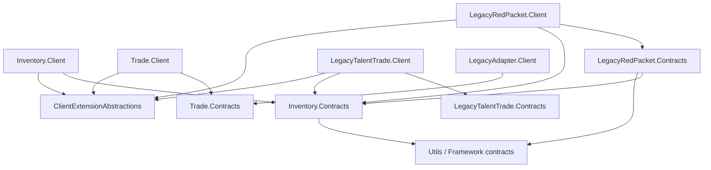

# 库存插件客户端架构与持久化评估

> 状态：评估与决策草案，尚未进入实现。  
> 日期：2026-09-13。  
> 调查依据：`AGENTS.md`、中英文设计哲学、`Compatibility-Boundaries.md`、中英文附属 Mod 开发者指南，以及当前扩展注册、Trade、LegacyRedPacket 和持久化代码。

## 1. 已确认范围

1. 库存是独立客户端插件，暂定扩展 ID 为 `builtin.inventory`。
2. Inventory 的 Contracts 和实现只进入客户端依赖图；服务端不得引用 Inventory 程序集或库存领域类型。
3. 第一轮实际接入对象是 `LegacyRedPacket.Client` 与 `LegacyTalentTrade.Client`；不修改它们的出站、入站格式或 Relay 协议，只替换客户端最终交付/返还适配点。
4. LegacyRedPacket.Client 和 LegacyTalentTrade.Client 硬依赖 Inventory；库存不可用时禁止相关完成或领取能力，不回退成直接空投。
5. 库存按当前 RimWorld 存档隔离，不建立账户级或跨存档共享库存。
6. 可无损合并的同质物品用 `long` 数量保存；非同质物品逐件保存完整数据。
7. 支持手动提取和按游戏时间重复提取，例如每个游戏日提取指定数量。
8. 提取沿用当前空投逻辑：按现有“投当前地图”设置选择当前地图，否则优先玩家主地图；落点用 `DropCellFinder.TradeDropSpot`。没有地图时保持待提取且不扣库存。
9. 定时提取采用每天固定游戏时刻；错过触发或没有地图时只保留一次待执行，不累计多日补发。
10. LegacyTalentTrade 的出租 Pawn 不进入普通库存，继续现有即时空投、租期和归还流程。
11. 同一路径回滚旧存档并检测到较新 journal 时，隔离分叉日志并弹出恢复选择，默认不自动重放。

## 2. 可行性结论

方案可行。`100,000,000` 白银可表示为一条聚合记录和一个 `long`，入账不创建大量 `Thing`；提取时再按 `ThingDef.stackLimit`、每 Tick 堆数和时间预算逐批实体化。

这不能简化为 `Dictionary<ThingDef, long>`。要支持所有物品并保证不复制、不丢失，至少需要：

- 独立 Inventory Contracts 与客户端实现；
- “聚合余额 + 独立实例”双形态账本；
- 原始 `FrameworkItemPayload` 的完整保留与版本化 codec；
- 幂等入账和显式提取事务；
- 按存档持久化与可选的客户端崩溃恢复日志；
- 扩展硬依赖的缺失、失败和生命周期传播修复。

库存应属于插件层。Host 只继续提供通用扩展发现、API registry、主线程调度和 UI 挂载点，不新增 Trade、红包或库存专用分支。

## 3. 当前代码审计

### 3.1 Trade

`Extensions/Trade/Client/PhinixDefaultTradeBehaviour.cs` 在 `OnTradeCompleted` 和 `OnTradeCancelled` 中把 `TradeCompletionEventArgs.Items` 转成 `Thing[]` 后立即空投。

当前路径有两个阻断问题：

- `TradeCompletionEventArgs` 只保留降级后的 `TradeItemSnapshot[]`，原始 `FrameworkItemPayload` 在服务层解码后丢失，不能保证完整保存任意 Mod 物品。
- 完成路径会过滤 `UnknownItem` 后继续交付，可能部分丢物，违反兼容边界中的整批成功/整批失败原则。

服务端已有持久化 `PendingCompletionNotification`，但发送完成事件后立即标记 delivered；“已发送”没有等同于“客户端已经持久入库”的证据。本轮不修改出站/入站协议，也不接入这条新版 Trade 路径，因此只把它保留为代码审计结论，不纳入第一轮实现。

### 3.2 LegacyRedPacket

`Extensions/LegacyRedPacket/Client/RedPacketStateMachine.cs` 的 `SpawnReward` 按 `stackLimit` 循环创建 `Thing`，然后交给 `RedPacketDropHelper.DropPodsWithLimit`。超大数量会产生与堆数成正比的对象和主线程工作。

旧红包协议使用 `int TotalCount` / `int amount`，只传 Def、Stuff、品质、耐久等模板字段。库存能完整保存它收到的数据，却不能恢复协议从未传输的 Mod 组件状态。若红包未来支持任意非同质物品，需要升级红包载荷；这与库存能否保存完整 payload 是两件事。

### 3.3 LegacyTalentTrade

`Extensions/LegacyTalentTrade/Client` 目前在市场成交、直接交易执行、出租接收、出租归还、复活返还、取消挂牌和过期挂牌等多处直接调用 `PawnDeserializer.DeserializeAndSpawn` 或 `DropPodUtility`。Pawn 已有压缩 Scribe XML，可作为 `talent-trade.pawn` 的独立完整载荷；它永远按实例保存，不参与 `long` 聚合。

接入点必须位于协议消息通过身份和状态校验之后、`DeserializeAndSpawn` 之前：先把原始 pawn payload 作为一笔幂等事务持久入库，再由库存提取时调用“Deserialize 但不 Spawn”与现行 `SpawnViaDropPod`。这样不改变 wire 格式，也不在网络 handler 前插新协议。

出租 Pawn 与永久转移 Pawn 的所有权不同。已决定出租 Pawn 不进普通库存，继续现有即时生成、租期和归还流程；只有永久取得所有权的市场成交、直接交易接收，以及本方永久物品/Pawn 的取消返还进入库存。

### 3.4 现行空投

Trade 和红包当前都采用：

```text
dropCurrentMap = true  -> Find.CurrentMap
dropCurrentMap = false -> Find.AnyPlayerHomeMap ?? Find.CurrentMap
落点                   -> DropCellFinder.TradeDropSpot(map)
交付                   -> DropThingsNear / DropThingGroupsNear
```

Inventory 应把它收敛成一个客户端 `InventoryDeliveryService`。Trade 和 RedPacket 只负责入库，不再分别持有空投实现。Inventory 版本在调用 `TradeDropSpot` 前必须检查地图有效性。

## 4. 插件依赖重新梳理

### 4.1 当前直接依赖

```text
Trade.Client
  -> Trade.Contracts
  -> ClientExtensionAbstractions / UserManagement / Utils

LegacyRedPacket.Contracts
  -> Trade.Contracts / Utils

LegacyRedPacket.Client
  -> LegacyRedPacket.Contracts
  -> Trade.Contracts
  -> Trade.Client                  # 直接引用实现程序集
  -> ClientExtensionAbstractions / UserManagement / Utils

LegacyTalentTrade.Client
  -> LegacyTalentTrade.Contracts
  -> ClientExtensionAbstractions / UserManagement / Utils

LegacyAdapter.Client
  -> Trade.Contracts / ClientExtensionAbstractions / Connections / Utils
```

运行时只有 `builtin.legacy-redpacket -> builtin.trade` 声明。

### 4.2 目标客户端依赖



约束：

- `Inventory.Contracts` 定义中立的入账、查询、提取和计划 API，不引用 Trade、RedPacket 或服务端项目。
- `Inventory.Client` 实现账本、`GameComponent`、UI、计划和空投，不引用 Trade 或 RedPacket。
- 第一轮只有 `LegacyRedPacket.Client`、`LegacyTalentTrade.Client` 引用 `Inventory.Contracts`；它们通过 API registry 获取能力，不引用 `Inventory.Client`。
- `LegacyRedPacket.Client` 暂时声明 `DependsOn = { "builtin.trade", "builtin.inventory" }`，直到旧 Trade 类型依赖完成拆除。
- `LegacyTalentTrade.Client` 声明 `DependsOn = { "builtin.inventory" }`。
- RedPacket 的物品描述迁为自身 DTO 或 Inventory 中立载荷后，移除对 `Trade.Client` 的实现引用，并尽量移除 RedPacket.Contracts 对 Trade.Contracts 的依赖。
- `LegacyAdapter.Client` 保持面向 Trade Contracts；它不直接认识库存。本轮也不修改它的协议收发。
- Server、Trade.Server、ServerRuntime 均不引用 `Inventory.Contracts` 或 `Inventory.Client`。

### 4.3 当前依赖框架缺口

开发者指南写明依赖会拓扑注册/激活并逆序关闭，但当前实现实际是：

- `Register`、`Activate` 和 `Shutdown` 都按扫描所得顺序执行；
- Shutdown 没有逆序；
- 循环依赖只记 warning；
- `StaticActivationPolicy` 只检查用户禁用集合中的直接依赖；
- 依赖缺失、注册失败或激活失败不会可靠阻止依赖者；
- 传递依赖禁用没有完整传播。

硬依赖 Inventory 前必须修复通用框架。不能依靠程序集数字前缀或类名字母序碰巧正确。

## 5. 建议项目结构

```text
Extensions/Inventory/
  Contracts/
    InventoryExtension.csproj
    InventoryContracts.cs
    InventoryResults.cs
  Client/
    InventoryExtension.Client.csproj
    BuiltInInventoryClientExtension.cs
    InventoryGameComponent.cs
    InventoryLedger.cs
    InventoryDepositService.cs
    InventoryExtractionService.cs
    InventoryScheduleService.cs
    InventoryDeliveryService.cs
    InventoryTab.cs
    InventorySettingsPanel.cs
```

`BuiltInInventoryClientExtension` 走标准 `Discover -> Register -> Activate -> Shutdown`，与第三方扩展平权。`GameComponent` 类型可能在插件被禁用时仍由 RimWorld 构造，所以构造器和 `ExposeData` 只处理无副作用数据；订阅、调度和 UI 绑定只能由已激活扩展管理。

## 6. 账本模型

### 6.1 聚合余额

```text
InventoryAggregateEntry
  EntryId
  CodecId / CodecVersion
  CanonicalPayload
  AggregationKey
  Quantity: long
  SourceSummary
```

库存不得凭 `defName` 猜测能否合并。Codec 必须声明 payload 是否可无损拆分/合并，并生成稳定 `AggregationKey`。只有合并不丢品质、耐久、材料、组件、所有权或 Mod 状态时，才能累加 `long`。

所有数量运算使用 checked 语义，合法范围为 `1..long.MaxValue`。聚合溢出时整笔入账失败，禁止环绕、截断或转负数。实际 `Thing.stackCount` 仍受 `int` 和 `ThingDef.stackLimit` 限制。

### 6.2 独立实例

```text
InventoryInstanceEntry
  EntryId
  CodecId / CodecVersion
  FullPayload
  Source
```

武器、服装、带组件状态或其他不可安全合并的物品逐件保存完整 payload，提取时才解码成 `Thing`。一亿件互不相同的物品天然需要 `O(n)` 数据；库存能避免同时生成地图实体，不能用一个 `long` 无损压缩不同状态。首要场景白银属于 `O(1)` 聚合记录。

### 6.3 完整载荷

- 入库 API 接受原始 `FrameworkItemPayload`，不能先降级为 `TradeItemSnapshot`。
- Codec 带版本并提供无损往返；未知 codec 或缺失 Mod 时保留原 payload，记录为暂不可提取。
- 单个 payload、批次总字节数、记录数和幂等历史必须有硬上限。
- 任一项损坏或不受支持时整批入账失败，不生成 `UnknownItem` 后继续。

## 7. 本地持久化方案比较

### 7.1 方案 A：只保存到 RimWorld 存档

实现：`InventoryGameComponent : GameComponent` 在 `ExposeData` 中保存 schema、账本、幂等键、提取计划和事务状态。

优点：

- 世界与库存天然同生共死；
- 复制、另存为、回滚和删除存档的语义最接近 RimWorld 原生行为；
- 没有外部文件串档、锁冲突或垃圾回收问题；
- 纯客户端，工程量最低。

缺点：

- 到账后至下一次保存前崩溃，会丢失最近入账；
- 若来源已经删除待交付记录，客户端无法自助恢复；
- 不能把日志当成恢复机制弥补。

适用取向：优先保证存档时间线绝对直观，接受保存点之后的进度全部回滚。

### 7.2 方案 B：存档快照 + 客户端事务日志

实现：`GameComponent` 仍是库存产品数据；每次入账先向按存档隔离的 append-only journal 写入小型事务并刷盘，然后更新内存。存档记录 `InventorySaveId`、checkpoint 和已应用事务 ID，加载时只重放匹配存档且未进入快照的事务。

优点：

- 到账可在下一次游戏存档前达到本地持久；
- 崩溃后能恢复已写日志但未进入存档快照的交易/红包；
- 不需要服务端引用 Inventory；
- journal 只保存事务，正常 checkpoint 后可压缩。

缺点：

- 必须定义稳定存档身份；
- 另存为、复制存档和加载旧备份会形成分支；如果两个文件共享 `InventorySaveId`，不能让后续 journal 在两者之间串读；
- 需要 checkpoint、内容哈希、幂等、损坏尾部截断、原子替换和日志回收；
- 本地日志丢失后只能回到最近存档快照。

安全限定：journal 只是同一存档时间线的崩溃恢复层，不能作为账户库存、导入来源或跨存档转移通道。

### 7.3 排除方案

- **服务端库存为权威**：会让服务端理解库存或存档身份，超出“库存引用仅限客户端”。
- **独立本地文件直接作为库存权威**：与存档生命周期脱节，最容易串档和复制物品。
- **每次到账强制保存整个 RimWorld 存档**：侵入性和卡顿风险高，保存时机也未必合法。

### 7.4 推荐

已决定采用方案 B，并要求严格保证原子性与隔离性。它借鉴 Redis AOF 与快照的工程思想，但不引入 Redis 服务，也不把 journal 提升为跨存档库存权威。

在已选方案 B 中，`ExposeData` 不得生成 Thing、空投或发网络包；损坏单项必须隔离，不能阻止整个存档加载；返回主菜单和切换存档必须释放旧账本、调度和 UI 引用。

### 7.5 原子性、隔离性与恢复协议

#### 单写者模型

- 每个已加载存档只允许一个 `InventoryTransactionCoordinator` 修改账本。
- 网络回调只提交不可变入账意图，实际事务串行封送到客户端主线程或专用单写者队列。
- UI 查询读取不可变快照；不能直接拿到内部 `List` / `Dictionary` 后修改。
- 每笔事务带 `ExpectedLedgerVersion`；手动提取、定时提取和入账竞争同一记录时，由协调器按版本只提交一次。

#### AOF 风格事务记录

一整个入账批次编码为一条完整 journal record，而不是逐物品多条记录：

```text
Magic | FormatVersion | SaveIsolationKey | Sequence | TransactionId
Operation | PayloadLength | Payload | PayloadHash | RecordChecksum
```

提交顺序固定为：

```text
验证整批
  -> 在内存中构造候选结果但不发布
  -> 追加一条完整事务记录
  -> Flush(flushToDisk: true)
  -> 校验写入结果
  -> 原子发布新的内存账本版本
  -> 向调用方返回成功
```

崩溃点语义：

- 落盘前崩溃：事务未提交，内存也不变。
- 完整落盘后、内存发布前崩溃：恢复扫描会重放一次。
- 内存发布后、调用方收到成功前崩溃：来源重试由 `TransactionId` 去重。
- 尾部半写：长度、hash 和 checksum 不完整，恢复时忽略并隔离尾部，不应用半笔事务。

#### 快照与 AOF 重写

- `GameComponent` 保存账本快照、`AppliedThroughSequence` 和内容 hash。
- `ExposeData` 期间只输出快照，不删除 journal，因为此时尚不能证明整个 RimWorld 存档已成功写完。
- 只有观察到“存档成功完成”后才允许 checkpoint/重写；具体可用的 RimWorld 1.6 完成回调必须在实现前用实际 API 核对，不得猜测。
- 重写先生成临时文件，写入并刷盘后用同卷原子替换；失败时保留旧 journal。旧文件的删除永远晚于新文件可恢复。
- 第一版可以暂不压缩 journal，但必须设总字节硬上限和只读保护，不能无界增长。

#### 存档隔离键

仅靠写在存档里的 GUID 不能区分一个存档文件的字节级复制品。严格隔离至少需要组合：

```text
EmbeddedSaveId + SaveFileIdentity + CheckpointId
```

不同路径的复制存档使用不同 journal 命名空间；库存快照会随存档复制，但复制后产生的新事务不互相串读。对于“旧备份覆盖回同一路径”这种情况，加载到的 checkpoint 可能落后于该路径 journal head，系统必须检测分叉，隔离所有不能证明属于当前 checkpoint 后继的记录，并弹出恢复选择。默认操作是不重放较新记录；只有玩家明确选择恢复后才把隔离分支作为一笔可审计、幂等的恢复事务应用。关闭弹窗或加载流程异常都等同于不恢复。

#### 文件与进程边界

- journal 文件只允许当前存档协调器持有排他写锁；无法取得锁时库存进入只读故障态，上游领取/完成入口停止。
- 路径必须经过规范化，并验证最终路径仍在 Inventory 的本地存储根目录内。
- 每条记录和整个文件有大小上限；解析时先验长度再分配内存。
- 不允许从其他存档目录导入、复制 journal 或手工兑换；journal 不是物品转移格式。

## 8. 入账与所有权

建议 API：

```text
IInventoryDepositApi.TryDeposit(batch) -> InventoryDepositResult
IInventoryQueryApi.GetSnapshot()
IInventoryExtractionApi.Enqueue(request)
IInventoryScheduleApi.Create/Update/Delete(schedule)
```

批次包含稳定 `DepositId`、来源、当前存档身份和原始 Items。Trade 的键至少含 `tradeId + recipientUuid + completed/cancelled`；红包至少含 `packetId + claimerUuid`。

事务不变量：

1. 先校验整批 codec、payload、数量、资源预算和存档身份。
2. 任一项失败则余额完全不变。
3. 相同 `DepositId` 重放返回“已提交”，不得再次增加余额。
4. 相同 ID 但内容哈希不同是冲突，不覆盖旧记录。
5. 只有达到已选择的本地持久化边界后，才能向上游返回“已接收”。

Trade 目标客户端流程：

```text
收到权威完成事件
  -> 保留原始 FrameworkItemPayload
  -> Inventory.TryDeposit
  -> 持久化成功
  -> UI 提示已存入库存
```

本轮不增加服务端 ack，也不修改 Trade/红包/人才交易的 wire 格式。该约束意味着事务边界从“客户端已收到且通过现有校验的 payload”开始；journal 能关闭其后的崩溃窗口，不能证明发送端事件一定到达。

红包目标流程：

```text
分配消息通过因果校验
  -> 构造库存 payload，不创建 Thing 列表
  -> Inventory.TryDeposit(packetId + claimerUuid)
  -> 持久化成功后标记本地已交付
```

Legacy Relay 没有和本地持久提交绑定的可靠 ack。接入前必须补齐分配、重播和入账失败状态；不能先消耗份额再静默丢物。

## 9. 手动提取与定时计划

提取状态机：

```text
Planned -> Materializing -> Delivering -> Committed
                         -> RetryableFailure
                         -> Quarantined
```

- 物品创建与地图访问只在主线程。
- 每 Tick 限制创建堆数和耗时，所有任务共享总预算。
- 只有空投系统成功接管本批物品后才扣余额。
- 中途失败时未交付余额仍在库存；临时 Thing 必须销毁或重新托管。
- 手动和定时任务竞争同一余额时，只允许一个事务提交。

第一版计划模型：

```text
ScheduleId
EntrySelector
QuantityPerRun: long
DayTick                    # 每天固定时刻，范围 0..59999
LastTriggeredDay
PendingDueDay              # 可空；错过时只保留最近一次
Enabled
```

RimWorld 一天按 60000 游戏 Tick 换算，`DayTick` 表示当天固定时刻。计划服务按当前游戏绝对 Tick 计算天序号和日内 Tick，不使用现实时间。暂停不推进；读档后若发现今天的时刻已经错过，只建立一笔 `PendingDueDay`，不会为离开的每一天补建任务。没有地图或全局提取预算不足时保持这一笔待执行；成功创建提取事务后记录 `LastTriggeredDay`，同一天不重复触发。触发后的实体化仍按全局提取预算逐批执行。

## 10. 依赖框架前置工作

1. 缺失依赖阻止依赖者注册/激活。
2. 循环依赖阻止环内模块运行。
3. 按拓扑序 Register、Activate，按逆序 Shutdown。
4. 依赖注册或激活失败向所有依赖者传播。
5. 用户禁用传播到传递依赖者。
6. API registry 不向依赖者暴露半初始化实现。
7. 用 `Phase35RuntimeTests` 覆盖缺失、循环、失败传播、拓扑顺序和逆序关闭。
8. 同步修正中英文开发者指南；当前指南对实现能力描述过强。

## 11. 实施顺序

### Phase 0：通用依赖与契约

- 修复扩展依赖框架。
- 新建纯客户端使用的 Inventory.Contracts。
- 定义聚合能力、完整 payload 版本和入账结果。
- 给 Trade 完成事件增量保留原始 payload，保持旧属性兼容。

### Phase 1：账本与本地持久化

- 新建 Inventory.Client、双形态账本和 GameComponent。
- 实现 checked long、幂等事务、坏记录隔离和存档切换清理。
- 实现已确定的 GameComponent 快照 + 客户端 AOF 风格 journal，并落实分叉隔离与恢复选择。
- 先提供只读库存 Tab 验证保存/加载。

### Phase 2：提取

- 实现统一空投服务、手动提取和时间切片。
- 实现游戏 Tick 重复计划、无地图暂停和事务恢复。

### Phase 3：LegacyTalentTrade

- LegacyTalentTrade.Client 声明 Inventory 硬依赖。
- 新增 `talent-trade.pawn` 完整实例 codec，复用现有压缩 Scribe XML。
- 在现有协议 handler 完成身份/状态校验后，将直接 Spawn 改为幂等入库。
- 不改变 TalentTradeTransport、协议文本或 Relay 收发。
- 只接永久所有权转移和永久返还；出租接收、租期、出租归还与复活返还维持现有即时路径。

### Phase 4：LegacyRedPacket

- RedPacket.Client 声明 Inventory 硬依赖。
- 领取结果幂等入库，不调用 `SpawnReward`。
- 补齐 Relay 重播和入账失败恢复。
- 移除 RedPacket.Client 对 Trade.Client 实现程序集的引用。

### Phase 5：发布收尾

- 更新 solution、legacy csproj 的显式 Compile、产物排序和 artifact 检查。
- 更新中英文稳定文档。
- 验证产物不包含游戏/Unity 引用 DLL。

## 12. 验收重点

- 一亿白银入账只产生一条聚合记录，不创建 Thing。
- 非同质物品保存/加载后完整 payload 不变。
- 重复事件幂等；同 ID 异内容报冲突。
- codec 失败整批不入账、不部分空投。
- 不同存档连续切换不串库存。
- 缺失 Mod/codec 时记录保留但不可提取。
- 无地图不生成、不扣账；恢复地图后可重试。
- 单 Tick 创建量和时间有硬预算。
- Trade/RedPacket 在 Inventory 禁用、缺失或失败时不能激活。
- Inventory Contracts 和实现不进入任何服务端项目引用。
- journal 覆盖每个提交崩溃点、半写尾部、checksum 错误、重复事务、并发提取、另存为、复制和回滚旧档的分支测试。
- LegacyRedPacket 与 LegacyTalentTrade 的 wire 字节和消息类型保持不变。

## 13. 决策状态

本轮发现的产品分歧已经确认：持久化采用存档快照 + 客户端 AOF 风格 journal；回滚分叉默认隔离且不重放；出租 Pawn 不进普通库存；定时提取按每天固定游戏时刻；不修改现有协议收发；Inventory 引用严格限于客户端项目。

进入实现前仍需通过代码验证两项技术事实，但它们不改变产品决策：

1. RimWorld 1.6 能否提供可靠的“整个存档已经成功完成”回调。若没有，journal 第一版不得在保存过程中截断，只能保守保留并在安全时机重写。
2. 当前运行时能否稳定取得规范化的存档文件身份。若只能取得文件名而非最终路径，隔离键必须退化为“嵌入 ID + 规范化文件名 + checkpoint”，并在 UI 明示重名冲突。
