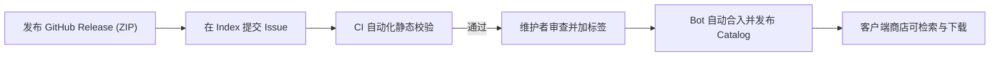

# Phinix Rework 插件开发指南

本文档为 Phinix Rework 客户端托管插件（Managed Plugins）的开发参考。内容对照当前代码与已验证实践编写，旨在提供准确、精简的技术规范与操作指导。

> **说明**：Phinix 插件开发 skill 暂停编写，待本地侧载及[开发者基础能力](branch-local/dev/Developer-Foundation-Delivery-Plan.md)验收后恢复；当前没有可用的调用链接。

---

## 1. 架构总览与平权原则

### 1.1 插件平权
在 Phinix Rework 中，内置功能（聊天、交易、虚拟库存、插件商店）与第三方插件享有完全平等的运行时地位：
- **统一发现机制**：通过程序集扫描定位标记有 `[PhinixExtension]` 的模块。
- **统一注册与装配**：通过 `IExtensionBuilder` 暴露 API（`RegisterApi<T>`）或使用依赖注入作用域（`IClientCompositionScope`）。
- **统一生命周期管理**：遵循被动构造、主线程显式激活（`Activate`）与对称关闭（`Shutdown`）。

### 1.2 依赖边界
- **宿主不依赖插件**：客户端宿主（`Phinix-Rework`）仅引用通用契约层（`ClientExtensionAbstractions`），严禁引用任何业务插件或插件的 Contracts 项目。
- **插件间松耦合**：插件之间的协作通过各自公开的 Contracts 接口完成，借助宿主的 API 注册表（`ExtensionHostContext.TryResolveApi<T>`）互相解析，宿主不充当中介。
- **依赖声明**：通过 `[PhinixExtension("your.package.id", DependsOn = new[] { "builtin.inventory" })]` 声明依赖。宿主注册表将依据依赖图进行拓扑排序，确保被依赖模块先于依赖模块激活。

---

## 2. 公开 API 概览

### 2.1 宿主通用服务
模块在激活阶段通过 `ExtensionHostContext.GetRequiredService<T>()` 获取宿主提供的中立基础设施服务：

| 接口 | 命名空间 | 职责与能力 |
| :--- | :--- | :--- |
| `IClientSessionContext` | `PhinixClient.Framework` | 认证/登录状态、会话 ID 和本地用户 UUID（不提供服务器地址） |
| `IClientUserDirectory` | `PhinixClient.Framework` | 在线与离线用户查询、显示名称与资料映射 |
| `IClientUserEventStream` | `PhinixClient.Framework` | Disconnected、UsersChanged、UserDisplayNameChanged、BlockedUsersChanged 事件 |
| `IClientMainThreadDispatcher` | `PhinixClient.Framework` | 向 RimWorld 游戏主线程派发回调（`Enqueue(Action)`） |
| `IClientSettingsContext` | `PhinixClient.Framework` | 共享键值设置（`Get<T>`、`Set<T>`）；由插件以模块 ID 前缀隔离键，宿主不会自动隔离 |
| `IClientLocalizationService` | `PhinixClient.Framework` | 本地化服务，通过 `ForModule(this)` 获取包隔离的 `IClientLocalizer` |
| `IClientWindowService` | `PhinixClient.Framework` | 宿主窗口管理（打开主界面、对话框等） |
| `IClientSoundService` | `PhinixClient.Framework` | 播放原版 UI 音效 |
| `IClientExtensionManagementWindowService` | `PhinixClient.Framework` | 打开扩展管理界面 |

### 2.2 UI 挂载点
插件在注册阶段通过 `builder.RegisterApi<T>(instance)` 挂载界面组件：

- **主 Tab 页签（`IMainTabProvider` / `IResponsiveMainTabProvider`）**：
  在 Phinix 窗口顶部注册专属页面。需提供 `TabLabel`（标签文本）、`TabOrder`（排序权重）以及 `Draw(Rect inRect)` 渲染回调。
- **侧栏抽屉（`IServerSidebarProvider` / `IResponsiveSidebarProvider`）**：
  在主界面右侧提供抽屉或折叠面板。
- **Tab 角标（`IBadgeProvider`）**：
  为所属 Tab 提供未读计数或红点提示（`BadgeText`）。
- **设置面板（`IClientSettingsPanelProvider`）**：
  在 Phinix 设置窗口中注册专属设置子面板。
- **顶部横幅通知（`INoticeBannerProvider`）**：
  在主界面顶端动态渲染可交互通知条。
- **按键拦截（`IUiAcceptKeyHandler`）**：
  拦截 Enter / Return 等确认键。

### 2.3 响应式布局原语
位于 `PhinixClient` 命名空间（源码在 `Client/ClientExtensionAbstractions/UI`）：
- `UiScreenSafeArea.ClampWindow`：确保弹窗和主窗口始终限制在屏幕可见安全区域内。
- `UiScreenSafeArea.Normalize` 是 internal 实现，不是插件可调用的公开 API。
- `ResponsiveFormLayout`：单行与垂直堆叠自适应表单。
- `ResponsiveSplitLayout`：支持空间不足时退化为垂直排列或 SinglePane 子 Tab 的双栏布局。
- `ResponsiveToolbarLayout`：计算可见操作和溢出按钮的几何位置；调用方负责绘制控件与 `FloatMenu`。
- `VirtualListLayout`：大型列表视口可见行裁剪计算。

---

## 3. 生命周期与依赖注入（DI）

### 3.1 生命周期阶段
模块经历以下标准生命周期：
1. **构造（Construction）**：必须是**完全被动的**。仅分配内存与初始化只读字段。严禁在此启动线程、发起网络请求、读取游戏状态或注册全局钩子。
2. **注册（Registration / Composition）**：
   - 宿主完成基础服务初始化后调用。
   - 用于声明导出的 API、UI 挂载点以及配置依赖注入容器。
3. **激活（Activation）**：
   - 游戏主线程调用 `Activate(ExtensionHostContext hostContext)`。
   - 解析借用服务、订阅事件、加载持久化设置、启动后台任务。
4. **关闭（Shutdown）**：
   - 宿主扩展运行时停止时调用 `Shutdown(ExtensionHostContext hostContext)`。断线通过通用事件处理，不等于模块 Shutdown；启停保存的是下次启动意图，读档也不自动重建全部模块。
   - 必须**严格对称清理**：退订事件、终止后台任务、释放自身拥有的一切资源。

### 3.2 两种模块开发模式

#### 方式 A：现代 DI 组合模式（推荐新插件采用）
基于中立容器抽象实现服务构造函数注入与作用域自动回收：

```csharp
using System;
using PhinixClient;
using PhinixClient.Framework;
using UnityEngine;
using Utils;
using Utils.Framework;
using Verse;

[PhinixExtension("my.custom.plugin")]
public sealed class MyCustomPlugin : ClientExtensionModule, IActivatablePhinixExtensionModule
{
    private IClientCompositionScope scope;
    public override string ExtensionId => "my.custom.plugin";

    public override void Compose(IExtensionBuilder builder)
    {
        var log = builder.HostContext.Log ?? ((message, level) => { });
        var candidate = builder.HostContext.GetRequiredService<IClientCompositionFactory>().CreateScope(local =>
        {
            local.Borrow<Action<string, LogLevel>>(log);
            local.Register<IMainTabProvider, MyPluginTab>();
        });
        try
        {
            builder.RegisterApi<IMainTabProvider>(candidate.Resolve<IMainTabProvider>());
            scope = candidate;
        }
        catch
        {
            try { candidate.Dispose(); }
            catch (Exception cleanup)
            {
                try { log("Composition cleanup failed: " + cleanup, LogLevel.ERROR); }
                catch { }
            }
            throw;
        }
    }

    public void Activate(ExtensionHostContext hostContext) { }
    public void Shutdown(ExtensionHostContext hostContext)
    {
        var owned = scope;
        scope = null;
        owned?.Dispose();
    }
}

public sealed class MyPluginTab : IMainTabProvider
{
    private readonly Action<string, LogLevel> log;
    public MyPluginTab(Action<string, LogLevel> log) { this.log = log; }
    public string TabLabel => "Example";
    public float TabOrder => 500;
    public void Draw(Rect rect)
    {
        if (Widgets.ButtonText(rect, "Hello")) log("Example clicked.", LogLevel.INFO);
    }
}
```

> **注意**：宿主内部采用 Autofac 8.4.0 实现，但框架在中立层完全隐藏了第三方容器类型。插件工程无需也不应引用 Autofac。

#### 方式 B：传统模块模式（Legacy Register，过渡兼容）
实现 `IPhinixExtensionModule`，直接在 `Register` 中挂载实例：

```csharp
[PhinixExtension("my.legacy.plugin")]
public sealed class MyLegacyPlugin : IPhinixExtensionModule, IActivatablePhinixExtensionModule
{
    public string ExtensionId => "my.legacy.plugin";

    public void Register(IExtensionBuilder builder)
    {
        builder.RegisterApi<IMainTabProvider>(new MyPluginTab(builder.HostContext.Log ?? ((message, level) => { })));
    }

    public void Activate(ExtensionHostContext hostContext) { /* 启动 */ }
    public void Shutdown(ExtensionHostContext hostContext) { /* 清理 */ }
}
```

> **状态说明**：宿主目前对方式 B 提供无缝源兼容与二进制兼容，但在启动时会输出一条迁移建议日志。计划在宿主 1.0 / 客户端抽象 2.0 之前完成所有旧模块迁移后才会移除该入口。

### 3.3 现有独立插件的实际状态
目前维护中的三个独立插件仓的代码现状如下：
- **Phinix-Example-Plugin**（1.0.2 开发修订）：已迁移 `ClientExtensionModule.Compose`，拥有 DI scope 与 localizer，借用宿主服务；既有正式 1.0.2 制品不改写。
- **Phinix-Legacy-RedPacket**（1.0.0）：使用传统模式，依赖 Trade 与 Inventory，尚未迁移 DI。
- **Phinix-Legacy-TalentTrade**（1.0.1）：使用传统模式，依赖 Harmony 补丁，尚未迁移 DI。

**切勿宣称全部插件已完成 DI 迁移。** 这三个仓库的 DI 迁移属于后续独立安排。

---

## 4. 线程模型与资源所有权

### 4.1 线程安全与主线程派发
RimWorld 引擎与 Unity 渲染均严格绑定主线程：
- 所有 GUI 绘制（`Draw`）、控件操作、字体度量、世界实体访问（`Verse.*`、`RimWorld.*`）**必须在主线程执行**。
- 后台网络线程或计时器回调严禁直接访问游戏对象或修改 UI 状态。
- 数据到达后，通过 `IClientMainThreadDispatcher.Enqueue(Action)` 封送至主线程：

```csharp
mainThreadDispatcher.Enqueue(() =>
{
    // The callback may execute after a save/world change; validate its context again.
    if (Current.Game == null || Find.LetterStack == null) return;
    // Apply only the operation still owned by this session/world.
});
```

### 4.2 资源所有权与配对释放
- **自拥有资源**：插件实例化的 `Timer`、`Thread`、文件句柄、订阅的事件委托，必须在 `Shutdown` 中严格销毁或取消订阅（`+=` 对应 `-=`）。
- **借用服务保护**：通过 `ExtensionHostContext` 或 `IClientCompositionBuilder.Borrow` 借用的宿主服务（如 `IClientSessionContext`、`IClientSettingsContext`），其生命周期由宿主掌控，**插件绝不能对其调用 `Dispose`**。
- **本地化字典**：通过 `localizationService.ForModule(this)` 创建的局部本地化器，在 `Shutdown` 时必须解绑事件并调用 `localizer.Dispose()`。

### 4.3 Harmony 补丁约束
如果插件需要使用 Harmony 修改游戏原版逻辑：
1. **严禁在静态构造函数中 Patch**：反射扫描本身并不保证执行静态构造函数；但若补丁依赖某次类型初始化，就无法由模块生命周期可靠控制启用与清理。
2. **在 `Activate` 中挂载，在 `Shutdown` 中卸载**：
   ```csharp
   private Harmony harmony;

   public void Activate(ExtensionHostContext hostContext)
   {
       harmony = new Harmony("author.plugin.id");
       harmony.PatchAll(Assembly.GetExecutingAssembly());
   }

   public void Shutdown(ExtensionHostContext hostContext)
   {
       harmony?.UnpatchAll("author.plugin.id");
       harmony = null;
   }
   ```

---

## 5. 构建与打包流程

### 5.1 环境要求
- **.NET 10 SDK**（运行构建驱动与打包工具）。
- **.NET Framework 4.7.2** 目标包（通过 `Microsoft.NETFramework.ReferenceAssemblies` 支持全平台交叉编译）。
- **RimWorld 1.6 依赖引用**：用于编译期引用解析（`Assembly-CSharp.dll`、`UnityEngine*.dll`）。

### 5.2 打包规范
已走通的本地编译、离线预检、开发者模式 ZIP 导入与重启迭代入口见[本地开发快速入门](Local-Plugin-Quickstart.md)。Example 引用预先准备的公开宿主 DLL，支持 `--host-assemblies`；`example/package-config.json` 配置兼容范围、依赖和外部 Mod。`ManagedPackageTool --validate ZIP` 复用安装的静态 ZIP 校验器。

使用官方 `pack.py` 脚本配合 `ManagedPackageTool` 生成符合 manifest schema 1 的托管 ZIP 包（商店 catalog 使用 schema 3）：

下列参数适用于 Example 仓库；两个 Legacy 插件使用各自的 `--phinix-package`、`--packager` 等参数，不存在通用 `pack.py`。

```bash
python3 pack.py \
  --phinix-root <path-to-Phinix-Rework> \
  --game-references <path-to-RimWorld-Managed> \
  --output <path-to-output>/your-package-1.0.0.zip
```

#### 规范 ZIP 结构
```text
your-package-1.0.0.zip
├── manifest.json                  # 包元数据、程序集列表、依赖项与 Phinix 版本区间
├── Assemblies/
│   └── YourPlugin.dll             # 仅包含插件自身的编译 DLL
└── Resources/
    └── Localization/              # 包隔离的本地化字典
        ├── en-US.json
        └── zh-CN.json
```

> [!CAUTION]
> **打包红线**：ZIP 包内**严禁包含**任何游戏程序集（`Assembly-CSharp.dll`、`UnityEngine*.dll`）、宿主程序集（`Utils.dll`、`ClientExtensionAbstractions.dll`）或 Harmony。包含外来依赖会导致运行时程序集冲突，并在 Index 自动化准入时被直接拒绝。

---

## 6. 测试与验证

1. **自动化运行时测试**：
   针对无 UI 的业务状态机和契约逻辑，编写基于 .NET 10 的控制台测试或单元测试，验证输入边界与异常恢复。
2. **本地游戏安装测试**：
   - 商店安装使用完整的管理事务，写入包文件、安装 receipt 和期望状态；仅解压 ZIP 不能登记插件。
   - 私有候选包开启开发者模式后，从商店“安装本地插件 ZIP”导入，核对摘要并重启。按[本地开发快速入门](Local-Plugin-Quickstart.md)操作；直接解压或复制 bundle 不会创建托管安装记录。
   - 托管目录由实际 SaveDataRoot 决定，包目录使用 sourceId/packageId 派生的 `pkg-<hash>`，不是 `<package-id>/<version>`。
   - 测试普通启停、重启生效、读档、断线与宿主退出；分别检查模块、连接、存档和操作生命周期。

---

## 7. 插件发布与 Index 准入流程



1. **发布公开 Release**：
   在作者自身的公开 GitHub 仓库创建正式 Release，上传规范命名的 ZIP 产物。
2. **提交准入申请**：
   在 [Phinix-Plugin-Index](https://github.com/HunYuan2333/Phinix-Plugin-Index) 创建 **Plugin submission** Issue，参考 Index 的 `examples/managed-submission.json` 和 Issue 模板填写完整 candidate JSON，包括固定仓库/Release/asset/sourceCommit 身份、摘要及 manifest；不要只填一个下载直链。工坊条目另用 `examples/workshop-submission.json`，无需托管 ZIP。
3. **自动化静态检查**：
   Index CI 自动拉取产物，校验 JSON Schema、PE 元数据、依赖闭包与哈希一致性，并将结果评论在 Issue 中。
4. **维护者核准**：
   维护者审查合规后添加 `plugin-approved` 标签。
5. **不可变发布**：
   系统自动生成凭证 PR 并合并，生成新的 `catalog-v3-<commit>` 目录发布，更新 `stable.json`。
6. **客户端消费**：
   玩家在游戏内商店即可检索、安装及更新该插件。

---

## 8. 现有插件已知限制与参考实践

- **Phinix-Example-Plugin**：
  展示了最小化的页签渲染、持久化设置、语言切换与响应式提示。不包含地图物品生成、复杂通信或网络请求，是学习 UI 扩展的理想起点。
- **Phinix-Legacy-RedPacket**：
  - 依赖 Trade 与 Inventory 模块。
  - **已知问题 1**：普通等价堆叠（如 200 钢铁）跨多物理堆发送时可能触发不兼容堆异常。计划在后续独立更新中统一选择与合并预检规则。
  - **已知问题 2**：已观察到领取完成汇总在 `Root_Entry` 调用链中抛出 `NullReferenceException`；具体根因待复现核对，不能直接认定是世界上下文缺失。计划核对通知调度与领域提交的边界。
- **Phinix-Legacy-TalentTrade**：
  - 依赖 Harmony 补丁拦截原版殖民者逻辑。
  - **已知限制**：租借记录与市场挂牌数据保存在当前存档的 `GameComponent` 中。若存档内仍有进行中的交易或外出租赁人员，严禁直接卸载插件，应先处理未完成交易/租赁并备份存档，卸载后加载风险需在测试存档中验证。
- **CI / GitHub Actions 自动构建状态**：
  三个插件仓库的 GitHub Actions 自动构建流仍在 F7 后续规划中（统一 main/dev 分支，仅在 main 提交触发编译与打包）。当前仍以本地打包和人工发布为主。
